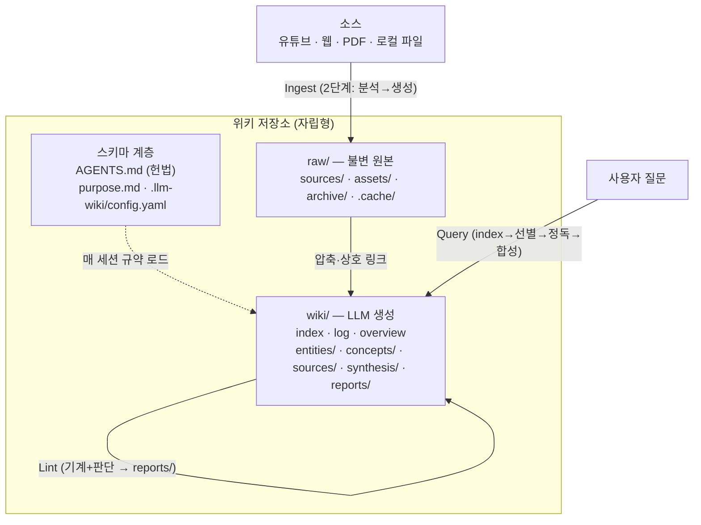
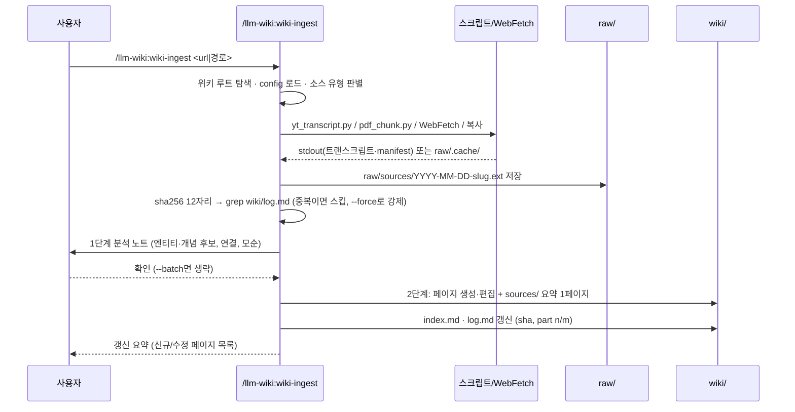

# ARCHITECTURE

## 1. 3계층 모델과 3연산

에이전트는 매 세션 스키마 계층을 읽고, `raw/`는 추가·아카이브만 하며, `wiki/`만 생성·편집한다. 위키의 가치는 **압축**이다 — 소스 1:1 미러 금지, 소스당 요약 1페이지 + 횡단 엔티티/개념 페이지.

## 2. Ingest 시퀀스

## 3. 플러그인 vs 위키 경계

| 무엇 | 어디 사는가 | 역할 |
|------|------------|------|
| 커맨드 4개 (`wiki-init`·`wiki-ingest`·`wiki-lint`·`wiki-status`) | 플러그인 `commands/` | 워크플로의 순서·게이트·출력만 |
| 스킬 2개 (`wiki-maintainer`·`source-extract`) | 플러그인 `skills/` | 운영 보강 · 추출 레시피(단일 소스) |
| 스크립트 3개 (`yt_transcript`·`pdf_chunk`·`wiki_check`) | 플러그인 `skills/source-extract/scripts/` | 기계 작업. stdout·캐시만 출력 |
| 템플릿 7종 | 플러그인 `templates/` | init이 렌더링하는 원본. `schema_version`의 기준 |
| `AGENTS.md` (운영 규칙 전체) | **위키** 루트 | 헌법 — 플러그인 없이도 위키가 동작하는 근거 |
| `CLAUDE.md` (포인터) | **위키** 루트 | `@AGENTS.md` 임포트 한 줄 + 폴백 안내 |
| `purpose.md` · `.llm-wiki/config.yaml` | **위키** | 왜(목적·핵심 질문) · 설정 |
| `raw/` · `wiki/` 콘텐츠 | **위키** | 데이터 전부 |

플러그인을 지워도 위키는 완전하다. 플러그인은 세팅·업그레이드·소스 추출만 담당한다.

## 4. 옵션 매트릭스

| 옵션 | 기본값 | 영향 범위 | 영향 없음 |
|------|--------|----------|----------|
| Core | 항상 | 3계층 구조, 커맨드·스크립트, AGENTS.md 규약 | — |
| Obsidian | off | `link_style`(wikilink) 렌더링, `.obsidian/` 최소 생성, Web Clipper·graph view 안내, fetch 실패 폴백 | 위키 콘텐츠 구조·스크립트 동작 |
| qmd | off (`search: none`) | lint가 index 200 초과 시 도입 제안, config `search: qmd` 기록 | 위키 콘텐츠 **무변경** — 언제든 attach/detach |

## 5. 설계 결정 기록 (ADR-lite)

**ADR-1. MCP 서버를 두지 않는다.**
상태가 전부 파일시스템에 있다(마크다운·YAML·캐시). 조회·수정에 프로토콜이 필요 없고, 규약(`AGENTS.md`)은 에이전트 컨텍스트로 직접 로드된다. MCP를 두면 상주 프로세스·설치 의존이 생겨 위키의 "어디서든 동작" 속성이 깨진다.

**ADR-2. AGENTS.md를 canonical 스키마로 둔다 (CLAUDE.md는 포인터).**
Codex·Cursor 등은 `AGENTS.md` 표준을 읽지만 임포트 문법이 없고, Claude Code는 `CLAUDE.md`만 자동 로드하지만 `@path` 네이티브 임포트가 있다. 따라서 내용은 AGENTS.md 한 곳에 두고 CLAUDE.md가 `@AGENTS.md`로 가리키는 방향만이 양 런타임에서 기계적으로 동작하며, 두 파일 내용 드리프트를 원천 차단한다. 심볼릭링크는 배제 — Windows git 기본 설정(`core.symlinks=false`)에서 링크가 경로 문자열이 적힌 일반 파일로 체크아웃되어 이식성이 깨진다.

**ADR-3. 장문 PDF는 청킹한다.**
이 패턴의 인제스트 단위는 "한 번에 소화 가능한 조각"(책은 챕터 단위)이고, 청크당 1 pass + log의 `part n/m` 기록으로 중단·재개가 가능해진다. 컨텍스트 창 대비 토큰 경제도 이유다. **원본 보존과는 무관하다** — 원본 PDF는 `raw/sources/`에 그대로 있고 청크는 `raw/.cache/`의 파생물(gitignore 대상)일 뿐이다.

**ADR-4. 스크립트는 wiki/를 쓰지 않는다.**
판단은 LLM, 기계 작업은 스크립트라는 경계다. 추출 스크립트는 stdout 또는 `raw/.cache/`에만 출력하고, 그 결과를 어디에 어떻게 반영할지(페이지 생성·편집·index·log)는 항상 에이전트가 결정한다. 이 경계 덕에 스크립트는 결정적으로 테스트 가능하고, 위키 반영 품질은 스키마(AGENTS.md) 개선으로만 다룬다.
