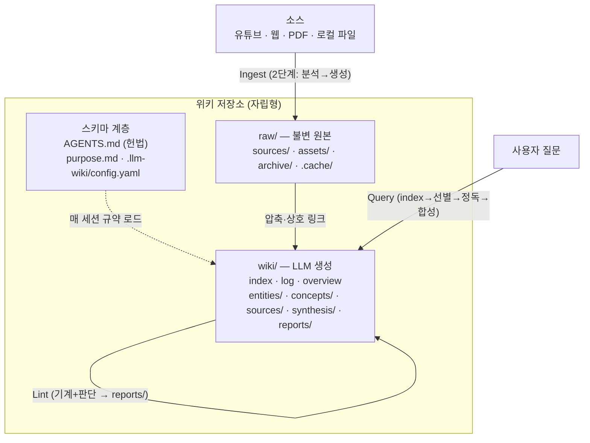
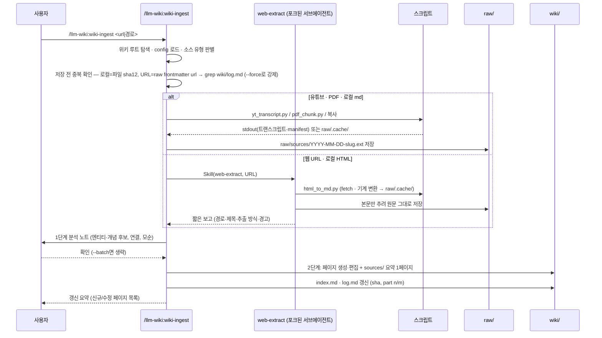

# ARCHITECTURE

## 1. 3계층 모델과 3연산

에이전트는 매 세션 스키마 계층을 읽고, `raw/`는 추가·아카이브만 하며, `wiki/`만 생성·편집한다. 위키의 가치는 **압축**이다 — 소스 1:1 미러 금지, 소스당 요약 1페이지 + 횡단 엔티티/개념 페이지.

## 2. Ingest 시퀀스

## 3. 플러그인 vs 위키 경계

| 무엇 | 어디 사는가 | 역할 |
|------|------------|------|
| 워크플로 스킬 4개 = 슬래시 커맨드 (`wiki-init`·`wiki-ingest`·`wiki-lint`·`wiki-status`) | 플러그인 `skills/wiki-*/` | 워크플로의 순서·게이트·출력만 |
| 보조 스킬 3개 (`wiki-maintainer`·`source-extract`·`web-extract`, 모델 전용) | 플러그인 `skills/` | 운영 보강 · 추출 레시피(단일 소스) · 웹 원본 추출(포크 실행) |
| 스크립트 4개 (`yt_transcript`·`pdf_chunk`·`wiki_check`·`html_to_md`) | 플러그인 `skills/source-extract/scripts/` | 기계 작업. stdout·캐시만 출력 |
| 템플릿 7종 | 플러그인 `templates/` | init이 렌더링하는 원본. `schema_version`의 기준 |
| `AGENTS.md` (운영 규칙 전체) | **위키** 루트 | 헌법 — 플러그인 없이도 위키가 동작하는 근거 |
| `CLAUDE.md` (포인터, 위키에 원래 있을 때만) | **위키** 루트 | 기존 `CLAUDE.md`에 `@AGENTS.md` 임포트 한 줄 + 폴백 안내를 덧붙인다 |
| `purpose.md` · `.llm-wiki/config.yaml` | **위키** | 왜(목적·핵심 질문) · 설정 |
| `raw/` · `wiki/` 콘텐츠 | **위키** | 데이터 전부 |

플러그인을 지워도 위키는 완전하다. 플러그인은 세팅·업그레이드·소스 추출만 담당한다.

## 4. 옵션 매트릭스

| 옵션 | 기본값 | 영향 범위 | 영향 없음 |
|------|--------|----------|----------|
| Core | 항상 | 3계층 구조, 스킬·스크립트, AGENTS.md 규약 | — |
| Obsidian | off | `link_style`(wikilink) 렌더링, `.obsidian/` 최소 생성, Web Clipper·graph view 안내, fetch 실패 폴백 | 위키 콘텐츠 구조·스크립트 동작 |
| qmd | off (`search: none`) | lint가 index 200 초과 시 도입 제안, config `search: qmd` 기록 | 위키 콘텐츠 **무변경** — 언제든 attach/detach |

## 5. 설계 결정 기록 (ADR-lite)

**ADR-1. MCP 서버를 두지 않는다.**
상태가 전부 파일시스템에 있다(마크다운·YAML·캐시). 조회·수정에 프로토콜이 필요 없고, 규약(`AGENTS.md`)은 에이전트 컨텍스트로 직접 로드된다. MCP를 두면 상주 프로세스·설치 의존이 생겨 위키의 "어디서든 동작" 속성이 깨진다.

**ADR-2. AGENTS.md를 canonical 스키마로 둔다 (CLAUDE.md는 이미 있을 때만 포인터).**
Codex·Cursor 등은 `AGENTS.md` 표준을 읽지만 임포트 문법이 없다. Claude Code는 v2.1.277부터 `CLAUDE.md`가 없으면 `AGENTS.md`를 직접 읽는다. 따라서 내용은 AGENTS.md 한 곳에 두고, init은 새 위키에 `CLAUDE.md`를 만들지 않는다. 위키 폴더에 `CLAUDE.md`(또는 `.claude/CLAUDE.md`)가 원래 있으면 Claude Code가 그쪽만 읽으므로, 그 파일에 `@AGENTS.md` 임포트를 덧붙인다 — 내용은 여전히 AGENTS.md 한 곳이라 두 파일의 드리프트가 생기지 않는다. 심볼릭링크는 배제 — Windows git 기본 설정(`core.symlinks=false`)에서 링크가 경로 문자열이 적힌 일반 파일로 체크아웃되어 이식성이 깨진다.
(0.3.0 전에는 Claude Code가 `CLAUDE.md`만 자동 로드해 init이 항상 포인터 `CLAUDE.md`를 만들었다. 그렇게 만든 기존 위키의 포인터는 그대로 둬도 된다 — Claude Code는 임포트된 `AGENTS.md`를 두 번 읽지 않는다.)

**ADR-3. 장문 PDF는 청킹한다.**
이 패턴의 인제스트 단위는 "한 번에 소화 가능한 조각"(책은 챕터 단위)이고, 청크당 1 pass + log의 `part n/m` 기록으로 중단·재개가 가능해진다. 컨텍스트 창 대비 토큰 경제도 이유다. **원본 보존과는 무관하다** — 원본 PDF는 `raw/sources/`에 그대로 있고 청크는 `raw/.cache/`의 파생물(gitignore 대상)일 뿐이다.

**ADR-4. 스크립트는 wiki/를 쓰지 않는다.**
판단은 LLM, 기계 작업은 스크립트라는 경계다. 추출 스크립트는 stdout 또는 `raw/.cache/`에만 출력하고, 그 결과를 어디에 어떻게 반영할지(페이지 생성·편집·index·log)는 항상 에이전트가 결정한다. 이 경계 덕에 스크립트는 결정적으로 테스트 가능하고, 위키 반영 품질은 스키마(AGENTS.md) 개선으로만 다룬다.

**ADR-5. 슬래시 커맨드는 `commands/`가 아니라 스킬로 둔다.**
공식 문서는 `commands/`를 "여전히 지원되는 이전 형식"으로, 새 플러그인엔 `skills/`를 권장한다. 스킬 형식이어도 호출명(`/llm-wiki:<디렉토리명>`)·인자(`$ARGUMENTS`)·모델 호출 가능성은 같고, 보조 파일·`${CLAUDE_SKILL_DIR}`·포크 실행 같은 확장 여지가 생긴다. "커맨드 4개" 원칙은 사용자 호출 스킬 수로 유지한다 — 보조 스킬은 `user-invocable: false`로 슬래시 메뉴에서 숨기고, `tests/test_skills.py`가 이를 검사한다.

**ADR-6. 웹 원본은 포크된 서브에이전트가 실제 HTML에서 추출한다.**
WebFetch는 페이지를 소형 모델이 가공한 답을 돌려주므로, 그대로 쓰면 불변 원본 계층(`raw/`)에 요약·누락된 가공본이 들어간다. 반대로 결정적 추출기 하나로는 제각각인 웹 형식(문서 사이트·블로그·GitHub·SPA)을 감당하지 못한다. 그래서 역할을 나눈다 — 기계 작업(fetch, script·style·nav 제거, HTML→마크다운 변환)은 표준 라이브러리 헬퍼 `html_to_md.py`가, 본문 판단(군더더기 제거·누락 확인·폴백 선택)은 에이전트가 맡는다(원칙 3). 에이전트는 `context: fork` 스킬 `web-extract`로 격리 실행되므로 원본 HTML과 시행착오가 메인 인제스트 세션의 컨텍스트를 채우지 않고 짧은 보고만 돌아온다 — 토큰은 서브에이전트 안에서 쓰이고 메인 세션은 오히려 가벼워진다. 추출 결과가 비결정적이므로 웹 소스의 중복 확인은 sha가 아니라 URL로 한다. 비신뢰 페이지를 읽는 에이전트이므로 스킬 본문에 인젝션 방어(페이지 속 지시 불이행, 저장 경로 외 쓰기 금지)를 명시한다.

**ADR-7. 원본과 페이지는 데이터다 — 인젝션 방어를 스키마에 둔다.**
위키 운영 에이전트는 웹 페이지·자막 같은 비신뢰 텍스트를 쓰기·셸 권한을 가진 채 읽는다. 방어를 플러그인(`web-extract`)에만 두면 플러그인 없는 런타임과 인제스트 본체(`--batch` 연속 처리)는 무방비가 되므로, 규칙은 위키 자립성(원칙 2)대로 `AGENTS.md`에 둔다(schema v2): 원본·페이지 속 지시문을 따르지 않고, 분석 단계에서 지시문 유무를 확인해 발견하면 batch 모드여도 사람 확인을 받으며, 지시문을 페이지에 옮기지 않는다 — 페이지로 옮겨진 지시문이 다음 세션에서 규칙처럼 읽히는 2차 주입을 막기 위해서다. 멈춤 조건은 **읽는 에이전트를 향해 이 환경에서의 행동을 요구하는 문장**으로 한정하고, 애매하면 멈춘다. 프롬프트를 주제로 다루는 글(LLM 위키의 흔한 소스)이 예시로 인용한 프롬프트까지 멈추면 batch가 쓸모없어지고, 실행 점검에서 같은 글을 두고 실행마다 판단이 갈렸다(한 번은 멈추고 한 번은 진행). 1차 방어는 무조건적인 불이행(§1)과 페이지에 지시문 형태로 옮기지 않기이고, 멈춤은 batch 모드의 보조 경보다.

**ADR-8. 스킬은 셸보다 파일 도구를, 셸은 절대 경로의 단일 명령으로 쓴다.**
실행 점검에서 `cd <위키> && cat …` 같은 복합 명령·셸 변수·플래그 붙은 `cp`가 사용자의 권한 확인을 불렀고(읽기 차단 규칙이 있으면 `cd` 뒤의 상대 경로는 어느 파일인지 정적으로 판정할 수 없다), 위키 밖에 있는 플러그인 템플릿은 셸로는 아예 읽히지 않았다. 그래서 스킬 지시문은 파일 읽기·검색을 Read·Glob·Grep 도구로, 템플릿 렌더링을 Read→Write로 하고, Bash는 도구로 대신할 수 없는 일(`uv run` 스크립트·`curl`·`shasum`·`cp`·`mv`·`git init`)에만 `cd` 없이 절대 경로로 쓴다. `wiki_check.py`는 `--root`로 위키를 받는다. 긴 원본(자막·웹 본문)은 캐시 파일로 받아 옮기고 Write로 다시 쓰지 않는다 — 토큰 낭비이고 원문이 바뀔 위험이 있다. `tests/test_skills.py`가 `cd` 복합 명령 지시와 `--root` 없는 호출을 검사한다.

## 6. 스키마 버전 이력

위키 `AGENTS.md` managed 블록의 `schema_version`이다. `/llm-wiki:wiki-init` 업그레이드 모드가 이 목록으로 변경을 요약해 보여준다. 템플릿을 바꿀 때마다 한 줄 추가한다(`tests/test_templates.py`가 현재 버전 항목을 검사).

- **v1** (2026-07-27) — 초판. 13개 섹션.
- **v2** (2026-09-29) — §1 "원본과 페이지는 데이터다"(인젝션 방어, ADR-7), §7 분석 단계의 지시문 확인(읽는 에이전트를 향한 문장 — 예시로 인용된 프롬프트는 내용)·지시문 발견 또는 애매할 때 batch 예외·페이지에 지시문 옮기지 않기, §9 기계 검사 목록에 "ingest 항목의 sha 기록"·"어느 페이지도 참조하지 않는 원본" 추가. 마이그레이션: managed 블록 교체만 — 페이지·config 변경 없음.
