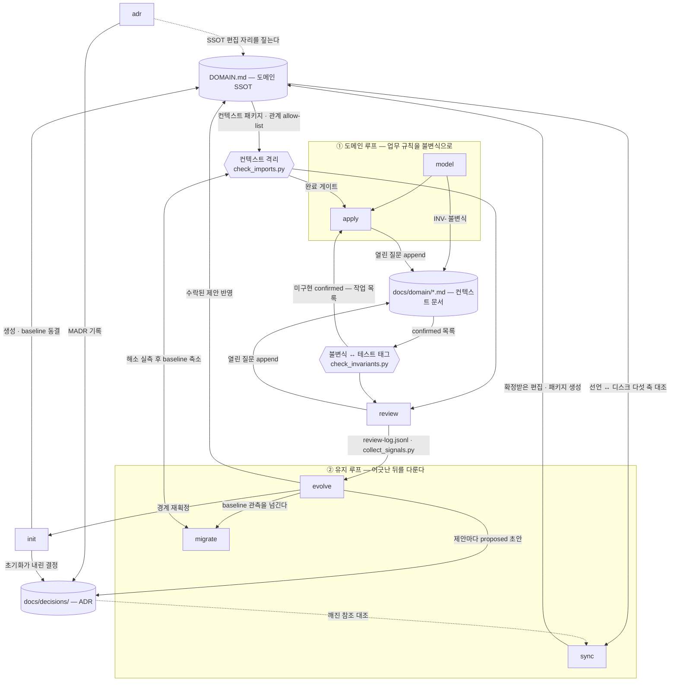

# superdomain

문서 기반 **도메인 거버넌스**(DDD) Claude Code 플러그인.

LLM은 세션마다 프로젝트의 도메인을 처음부터 다시 추측한다. 어제 합의한 컨텍스트 경계도, 왜 이
컨텍스트가 `core`인지도, 주문이 언제 확정으로 넘어가는지도 다음 세션에는 남아 있지 않아 매번
그럴듯하지만 조금씩 다른 답이 나온다. superdomain은 그 추측을 없애기 위해 **결정을 문서에
고정하고, 기계로 확인할 수 있는 것은 기계가 확인하게 하고, 의미론적 판단만 LLM에 남긴다.**
도메인 경계의 진실은 대상 프로젝트 루트의 `DOMAIN.md` 한 파일(SSOT)이고, `parse_domain.py`가 그
문서의 유일한 해석기다.

**언어 범위를 먼저 밝힌다.** 인터뷰·문서·ADR·리뷰는 대상 프로젝트의 언어와 무관하지만, **결정적
검사 둘은 Kotlin·Java 전용이다** — `check_imports.py`는 `.kt`/`.java` 소스의 `package`·`import`를
읽고, `check_invariants.py`는 테스트의 `@Tag("INV-...")` 리터럴을 본다. Python·TypeScript
프로젝트에서도 문서와 리뷰는 그대로 쓸 수 있지만 **기계 강제는 걸리지 않는다.**

이 저장소가 곧 플러그인이자 그것을 배포하는 마켓플레이스다 — 루트의
`.claude-plugin/plugin.json`이 플러그인을, `.claude-plugin/marketplace.json`이 마켓플레이스를
선언하고, 마켓플레이스는 자기 저장소 루트(`"source": "./"`)를 플러그인으로 가리킨다.

## 설치

전제조건은 [Claude Code](https://code.claude.com)와 `python3`뿐이다. 스킬이 부르는 검사
스크립트는 Python 표준 라이브러리만 쓰므로 따로 설치할 패키지가 없다.

### 마켓플레이스에서 설치 (권장)

Claude Code 세션 안에서:

```
/plugin marketplace add Cho-D-YoungRae/superdomain
/plugin install superdomain@superdomain
```

터미널에서도 같은 일을 할 수 있다.

```bash
claude plugin marketplace add Cho-D-YoungRae/superdomain
```

```bash
claude plugin install superdomain@superdomain
```

설치되는 것은 스킬 여덟 개, 서브에이전트 `domain-reviewer`, 세션 시작 훅 하나다. 무엇이 실제로
잡혔는지는 다음으로 확인한다.

```bash
claude plugin details superdomain
```

갱신은 `claude plugin marketplace update superdomain`, 제거는
`claude plugin uninstall superdomain`이다.

### 로컬 개발용 로드

```bash
claude --plugin-dir /path/to/superdomain
```

스킬은 `/superdomain:<스킬명>`으로 노출된다. `SKILL.md` 본문은 핫리로드되지만
`plugin.json`·훅·에이전트를 고쳤다면 `/reload-plugins`가 필요하다.

## 워크플로

스킬 여덟 중 다섯은 루프 둘로 묶인다 — 업무 규칙을 불변식으로 굳혀 코드로 내리는 **도메인 루프**,
선언과 현실이 어긋난 뒤를 다루는 **유지 루프**. 남은 셋은 루프 밖에 있다: `init`이 SSOT를 세우고,
`review`가 변경마다 경계를 보고, `adr`은 결정이 나오는 자리마다 끼어든다. 사각 노드가 스킬이고,
원통은 문서, 육각형은 스킬이 통과해야 하는 결정적 검사다. **실선은 그 문서를 쓰거나 그 결과를
소비하는 흐름이고, 점선은 쓰지 않고 읽기만 하는 관계다** — `adr`은 `DOMAIN.md`를 고치지 않고 고칠
자리를 짚기만 하며, `sync`는 ADR을 읽어 깨진 참조만 대조한다.



**이 그림은 스킬 사이의 흐름이지 검증 장치가 아니다.** 대상 프로젝트의 도메인이 실제로 지켜지는지
판정하는 것은 결정적 검사 둘뿐이다 — `check_imports.py`가 컨텍스트 격리(규칙
`derived.context-isolation`)를, `check_invariants.py`가 `confirmed` 불변식의 테스트 태그 존재를
본다. 그 둘이 볼 수 없는 의미론만 `domain-reviewer`가 읽고, 두 검사와 에이전트가 충돌하면 믿을
것은 검사다.

**관계 표가 격리 검사의 allow-list다.** 한 줄이 여는 것은 **쌍**이고 **방향을 구분하지 않는다** —
`customer-supplier`·`acl` 같은 유형은 설계 의도의 기록이지 허용 방향을 바꾸는 입력이 아니다.

## 언제 어느 스킬을 부르는가

위가 순서라면 이쪽은 계기다 — 상황에서 스킬을 찾는다.

- **아직 `DOMAIN.md`가 없다, 또는 컨텍스트를 신설·병합·분리해 경계를 다시 긋는다** → `init`. 다른
  스킬이 SSOT 부재를 발견해도 여기로 보낸다. 기존 코드의 격리 위반을 동결하는 것도 여기다.
- **업무 규칙이 흐릿해 코드로 옮기기 전에 정리한다** → `model`(인터뷰·이벤트 스토밍·미팅 정리).
- **`confirmed` 불변식에 대응하는 테스트 태그가 없다고 나왔다** → `apply`.
- **되돌리는 비용이 큰 선택을 방금 확정했다, 두 컨텍스트의 직접 참조를 `### 관계` 표로 열려는데
  근거를 가리킬 문서가 없다** → `adr`. 결정이 선언을 바꾸면 `- 분류:`·`- 패키지:`·`- 패턴:`·
  `### 관계` 표 넷 중 어디를 고칠지 짚어 준다(편집은 사용자가 한다).
- **PR·커밋 전에 이 변경이 경계를 넘었는지 본다** → `review`.
- **선언은 했는데 디스크에 패키지가 없다, 이미 선언된 새 컨텍스트의 자리를 올린다,
  리팩터링·ADR 대체 뒤 문서가 따라왔는지 본다, 오랜만에 열어 선언이 아직 사실인지 모르겠다** →
  `sync`. **확정받은 빈 패키지 디렉터리를 직접 만드는 것도 이 스킬이다.** 다만 **컨텍스트를 새로
  등재하는 것은 `sync`가 하지 않는다** — 경계·분류·패키지를 정하는 인터뷰가 필요하고 그 정본은
  `init`이다.
- **분기·릴리스 회고 자리, 또는 같은 지적이 리뷰마다 반복된다** → `evolve`.
- **`docs/domain/baseline.jsonl`이 있고 그 부채를 실제로 줄인다** → `migrate`.

## 지금 있는 것

**없는 것을 있는 것처럼 쓰지 않는 것이 이 플러그인의 제1 원칙이므로, 아래 표에 있는 것이 전부다.**

| 산출물 | 위치 | 하는 일 |
|---|---|---|
| `/superdomain:init` | `skills/init/` | 질문으로 컨텍스트 경계·분류·패키지·관계를 확정하고 `DOMAIN.md`와 파생물(`docs/domain-summary.md`·컨텍스트 맵 생성 구역·ADR)을 만든다. 기존 코드의 격리 위반은 실측해 **동결할지 묻고**, 동결하면 `docs/domain/baseline.jsonl`을 만든다 |
| `/superdomain:model` | `skills/model/` | 인터뷰·이벤트 스토밍·미팅 정리 세 모드로 컨텍스트 문서를 키운다. 불변식은 `INV-<CONTEXT>-NNN`으로 채번되고 `proposed` → `confirmed` 승격은 **항목별 사용자 확정으로만** 일어난다. `DOMAIN.md`는 읽기만 한다 |
| `/superdomain:apply` | `skills/apply/` | 컨텍스트 문서의 `confirmed` 불변식 중 코드에 없는 것을 inside-out으로 구현하고 `@Tag("INV-...")` 테스트를 붙인다. `proposed`는 건드리지 않는다 |
| `/superdomain:adr` | `skills/adr/` | 결정을 MADR로 `docs/decisions/yyyy-MM-dd-slug.md`에 남기고 `accepted`·`superseded` 전이를 양방향 링크로 처리한다. 결정이 SSOT를 함의하면 고칠 자리를 짚고 파서 게이트 재실행을 권한다 |
| `/superdomain:review` | `skills/review/` | 변경을 결정적 검사 둘로 먼저 거른 뒤 의미론 판단만 `domain-reviewer`에 위임하고, 결과를 `docs/domain/review-log.jsonl`에 append한다. 코드는 고치지 않는다 |
| `/superdomain:sync` | `skills/sync/` | 선언과 디스크를 다섯 축으로 대조해 드리프트를 찾고, 항목마다 [패키지 생성 / 코드 수정 / 문서 수정 / 무시]를 제시한다. 방향은 권고하되 확인 없이 확정하지 않고, 대조하지 못한 축은 "0건"이 아니라 "대조하지 않음"으로 남긴다 |
| `/superdomain:evolve` | `skills/evolve/` | `collect_signals.py`의 관측에 `evolution-signals.md`의 임계값·해석을 적용해 **경계 재획정·분류 변경·관계 추가/삭제** 세 갈래의 제안과 `proposed` ADR 초안을 낸다. 임계값을 스스로 만들지 않고, 수락된 제안만 선언·파생물까지 반영한다 |
| `/superdomain:migrate` | `skills/migrate/` | `baseline.jsonl`을 **컨텍스트 쌍 단위 클러스터**로 갚는다. **부채를 줄이는 유일한 경로**이며 한 번에 한 클러스터, 항목 삭제의 근거는 `check_imports.py` 두 실행으로 실측된 해소뿐이다. 비면 파일을 지우고 상환 완료 ADR로 닫는다 |
| `domain-reviewer` 에이전트 | `agents/domain-reviewer.md` | 읽기 전용(Read·Grep·Glob). 전달받은 지식 문서의 `## 규칙` 절과 자유 관측 5범주(경계 누수·유비쿼터스 언어 불일치·애그리거트 우회·불변식 정합·관계 유형 위반)로만 판정한다 |
| SessionStart 훅 | `hooks/hooks.json` → `scripts/session_summary.sh` | cwd에서 git 루트까지 올라가며 `docs/domain-summary.md`를 찾아 세션 컨텍스트로 주입한다. 없으면 조용히 종료한다 |
| 도메인 선언 파서 | `scripts/parse_domain.py` | `DOMAIN.md`의 필수 결정 누락·비정규 값·깨진 참조·퇴역 라벨을 라인 번호와 함께 보고한다. **도메인 선언의 유일한 해석기**이고, `DOMAIN.md`를 읽는 나머지 셋은 전부 이 모듈로만 문서를 읽는다 |
| 컨텍스트 격리 검사기 | `scripts/check_imports.py` | `.kt`/`.java` 소스의 `package`·`import`만 읽어 컨텍스트 경계를 넘는 참조가 관계 표에 열려 있는지 본다. `baseline.jsonl`이 있으면 매칭 위반을 `[기존 부채]`로 강등한다(읽기만 한다) |
| 불변식 대조 검사기 | `scripts/check_invariants.py` | 컨텍스트 문서의 `confirmed` 불변식과 테스트의 `@Tag("INV-...")` 리터럴을 대조한다. 태그가 있을 수 없는 환경(테스트 소스 0건)은 클린이 아니라 `검사 불능`이다 |
| 진화 신호 수집기 | `scripts/collect_signals.py` | git log·`review-log.jsonl`·`baseline.jsonl` 이력에서 신호 5종을 **관측만** 한다. 임계값과 해석은 넣지 않는다 — 그 정본은 `evolution-signals.md`이고 적용은 `evolve`다 |
| 인덱스 생성기 | `scripts/build_index.py` | `references/knowledge/`를 스캔해 `references/INDEX.md`를 다시 만든다 |
| 거버넌스 문서 5종 | `references/governance/` | 도메인 선언 템플릿·컨텍스트 문서 표준·ADR·진화 신호·지식 문서 표준의 정본 |
| 지식 문서 12종 | `references/knowledge/` | strategic 4 · tactical 5 · patterns 3. 전부 성숙(draft 0). INDEX를 거쳐 필요한 것만 선별해 읽는다 |
| `study` 스킬 | `.claude/skills/study/` | 이 저장소 전용. 지식 베이스를 키운다(아래 참조) |

직접 실행 — 앞의 셋은 검증이고 `collect_signals.py`는 관측이다. 검증 중에서 `DOMAIN.md` 자체를
보는 가장 넓은 게이트는 `parse_domain.py`다: 나머지 셋이 전부 그 모듈 하나로 문서를 읽으므로,
여기서 거부되는 문서는 어느 스크립트로도 통과하지 못한다.

```bash
python3 scripts/parse_domain.py DOMAIN.md        # 0=OK, 1=해석 오류, 2=사용법 오류
python3 scripts/check_imports.py DOMAIN.md       # 0=위반 없음, 1=위반, 2=해석 불가·사용법 오류
python3 scripts/check_invariants.py DOMAIN.md    # 0=위반 없음, 1=위반·검사 불능, 2=해석 불가·사용법 오류
python3 scripts/collect_signals.py DOMAIN.md     # 0=산출, 1=산출 불가(사유 고지), 2=사용법 오류
```

**네 스크립트의 exit 의미가 같지 않다.** `check_imports.py`·`check_invariants.py`의 1은 정상 판정
결과(위반 발견)이고, `parse_domain.py`의 1은 해석 실패, `collect_signals.py`의 1은 신호를 만들지
못했다는 뜻이다. CI에서 같게 다루지 않는다. 그리고 `check_invariants.py`의 1은 **위반과 `검사
불능`을 겸하므로** exit만 보고 건수를 세지 않는다. 부가 플래그는 `check_imports.py`가 `--json`,
`check_invariants.py`가 `--json`·`--context <이름>`, `collect_signals.py`가 `--json`·
`--since <rev|날짜>`다. `parse_domain.py`는 플래그를 받지 않는다.

### 아직 시행되지 않는 것

**산출물 쪽에 "아직 없는 것"은 남아 있지 않다.** 남는 것은 문서가 적어 두고 기계가 아직 강제하지
않는 조항 하나 — 템플릿 마커의 버전에 따라 해석 규칙을 고르는 분기다
(`references/governance/domain-template.md` §6). 오늘은 `v1`뿐이라 분기할 것이 없고, 그 항목은
**침묵하지 않는다**: 파서가 아는 것보다 높은 버전을 단 문서는 통과하지 않고 거부된다.

반대로 규칙이 아무것도 검사하지 않는 **침묵**은 도구가 담당한다. "위반 없음"과 "검사한 것이
0개"를 갈라 주는 장치는 셋이다.

- `check_imports.py`의 네 층위 — 컨텍스트마다 귀속된 소스가 0건이면 `[0건 경고]`, 검사가
  성립하지 않았으면 푸터의 `생략:` 줄(경로 부재·경로가 디렉터리가 아님·소스 0건·있는 소스를 전부
  읽지 못함의 **네 갈래를 뭉뚱그리지 않는다**), `package` 선언이 여러 건이라 귀속을 믿을 수 없으면
  `ambiguous_package`, 파싱하지 못한 파일은 `읽지 못한 소스`.
- `check_invariants.py`의 `검사 불능` — 테스트 소스가 0건이면 태그가 있을 수 없으므로 클린(0)으로
  통과시키지 않는다.
- `parse_domain.py`의 **퇴역 라벨 명시 거부** — 구 템플릿에서 넘어온 라벨 6종은 조용히 버려지지
  않고 오류가 된다. 조용히 버리면 사용자는 자기가 쓴 결정이 강제되고 있다고 믿는다.

**두 검사기가 보는 것이 경계의 전부는 아니다.** `check_imports.py`는 `import` 문 없이 쓰이는
참조(같은 패키지 안의 타입, 본문에 그대로 쓴 완전 수식 이름)를 보지 못하고,
`check_invariants.py`는 `@Tag` 리터럴의 **존재**만 볼 뿐 그 테스트가 불변식을 실제로 단언하는지는
모른다. 이 사각을 대신 덮어 줄 다른 강제 장치는 없고, 그래서 두 스크립트는 그 한계를 리포트 푸터에
함께 출력한다. 그 자리를 읽는 것이 `domain-reviewer`의 몫이다.

그리고 동결을 선언한 프로젝트에서는 baseline 래칫이 기존 부채와 신규 위반을 가른다 — **동결은
`init`, 소비는 `check_imports.py`(읽기만), 축소는 `migrate`뿐이다.**

## 문서 예시는 어디에 있나

이 저장소는 플러그인이지 거버넌스 대상 프로젝트가 아니라서 루트에 `DOMAIN.md`가 없다. 예시는 정본
안에 있고, 그대로 복사해 파서를 통과하는 블록이 스켈레톤이다.

| 보려는 것 | 위치 |
|---|---|
| `DOMAIN.md` 한 벌 | `references/governance/domain-template.md` §2 — 프로젝트 둘·컨텍스트 셋이 든 완본(명시 패키지·복수 위치 패키지·관계 표·생성 구역 포함) |
| 라벨·표의 정확한 문법과 괄호 주석 규칙 | 같은 문서 §3 |
| 컨텍스트가 사는 패키지의 규약 기본값 | 같은 문서 §5.2 |
| `baseline.jsonl` 형식과 래칫 규율 | 같은 문서 §5.4 |
| `docs/domain/<컨텍스트>.md` | `references/governance/domain-doc-template.md` §3 |
| ADR 본문 | `references/governance/adr-template.md` §4 |

## 테스트

```bash
python3 -m unittest discover -s tests
```

345개 테스트가 돈다. **`pytest`를 쓰지 않는다** — 스크립트도 테스트도 Python 표준 라이브러리에만
의존하므로 설치할 것이 없다(PyYAML도 쓰지 않는다. frontmatter는 제한 문법 자체 파서로 읽는다).

## 지식 추가 절차

지식 베이스는 `references/knowledge/<topic>/<key>.md` **정확히 한 단계**다. 더 깊이 중첩하면
`build_index.py`가 오류로 거부한다.

**`study` 스킬로** — 이 저장소에서 "지식 추가", "이 문서 보완해줘", `/study`라고 요청하면 INDEX와
대조해 신규 작성 또는 기존 문서 보완을 진행하고 INDEX 재생성까지 한다. 이 저장소 로컬 스킬이라
대상 프로젝트에는 배포되지 않는다.

**손으로 할 때** — 세 단계가 전부다.

1. `references/knowledge/<topic>/<새파일>.md`를 만든다. `<topic>`은 기존 디렉터리
   (`strategic`, `tactical`, `patterns`) 중 하나이거나 새로 만든 하나다. 파일명이 곧 `key`이고
   `knowledge/` 전체에서 유일해야 한다.
2. 맨 위에 frontmatter로 `summary` 한 줄을 넣는다. 유일한 필수 필드다.
   ```markdown
   ---
   summary: 한 줄 요약
   read_when: [init, review]
   ---
   ```
3. `python3 scripts/build_index.py`를 실행해 `references/INDEX.md`를 갱신한다.

문서는 본문에 `## 적용 기준`과 `## 규칙` **레벨 2 헤딩이 둘 다** 생길 때까지 `draft`로 등재된다.
**draft 문서는 배경 설명으로 인용해도 되지만 판정 근거로 삼을 수 없다** — 완벽보다 존재가
우선이므로 얇은 초안을 올리는 것은 정상이고, 대신 그것이 판정에 쓰이지 않도록 막는 장치가 draft
플래그다. 자세한 규칙(frontmatter 제한 문법, 분량, 승격 절차)은
`references/governance/knowledge-doc-template.md`에 있다.

## 저장소 구조

```
.claude-plugin/plugin.json   플러그인 매니페스트
.claude-plugin/marketplace.json
                             마켓플레이스 매니페스트 — 이 저장소 루트를 플러그인으로 배포한다
.claude/skills/study/        이 저장소 전용 스킬 (배포되지 않음)
skills/init|model|apply|adr|review|sync|evolve|migrate/
                             /superdomain:<스킬명> (8종)
agents/domain-reviewer.md    review가 의미론 판단만 위임하는 읽기 전용 에이전트
hooks/hooks.json             SessionStart 훅 등록
scripts/
  parse_domain.py            DOMAIN.md 파서 — 도메인 선언의 유일한 해석기
  check_imports.py           컨텍스트 격리 검사기 — 해석 결과의 첫 소비자
  check_invariants.py        불변식 ↔ 테스트 태그 대조 검사기
  collect_signals.py         진화 신호 수집기 — 관측만 하고 임계값은 갖지 않는다
  build_index.py             references/INDEX.md 생성기
  session_summary.sh         SessionStart 훅 본체
references/
  INDEX.md                   생성물 — 직접 고치지 말고 build_index.py를 다시 돌린다
  governance/                도메인 선언 템플릿·컨텍스트 문서 표준·ADR·진화 신호·지식 문서 표준의 정본
  knowledge/<topic>/         DDD 지식 문서 (INDEX 경유 선별 로드)
tests/                       python3 -m unittest
docs/superpowers/            설계 스펙과 구현 계획
```

## 대상 프로젝트에 생기는 파일

| 경로 | 무엇 | 쓰는 스킬 |
|---|---|---|
| `DOMAIN.md` | 경계·분류·패키지·관계의 SSOT | `init`(생성) · `sync`·`evolve`(확정받은 편집) |
| `docs/domain-summary.md` | 세션 훅이 주입하는 30줄 이하 요약 | `init`·`sync`·`evolve`(재생성) |
| `docs/domain/<컨텍스트>.md` | 불변식·애그리거트·값 객체·도메인 이벤트·도메인 서비스·열린 질문. 컨텍스트가 하나뿐이면 `docs/domain.md`. **용어 정의는 쓰지 않는다** — 보편언어는 별도 용어집의 몫이다 | `model`(본문) · `apply`·`review`(열린 질문 append) |
| `docs/domain/baseline.jsonl` | 동결된 격리 위반 | `init`(동결) · `migrate`(축소) |
| `docs/domain/review-log.jsonl` | 리뷰 판정 이력 — `collect_signals.py`의 입력 | `review`(append) |
| `docs/decisions/yyyy-MM-dd-slug.md` | MADR 결정 기록 | `adr` · `init`(초기화가 실제로 내린 결정) · `evolve`(제안마다 `proposed` 초안) |
| `docs/conventions/<key>.md` | 선언에 자리가 없는 팀 규약. 반복되는 의미론 지적의 착지점 | 사용자(스킬이 승격 여부를 제안만 한다) |
