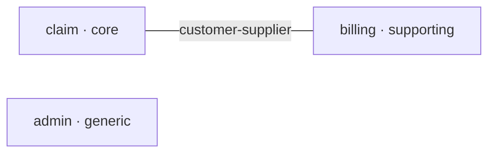

# superdomain 0.3.0 — 산출물 배치 이전과 리뷰 반영 Implementation Plan

> **For agentic workers:** REQUIRED SUB-SKILL: Use superpowers:subagent-driven-development (recommended) or superpowers:executing-plans to implement this plan task-by-task. Steps use checkbox (`- [ ]`) syntax for tracking.

**Goal:** 대상 프로젝트에 생기는 superdomain 산출물을 `docs/superdomain/` 아래로 옮기고, 2026-09-26 전수 리뷰에서 반영하기로 한 결함을 고쳐 0.3.0으로 내보낸다.

**Architecture:** 새 모듈 `scripts/layout.py`가 산출물 경로 지식을 독점하고, 네 스크립트는 `docs/superdomain/DOMAIN.md` 경로 인자에서 프로젝트 루트를 세 단계 위로 잡는다. 옛 배치(0.2.x)는 읽지 않고 감지해 exit 2와 `git mv` 안내로 멈춘다. 스킬 8종에 복붙된 공통 절차는 새 정본 `skill-protocol.md`·`derived-artifacts.md`로 모으고 스킬은 한 줄로 지목한다.

**Tech Stack:** Python 3 표준 라이브러리(외부 의존 없음), bash, `unittest`, Markdown(스킬·정본), Claude Code 플러그인 매니페스트.

**Spec:** `docs/superpowers/specs/2026-09-28-superdomain-layout-and-fixes-design.md` — 계획은 스펙을 근거로 삼는다. 실행자는 두 문서를 함께 읽는다.

## Global Constraints

- 스크립트·테스트는 **Python 표준 라이브러리만** 쓴다. `pytest`·PyYAML 금지.
- 테스트 명령은 언제나 `python3 -m unittest discover -s tests` (저장소 루트에서).
- 산출물 경로 문자열(`docs/superdomain/...`, 옛 `docs/domain/...` 등)은 **스크립트 중 `scripts/layout.py`에만** 둔다. 다른 스크립트는 layout 모듈의 상수·프로퍼티만 쓴다.
- 새 배치: `docs/superdomain/{DOMAIN.md, summary.md, contexts/<컨텍스트>.md, adr/yyyy-MM-dd-slug.md, conventions/<key>.md, state/baseline.jsonl, state/review-log.jsonl}`.
- 표시 경로·`- 경로:`·`baseline.jsonl`의 `path`는 **프로젝트 루트 기준** POSIX 상대경로다(루트 = `DOMAIN.md`의 세 단계 위).
- exit 계약: `parse_domain` 0 OK / 1 해석 오류 / 2 사용법·배치 오류. `check_imports` 0 / 1 위반 / 2 해석 불가·사용법·배치 오류. `check_invariants` 0 / 1 위반·검사 불능 / 2 해석 불가·사용법·배치 오류. `collect_signals` 0 산출 / 1 산출 불가 / 2 사용법·배치 오류.
- **침묵하지 않는다**: 검사하지 못한 것을 "0건"으로 보고하지 않는다. 새 코드도 같은 원칙을 지킨다.
- 사용자에게 보이는 문면·주석·커밋 메시지는 한국어. 주변 코드의 주석 밀도와 어조를 따른다.
- 커밋 메시지 형식: `type(scope): 한국어 요약` + 빈 줄 + 필요 시 본문 + 빈 줄 + `Co-Authored-By: Claude Opus 5.5 <noreply@anthropic.com>`. breaking change는 `type!:`.
- 작업 브랜치: `feat/docs-superdomain-layout` (이미 생성됨). `main`에 직접 커밋하지 않는다.
- 각 단계(§8의 1~5)가 끝나면 멈춰서 사용자 확인을 받는다.
- 셸 변수는 명령 블록 사이에 유지되지 않는다. `$SCRATCH`·`$REPO_ROOT`·`$SUPER`를 쓰는 블록은 첫 줄에서 다시 정의한다: `SCRATCH=/private/tmp/claude-501/-Users-choyoungrae-Projects-superdomain/d9f114e0-f508-47d3-a1c5-3ac2c75b08f4/scratchpad`, `REPO_ROOT=/Users/choyoungrae/Projects/superdomain`(= `SUPER`).

---

## File Structure

| 경로 | 상태 | 책임 |
|---|---|---|
| `scripts/layout.py` | 신설 | 산출물 경로 상수, `Layout`, `from_domain_path`, `legacy_leftovers`, 이행 안내 문면 |
| `scripts/parse_domain.py` | 수정 | 코드 펜스·라벨 자리 규칙, 퇴역 라벨 범위, BOM, CLI 배치 검증 |
| `scripts/check_imports.py` | 수정 | BOM, `from_context`/`to_context`, 요약 문면, layout 전환 |
| `scripts/check_invariants.py` | 수정 | BOM, 한계 문면, `contexts/` 전환, 단일 문서 특례 삭제 |
| `scripts/collect_signals.py` | 수정 | git 인코딩, BOM, layout 전환, baseline 이력의 옛 경로 병합 |
| `scripts/build_index.py` | 수정 | 성숙 판정(본문 필요), `read_when` 검증 |
| `scripts/session_summary.sh` | 수정 | 새 요약 경로, 옛 배치 안내, 읽기 실패 침묵 |
| `hooks/hooks.json` | 수정 | 명령 경로 따옴표 |
| `tests/test_layout.py` | 신설 | layout 계약 |
| `tests/test_*.py` (6개) | 수정 | 임시 디렉터리 위생, 새 배치, 신규 회귀 테스트 |
| `references/governance/skill-protocol.md` | 신설 | 스킬 공통 규약·라우팅 정본 |
| `references/governance/derived-artifacts.md` | 신설 | 파생물 재생성·선언 편집 규율 정본 |
| `references/governance/*.md` (5종) | 수정 | 경로, 라벨 자리 규칙, 신호 3 한계, 성숙 판정 |
| `references/knowledge/strategic/*.md` (3종) | 수정 | `read_when`, 규칙 절 정리, 용어집 이름 |
| `skills/*/SKILL.md` (8종) | 수정 | description·게이트·중복 제거·경로·개별 정정 |
| `agents/domain-reviewer.md` | 수정 | 출력 필드 분리, 경로, 잔재 |
| `README.md` | 수정 | 경로·라우팅·exit 표·테스트 수·study 표현 |
| `CHANGELOG.md` | 신설 | 0.3.0 변경과 이행 절차 |
| `LICENSE` | 신설 | MIT |
| `.claude-plugin/plugin.json` | 수정 | 0.3.0, license |
| `.github/workflows/ci.yml` | 신설 | unittest |
| `docs/superpowers/{specs,plans}/*.md` (이번 두 문서 제외) | 수정 | 보관 배너 |
| `.gitignore`, `.gitkeep` 6개, `tests/tmp*` | 삭제/수정 | 저장소 위생 |

---

# 단계 1 — 스크립트 수정 (배치와 무관)

### Task 1: 테스트 임시 디렉터리 위생

**Files:**
- Modify: `tests/test_build_index.py:52-66`
- Modify: `tests/test_check_imports.py:77-83`
- Modify: `tests/test_check_invariants.py:79-85`
- Modify: `tests/test_collect_signals.py:81-94`
- Modify: `tests/test_parse_domain.py:28-41`
- Modify: `tests/test_session_summary.py:20-30`
- Modify: `.gitignore`
- Delete: `tests/tmp*` (빈 디렉터리 52개)

**Interfaces:**
- Produces: 모든 테스트가 시스템 temp에 `superdomain-` 접두 디렉터리를 만들고 `addCleanup`으로 지운다. `self.tmpdir`는 `resolve()`된 경로다(macOS `/var` → `/private/var` 심링크 때문에 git이 돌려주는 경로와 비교가 어긋나지 않게).

- [ ] **Step 1: `tests/test_check_imports.py`의 `CheckTestCase` 교체**

```python
class CheckTestCase(unittest.TestCase):
    def setUp(self):
        # 시스템 temp에 만들고 삭제는 addCleanup에 건다 — setUp이 중간에 실패해도 정리된다.
        # 저장소 안(tests/)에 두면 정리에 실패한 디렉터리가 작업 트리에 쌓인다.
        self.tmpdir = Path(tempfile.mkdtemp(prefix="superdomain-")).resolve()
        self.addCleanup(shutil.rmtree, self.tmpdir, True)
        self.domain_path = self.tmpdir / "DOMAIN.md"
```

기존 `tearDown` 메서드(`shutil.rmtree(self.tmpdir, ignore_errors=True)`)는 삭제한다.

- [ ] **Step 2: `tests/test_check_invariants.py`의 `InvariantTestCase`에 같은 교체**

```python
class InvariantTestCase(unittest.TestCase):
    def setUp(self):
        self.tmpdir = Path(tempfile.mkdtemp(prefix="superdomain-")).resolve()
        self.addCleanup(shutil.rmtree, self.tmpdir, True)
        self.domain_path = self.tmpdir / "DOMAIN.md"
```

`tearDown` 삭제.

- [ ] **Step 3: `tests/test_collect_signals.py`의 `SignalsTestCase.setUp` 교체**

```python
    def setUp(self):
        self.tmpdir = Path(tempfile.mkdtemp(prefix="superdomain-")).resolve()
        self.addCleanup(shutil.rmtree, self.tmpdir, True)
        self.repo = self.tmpdir / "repo"
        self.repo.mkdir()
        self.domain_path = self.repo / "DOMAIN.md"
        subprocess.run(["git", "-c", "init.defaultBranch=main", "init", "-q", str(self.repo)],
                       check=True, capture_output=True)
        for key, value in (("user.email", "t@example.com"), ("user.name", "T"),
                           ("commit.gpgsign", "false")):
            self.git("config", key, value)
```

`tearDown` 삭제. `NotCollectableTest.test_outside_git_repository`의 docstring "저장소 밖이어야 하므로 tests/ 아래(플러그인 저장소 안)를 쓸 수 없다."는 그대로 둔다(여전히 참이다).

- [ ] **Step 4: `tests/test_parse_domain.py`의 `DomainTextCase` 교체**

```python
class DomainTextCase(unittest.TestCase):
    """문서 텍스트를 임시 파일에 써서 파싱하는 공통 도우미.

    임시 디렉터리는 시스템 temp에 만들고 addCleanup으로 지운다 — 실패한 테스트도 흔적을
    남기지 않는다.
    """

    def _write(self, text, name="DOMAIN.md"):
        tmpdir = Path(tempfile.mkdtemp(prefix="superdomain-")).resolve()
        self.addCleanup(shutil.rmtree, tmpdir, True)
        path = tmpdir / name
        path.parent.mkdir(parents=True, exist_ok=True)
        path.write_text(text, encoding="utf-8")
        return path
```

(`_parse_text`·`_messages`·`assertHasError`는 그대로.)

- [ ] **Step 5: `tests/test_session_summary.py`의 `setUp`/`tearDown` 교체**

```python
    def setUp(self):
        """Create isolated temp directory for each test."""
        self.tmpdir = Path(tempfile.mkdtemp(prefix="superdomain-")).resolve()
        self.addCleanup(shutil.rmtree, self.tmpdir, True)
```

`tearDown` 삭제. 파일 상단의 `TESTS_DIR` 상수가 더 쓰이지 않으면 삭제한다.

- [ ] **Step 6: `tests/test_build_index.py`의 `TestScan` 교체**

```python
class TestScan(unittest.TestCase):
    def _make(self, files):  # {상대경로: 내용} → 임시 references/ 디렉터리
        d = Path(tempfile.mkdtemp(prefix="superdomain-")).resolve()
        self.addCleanup(shutil.rmtree, d, True)
        for rel, content in files.items():
            p = d / "knowledge" / rel
            p.parent.mkdir(parents=True, exist_ok=True)
            p.write_text(content, encoding="utf-8")
        return d
```

기존 `setUp`(`self._tmp_dirs = []`)·`tearDown` 삭제.

- [ ] **Step 7: 남은 `TESTS_DIR` 기반 mkdtemp가 없는지 확인**

Run: `git grep -n "mkdtemp(dir=" tests/`
Expected: 출력 없음.

- [ ] **Step 8: 잔여 빈 디렉터리와 .gitignore 줄 제거**

Run: `find tests -maxdepth 1 -type d -name 'tmp*' -empty -delete && find tests -maxdepth 1 -name 'tmp*' | wc -l`
Expected: `0`

`.gitignore`에서 `tests/tmp*/` 줄을 지운다. 남는 내용:

```
.superpowers/
__pycache__/
```

- [ ] **Step 9: 전체 테스트**

Run: `python3 -m unittest discover -s tests 2>&1 | tail -3 && find tests -maxdepth 1 -name 'tmp*' | wc -l`
Expected: `Ran 345 tests` / `OK` / `0`

- [ ] **Step 10: 커밋**

```bash
git add .gitignore tests/
git commit -m "$(cat <<'EOF'
test: 임시 디렉터리를 시스템 temp로 옮기고 정리를 addCleanup에 건다

setUp이 중간에 실패하면 tearDown이 불리지 않아 tests/tmp* 빈 디렉터리 52개가 남아 있었다.

Co-Authored-By: Claude Opus 5.5 <noreply@anthropic.com>
EOF
)"
```

---

### Task 2: BOM — 모든 텍스트 입력을 `utf-8-sig`로 읽는다

**Files:**
- Modify: `scripts/check_imports.py:240,288`
- Modify: `scripts/check_invariants.py:289,401`
- Modify: `scripts/parse_domain.py:684`
- Modify: `scripts/collect_signals.py:434`
- Test: `tests/test_check_imports.py`, `tests/test_parse_domain.py`, `tests/test_check_invariants.py`, `tests/test_collect_signals.py`

**Interfaces:**
- Produces: 네 스크립트 모두 파일 선두 BOM(U+FEFF)을 벗기고 읽는다. 줄 번호는 바뀌지 않는다.

> 스펙 §4.1은 소스 두 곳만 적었지만, 같은 결함(선두 U+FEFF가 `^\s*`·`json.loads`를 깨뜨림)이 `DOMAIN.md` 첫 줄 마커, `baseline.jsonl`, `review-log.jsonl`에도 있다. 범위를 모든 텍스트 입력으로 넓힌다(스펙 §4.1을 이 계획과 같은 커밋에서 갱신했다).

- [ ] **Step 1: 실패하는 테스트 — check_imports**

`tests/test_check_imports.py`의 `class TestSourceParsing` 바로 뒤에 추가:

```python
class TestEncoding(CheckTestCase):
    """저장 인코딩의 변형(BOM·CRLF)이 귀속과 줄 번호를 바꾸지 않는다."""

    def test_bom_source_is_attributed_and_judged(self):
        # 첫 줄에 BOM이 붙으면 `^\s*package`가 매칭되지 않아 파일이 어느 컨텍스트에도 귀속되지
        # 않았다 — 위반이 어느 채널에도 나타나지 않는 침묵이다(2026-09-26 재현).
        self.two_contexts()
        self.src(LEAKY, "package com.acme.claim\n\nimport com.acme.admin.AdminUser\n\n"
                        "class Leaky\n")
        violation = self.assert_violation(self.check(), needle="AdminUser", count=1)
        self.assertEqual((violation.path, violation.line), (LEAKY, 3))

    def test_crlf_source_keeps_line_numbers(self):
        # 회귀 방지 — 수정 전에도 통과한다(캡처 그룹이 `\r`을 담지 않는다).
        self.two_contexts()
        self.src(LEAKY, "package com.acme.claim\r\n\r\nimport com.acme.admin.AdminUser\r\n\r\n"
                        "class Leaky\r\n")
        violation = self.assert_violation(self.check(), needle="AdminUser", count=1)
        self.assertEqual(violation.line, 3)
        self.assertNotIn("\r", violation.message)

    def test_bom_baseline_is_read(self):
        self.leaky_tree()
        path = self.baseline(self.entry(RULE_ID, LEAKY))
        path.write_text("" + path.read_text(encoding="utf-8"), encoding="utf-8")
        report = self.check()
        self.assertEqual(report.errors, [])
        self.assertEqual([(v.rule_id, v.path) for v in report.debt], [(RULE_ID, LEAKY)])
```

- [ ] **Step 2: 실패하는 테스트 — parse_domain**

`tests/test_parse_domain.py`의 `class TestTemplateMarker` 바로 앞에 추가:

```python
class TestEncoding(DomainTextCase):
    def test_bom_before_marker_on_first_line_is_accepted(self):
        # 제목 줄을 빼 마커가 첫 줄이 되게 한다. BOM이 `^\s*<!--`를 깨뜨리면 '형식이 올바르지
        # 않은 마커'로 거부된다 — 윈도우 에디터로 저장한 문서가 이유 없이 막힌다.
        text = "" + MINIMAL.split("\n", 1)[1]
        d = self._parse_text(text)
        self.assertEqual(d.errors, [])
        self.assertEqual([c.name for c in d.contexts], ["claim"])
```

- [ ] **Step 3: 실패하는 테스트 — collect_signals**

`tests/test_collect_signals.py`의 `ReviewLogTest`에 추가:

```python
    def test_bom_on_first_line_is_not_a_broken_line(self):
        self.base()
        self.log("" + review_line("a.one", CLAIM_KT))
        self.commit("log")
        log = self.collect().review_log
        self.assertEqual(log.broken, [])
        self.assertEqual([(entry.rule, entry.count) for entry in log.rules], [("a.one", 1)])
```

- [ ] **Step 4: 회귀 방지 테스트 — check_invariants**

`tests/test_check_invariants.py`의 `class TestTagScan`에 추가(수정 전에도 통과한다 — `RE_TAG`가 줄 머리에 묶이지 않으므로):

```python
    def test_bom_documents_and_sources_are_read(self):
        self.domain()
        self.doc("claim", "" + domain_doc(row("INV-CLAIM-001", "confirmed")))
        path = self.tagged("INV-CLAIM-001")
        path.write_text("" + path.read_text(encoding="utf-8"), encoding="utf-8")
        self.assert_clean(self.check())
```

- [ ] **Step 5: 실패 확인**

Run: `python3 -m unittest tests.test_check_imports.TestEncoding tests.test_parse_domain.TestEncoding tests.test_collect_signals.ReviewLogTest.test_bom_on_first_line_is_not_a_broken_line -v 2>&1 | tail -15`
Expected: `test_bom_source_is_attributed_and_judged`, `test_bom_baseline_is_read`, `test_bom_before_marker_on_first_line_is_accepted`, `test_bom_on_first_line_is_not_a_broken_line` FAIL. `test_crlf_source_keeps_line_numbers` PASS.

- [ ] **Step 6: 구현 — 인코딩 교체**

| 파일:줄 | 변경 |
|---|---|
| `scripts/check_imports.py:240` (`_read_source`) | `text = path.read_text(encoding="utf-8-sig")` |
| `scripts/check_imports.py:288` (`_load_baseline`) | `text = path.read_text(encoding="utf-8-sig")` |
| `scripts/check_invariants.py:289` (`_collect`) | `text = doc.path.read_text(encoding="utf-8-sig")` |
| `scripts/check_invariants.py:401` (`_scan_tags`) | `text = path.read_text(encoding="utf-8-sig")` |
| `scripts/parse_domain.py:684` (`parse_domain`) | `text = path.read_text(encoding="utf-8-sig")` |
| `scripts/collect_signals.py:434` (`_read_lines`) | `return (root / relpath).read_text(encoding="utf-8-sig", errors="replace").splitlines()` |

`check_imports.py`의 `_read_source` 위 주석 블록이 없으므로 `_read_source` 첫 줄에 한 줄 주석을 단다:

```python
        # utf-8-sig: 선두 BOM이 남으면 첫 줄의 `package`가 `^\s*`에 걸리지 않아 파일이 통째로 귀속을 잃는다.
```

- [ ] **Step 7: 통과 확인**

Run: `python3 -m unittest discover -s tests 2>&1 | tail -3`
Expected: `Ran 351 tests` / `OK`

- [ ] **Step 8: 커밋**

```bash
git add scripts/ tests/
git commit -m "$(cat <<'EOF'
fix: 선두 BOM이 있는 입력을 utf-8-sig로 읽는다

BOM으로 시작하는 Kotlin 소스는 package 선언이 매칭되지 않아 격리 위반이 누락되고 exit 0으로
통과했다. DOMAIN.md 첫 줄 마커, baseline.jsonl, review-log.jsonl도 같은 이유로 깨졌다.

Co-Authored-By: Claude Opus 5.5 <noreply@anthropic.com>
EOF
)"
```

---

### Task 3: `DOMAIN.md` — 코드 펜스와 라벨 자리 규칙, 퇴역 라벨 범위

**Files:**
- Modify: `scripts/parse_domain.py` (정규식 블록 `:121-138`, `_apply_label` `:235-248`, `_parse_document` `:375-449`)
- Test: `tests/test_parse_domain.py`

**Interfaces:**
- Produces: `parse_domain.RE_FENCE`, `parse_domain._retired_label_error(key, lineno) -> ParseError`. 파싱 의미 — 라벨은 섹션 머리(헤딩 다음 첫 `###` 전)에서만 적용, 펜스 안은 전부 무시, 닫히지 않은 펜스는 오류, 퇴역 라벨은 라벨 자리 전체(문서 머리·모르는 `##` 섹션 머리 포함)에서 거부.

- [ ] **Step 1: 실패하는 테스트**

`tests/test_parse_domain.py`의 `class TestParenComments` 바로 앞에 추가:

```python
class TestFreeTextIsolation(DomainTextCase):
    """템플릿 밖의 서술은 파싱 결과를 바꾸지 않는다(domain-template §1).

    라벨은 섹션 머리에서만 읽고, 코드 펜스 안은 어디서든 헤딩·라벨·표로 해석하지 않는다.
    """

    def test_label_under_subheading_is_free_text(self):
        d = self._parse_text(MINIMAL + "\n### 근거\n- 패키지: com.legacy.claim\n")
        self.assertEqual(d.errors, [])
        self.assertEqual(d.contexts[0].packages, [])

    def test_label_inside_fence_is_ignored(self):
        # 2026-09-26 재현: 펜스 안의 라벨이 OK / exit 0인 채 컨텍스트 패키지를 바꿨다.
        d = self._parse_text(MINIMAL + "```\n- 패키지: com.legacy.claim\n```\n")
        self.assertEqual(d.errors, [])
        self.assertEqual(d.contexts[0].packages, [])

    def test_heading_inside_fence_is_ignored(self):
        text = MINIMAL + "\n### 메모\n```markdown\n## 컨텍스트: ghost\n- 분류: core\n```\n"
        d = self._parse_text(text)
        self.assertEqual(d.errors, [])
        self.assertEqual([c.name for c in d.contexts], ["claim"])

    def test_labels_after_a_closed_fence_still_apply(self):
        d = self._parse_text(MINIMAL + "~~~~\n- 패키지: x.y\n~~~~~\n- 패턴: cqrs\n")
        self.assertEqual(d.errors, [])
        self.assertEqual(d.contexts[0].packages, [])
        self.assertEqual(d.contexts[0].patterns, ["cqrs"])

    def test_fence_closes_only_with_the_same_character(self):
        d = self._parse_text(MINIMAL + "```\n~~~\n- 패키지: x.y\n```\n")
        self.assertEqual(d.errors, [])
        self.assertEqual(d.contexts[0].packages, [])

    def test_unclosed_fence_is_error(self):
        text = (MINIMAL + "\n### 메모\n```\n열고 닫지 않았다\n\n"
                "## 컨텍스트: billing\n- 분류: supporting\n")
        d = self._parse_text(text)
        self.assertHasError(d, "닫히지 않은 코드 펜스")
```

`class TestRetiredLabels`에 추가:

```python
    def test_retired_label_in_document_head_is_rejected(self):
        text = MINIMAL.replace("<!-- superdomain:template v1 -->\n",
                               "<!-- superdomain:template v1 -->\n- 스타일: hexagonal\n")
        self.assertHasError(self._parse_text(text), "'스타일'")

    def test_retired_label_in_unknown_section_is_rejected(self):
        d = self._parse_text(MINIMAL + "\n## 모듈: core\n- 모듈 구성: multi\n")
        self.assertHasError(d, "'모듈 구성'")

    def test_retired_label_under_subheading_is_free_text(self):
        d = self._parse_text(MINIMAL + "\n### 근거\n- 스타일: 예전엔 hexagonal이었다\n")
        self.assertEqual(d.errors, [])
```

- [ ] **Step 2: 실패 확인**

Run: `python3 -m unittest tests.test_parse_domain.TestFreeTextIsolation tests.test_parse_domain.TestRetiredLabels -v 2>&1 | grep -E "FAIL|ERROR|ok$" | head -20`
Expected: `test_label_under_subheading_is_free_text`, `test_label_inside_fence_is_ignored`, `test_heading_inside_fence_is_ignored`, `test_labels_after_a_closed_fence_still_apply`, `test_fence_closes_only_with_the_same_character`, `test_unclosed_fence_is_error`, `test_retired_label_in_document_head_is_rejected`, `test_retired_label_in_unknown_section_is_rejected` FAIL. `test_retired_label_under_subheading_is_free_text`는 수정 전에는 FAIL이다(`###` 아래 라벨도 거부되고 있었다).

- [ ] **Step 3: 구현 — 정규식과 헬퍼**

`RE_TEMPLATE_MARKER` 정의 바로 뒤에 추가:

```python
# 코드 펜스(``` 또는 ~~~, 3개 이상, 들여쓰기 3칸까지). 여는 줄 뒤에는 정보 문자열(```mermaid)이
# 올 수 있고, 닫는 줄은 같은 문자로 여는 줄 이상의 길이여야 하며 뒤에 아무것도 없어야 한다.
# 펜스 안은 헤딩·라벨·표가 아니다 — 예시로 적은 선언이 진짜 선언을 덮어쓰지 않게 한다.
RE_FENCE = re.compile(r"^\s{0,3}(`{3,}|~{3,})(.*)$")
```

`_apply_label` 바로 위에 추가하고, `_apply_label`의 퇴역 라벨 분기를 이 헬퍼로 바꾼다:

```python
def _retired_label_error(key: str, lineno: int) -> ParseError:
    """구 템플릿 라벨의 명시 거부. 조용히 버리면 사용자는 그 결정이 강제된다고 믿는다."""
    return ParseError(
        lineno,
        f"'{key}'은(는) 구 템플릿(ARCHITECTURE.md)의 라벨입니다 — DOMAIN.md에는 쓸 수 "
        f"없습니다 ({NEW_TEMPLATE_DOC} 참조).",
    )
```

```python
    if key in RETIRED_LABELS:
        errors.append(_retired_label_error(key, lineno))
        return
```

- [ ] **Step 4: 구현 — `_parse_document` 교체**

```python
def _parse_document(text: str) -> Domain:
    """라인 기반 상태 머신으로 문서를 파싱해 Domain을 만든다.

    **템플릿 밖의 서술은 파싱 결과를 바꾸지 않는다**(domain-template §1). 그 약속을 지키는 규칙이
    둘이다 — 라벨은 **섹션 머리**(`##` 헤딩 다음부터 그 섹션의 첫 `###` 전까지)에서만 읽고,
    **코드 펜스 안**은 어디서든 헤딩·라벨·표로 해석하지 않는다. `### 근거` 아래에 예시로 적은
    `- 패키지:`가 진짜 선언을 덮어쓰던 결함(2026-09-26 재현)을 이 둘이 막는다.

    생성 구역 마커(`<!-- ...:generated:... -->` 쌍)는 라벨도 표도 헤딩도 아니므로 다른 주석과
    똑같이 무시된다 — 스킬이 그 사이를 통째로 갈아 끼워도 파싱 결과는 변하지 않는다.
    """
    lines = text.split("\n")
    domain = Domain()
    _check_template_marker(lines, domain.errors)

    current_project = None
    current_context = None
    current_subheading = None
    fence = None          # (문자, 길이, 여는 줄 번호) — 펜스 안에 있는 동안만 채워진다

    i = 0
    n = len(lines)
    while i < n:
        line = lines[i]
        lineno = i + 1

        m_fence = RE_FENCE.match(line)
        if fence is not None:
            if (m_fence and m_fence.group(1)[0] == fence[0]
                    and len(m_fence.group(1)) >= fence[1] and not m_fence.group(2).strip()):
                fence = None
            i += 1
            continue
        if m_fence:
            fence = (m_fence.group(1)[0], len(m_fence.group(1)), lineno)
            i += 1
            continue

        m_project = RE_PROJECT.match(line)
        if m_project:
            current_project = Project(name=m_project.group(1), line=lineno)
            domain.projects.append(current_project)
            current_context = None
            current_subheading = None
            i += 1
            continue

        m_context = RE_CONTEXT.match(line)
        if m_context:
            current_context = Context(name=m_context.group(1), line=lineno)
            domain.contexts.append(current_context)
            current_project = None
            current_subheading = None
            i += 1
            continue

        if RE_H2.match(line):
            # 알려지지 않은 '##' 헤딩(예: '## 컨텍스트 맵') — 섹션 없음(무시 모드)으로 전환.
            current_project = None
            current_context = None
            current_subheading = None
            i += 1
            continue

        m_h3 = RE_H3.match(line)
        if m_h3:
            current_subheading = m_h3.group(1)
            i += 1
            continue

        m_label = RE_LABEL.match(line)
        if m_label and current_subheading is None:
            if current_project is not None or current_context is not None:
                _apply_label(current_project, current_context,
                             m_label.group(1), m_label.group(2), lineno, domain.errors)
            elif m_label.group(1) in RETIRED_LABELS:
                # 문서 머리·모르는 '##' 섹션에는 라벨을 적용할 대상이 없다. 그래도 구 템플릿
                # 라벨은 여기서 거부한다 — 옛 문서의 머리에 남은 '- 스타일:'이 조용히 사라지면
                # 사용자는 그 결정이 아직 강제된다고 믿는다.
                domain.errors.append(_retired_label_error(m_label.group(1), lineno))
            i += 1
            continue

        if current_context is not None and RE_TABLE.match(line):
            block, next_i = _collect_table_block(lines, i)
            _apply_table(current_context, current_subheading, block, lineno, domain.errors)
            i = next_i
            continue

        i += 1

    if fence is not None:
        domain.errors.append(ParseError(
            fence[2],
            "닫히지 않은 코드 펜스입니다 — 이 줄 아래의 헤딩·라벨·표가 전부 무시됩니다. "
            "같은 문자로 된 닫는 펜스를 넣으세요.",
        ))

    if len(domain.projects) == 1:
        only_name = domain.projects[0].name
        for context in domain.contexts:
            if not context.project:
                context.project = only_name

    return domain
```

- [ ] **Step 5: 통과 확인**

Run: `python3 -m unittest discover -s tests 2>&1 | tail -3`
Expected: `Ran 360 tests` / `OK` (기존 `TestGeneratedZoneInsideSection`이 펜스를 포함한 생성 구역 뒤의 라벨을 여전히 같은 컨텍스트에 붙이는지 함께 확인된다)

- [ ] **Step 6: 정본 예시와 noguesstoday 선언이 그대로 통과하는지 확인**

Run:
```bash
python3 - <<'EOF'
import sys; sys.path.insert(0, "scripts")
from pathlib import Path
from parse_domain import parse_domain
lines = Path("references/governance/domain-template.md").read_text(encoding="utf-8").split("\n")
start = lines.index("```markdown") + 1
end = lines.index("```", start)
import tempfile; p = Path(tempfile.mkdtemp()) / "DOMAIN.md"
p.write_text("\n".join(lines[start:end]) + "\n", encoding="utf-8")
for path in (p, Path.home() / "Projects/noguesstoday/DOMAIN.md"):
    d = parse_domain(path)
    print(path.name, [e.message for e in d.errors], len(d.projects), len(d.contexts))
EOF
```
Expected: 두 줄 모두 오류 목록이 `[]`. (§2 스켈레톤은 3-백틱 `` ```markdown `` 펜스다 — 2026-09-28 확인. 스켈레톤 안에는 다른 펜스가 없다.)

- [ ] **Step 7: 커밋**

```bash
git add scripts/parse_domain.py tests/test_parse_domain.py
git commit -m "$(cat <<'EOF'
fix(parse): 라벨은 섹션 머리에서만 읽고 코드 펜스 안은 무시한다

### 근거 아래 펜스에 예시로 적은 '- 패키지:'가 OK / exit 0인 채 컨텍스트 패키지를 바꿨다.
닫히지 않은 펜스는 오류로, 퇴역 라벨은 문서 머리·모르는 섹션에서도 거부한다.

Co-Authored-By: Claude Opus 5.5 <noreply@anthropic.com>
EOF
)"
```

---

### Task 4: 지식 문서 — 성숙 판정과 `read_when` 검증

**Files:**
- Modify: `scripts/build_index.py` (docstring `:1-19`, `MATURE_HEADINGS` 근처, `_is_mature` `:89-96`, `scan_knowledge` `:153-164`)
- Test: `tests/test_build_index.py`

**Interfaces:**
- Produces: `build_index.READ_WHEN_VALUES = ("init", "model", "apply", "adr", "review", "sync", "evolve", "migrate")`, `build_index._has_body(lines, heading) -> bool`.

- [ ] **Step 1: 실패하는 테스트**

`tests/test_build_index.py`의 `TestScan`에 추가:

```python
    def _doc(self, body, read_when="[review]"):
        return f"---\nsummary: 요약\nread_when: {read_when}\n---\n{body}"

    def test_empty_mature_sections_stay_draft(self):
        # 템플릿의 빈 절을 그대로 남긴 문서가 성숙으로 등재되면 draft 장치가 우회된다.
        d = self._make({"tactical/x.md": self._doc("\n## 적용 기준\n\n## 규칙\n")})
        docs, errors = scan_knowledge(d)
        self.assertEqual(errors, [])
        self.assertTrue(docs[0].draft)

    def test_subheading_only_section_stays_draft(self):
        body = "\n## 적용 기준\n### 세부\n\n## 규칙\n- r\n"
        docs, _ = scan_knowledge(self._make({"tactical/x.md": self._doc(body)}))
        self.assertTrue(docs[0].draft)

    def test_comment_only_section_stays_draft(self):
        # knowledge-doc-template §8의 자리표시는 HTML 주석이다 — 그대로 복사한 문서는 draft여야 한다.
        body = "\n## 적용 기준\n<!-- 언제 쓰는가 -->\n\n## 규칙\n<!-- 체크리스트 -->\n"
        docs, _ = scan_knowledge(self._make({"tactical/x.md": self._doc(body)}))
        self.assertTrue(docs[0].draft)

    def test_body_under_a_subsection_counts(self):
        body = "\n## 적용 기준\n### 세부\n- 항목\n\n## 규칙\n- r\n"
        docs, _ = scan_knowledge(self._make({"tactical/x.md": self._doc(body)}))
        self.assertFalse(docs[0].draft)

    def test_scalar_read_when_is_error(self):
        # 스칼라는 문자열로 저장되어 INDEX에 'r, e, v, i, e, w'로 등재됐다(2026-09-26 재현).
        d = self._make({"tactical/x.md": self._doc("\n## 규칙\n- r\n", read_when="review")})
        docs, errors = scan_knowledge(d)
        self.assertTrue(any("x.md" in e and "read_when" in e for e in errors), errors)
        self.assertEqual(docs, [])

    def test_unknown_read_when_value_is_error(self):
        d = self._make({"tactical/x.md": self._doc("\n## 규칙\n- r\n",
                                                   read_when="[review, deploy]")})
        docs, errors = scan_knowledge(d)
        self.assertTrue(any("deploy" in e for e in errors), errors)

    def test_empty_read_when_is_allowed(self):
        d = self._make({"tactical/x.md": "---\nsummary: 요약\nread_when:\n---\n본문\n"})
        docs, errors = scan_knowledge(d)
        self.assertEqual(errors, [])
        self.assertEqual(docs[0].read_when, [])
```

- [ ] **Step 2: 실패 확인**

Run: `python3 -m unittest tests.test_build_index -v 2>&1 | grep -E "FAIL|ERROR" | head`
Expected: `test_empty_mature_sections_stay_draft`, `test_subheading_only_section_stays_draft`, `test_comment_only_section_stays_draft`, `test_scalar_read_when_is_error`, `test_unknown_read_when_value_is_error` FAIL.

- [ ] **Step 3: 구현**

`MATURE_HEADINGS` 바로 아래에 추가:

```python
# read_when의 어휘는 스킬 이름뿐이다. 스킬은 INDEX에서 자기 이름으로 문서를 고르므로 그 밖의 값은
# 어느 스킬도 고르지 않는 죽은 값이 된다.
READ_WHEN_VALUES = ("init", "model", "apply", "adr", "review", "sync", "evolve", "migrate")
```

`_is_mature` 교체:

```python
def _has_body(lines: list, heading: str) -> bool:
    """`heading` 줄 다음부터 다음 레벨2 헤딩 전까지 내용 줄이 하나라도 있는가.

    헤딩 줄과 한 줄짜리 HTML 주석(`<!-- … -->` — 템플릿의 자리표시)은 내용이 아니다.
    """
    if heading not in lines:
        return False
    for line in lines[lines.index(heading) + 1:]:
        if line.startswith("## "):
            return False
        if line and not line.startswith("#") and not (line.startswith("<!--")
                                                      and line.endswith("-->")):
            return True
    return False


def _is_mature(body: str) -> bool:
    """'## 적용 기준'과 '## 규칙' 레벨2 헤딩이 모두 있고, 둘 다 아래에 본문이 있는가.

    헤딩은 라인 전체가 정확히 일치해야 한다 — 문장이나 레벨3 헤딩 속 문구는 충족하지 않는다.
    본문이 빈 헤딩(자리표시 주석만 남은 절 포함)도 충족하지 않는다 — 템플릿의 빈 절을 그대로
    남긴 문서가 성숙으로 등재되면 "draft는 판정 근거가 될 수 없다"는 장치가 우회된다.
    """
    lines = [line.strip() for line in body.split("\n")]
    return all(_has_body(lines, heading) for heading in MATURE_HEADINGS)
```

`scan_knowledge`의 `docs.append(DocMeta(...))` 바로 앞(summary 검사 뒤)에 추가하고, `DocMeta`의 `read_when` 인자를 `read_when=read_when`으로 바꾼다:

```python
            read_when = meta.get("read_when", [])
            if read_when == "":
                read_when = []
            if isinstance(read_when, str):
                errors.append(f"{rel}: read_when은 리스트여야 합니다 — "
                              f"'read_when: [{read_when}]'처럼 대괄호로 감싸세요.")
                continue
            unknown = [value for value in read_when if value not in READ_WHEN_VALUES]
            if unknown:
                errors.append(f"{rel}: read_when의 {', '.join(unknown)}은(는) 스킬 이름이 "
                              f"아닙니다 (허용: {', '.join(READ_WHEN_VALUES)}).")
                continue
```

모듈 docstring의 성숙 판정 bullet을 다음으로 바꾸고, 한 줄을 추가한다:

```
- 문서 본문에 '## 적용 기준'과 '## 규칙' 레벨2 헤딩이 모두 있고 **둘 다 아래에 본문이 있어야**
  성숙(draft=False)으로 판정한다. 헤딩이 아니라 문장 속에 같은 문구가 등장하는 것, 헤딩만 있거나
  자리표시 주석만 남은 것은 성숙이 아니다 — draft 문서는 판정 근거로 인용될 수 없다는 규칙이 이 판정에 달려 있다.
- `read_when`은 리스트여야 하고 값은 스킬 8종 이름(`READ_WHEN_VALUES`)뿐이다.
```

- [ ] **Step 4: 통과 확인 + 현행 INDEX 불변**

Run: `python3 -m unittest discover -s tests 2>&1 | tail -3 && python3 scripts/build_index.py && git diff --stat references/INDEX.md`
Expected: `Ran 367 tests` / `OK`, `OK: ... (12개 문서)`, diff 출력 없음(현행 12종은 전부 본문이 있고 `read_when`이 유효하다 — 2026-09-28 확인).

- [ ] **Step 5: 커밋**

```bash
git add scripts/build_index.py tests/test_build_index.py
git commit -m "$(cat <<'EOF'
fix(index): 성숙 판정에 본문을 요구하고 read_when을 스킬 이름 리스트로 검증한다

헤딩만 있는 빈 절이 성숙으로 등재돼 draft 장치가 우회됐고, 스칼라 read_when은 INDEX에
글자 단위로 쪼개져 등재됐다.

Co-Authored-By: Claude Opus 5.5 <noreply@anthropic.com>
EOF
)"
```

---

### Task 5: 격리 위반에 출발·도착 컨텍스트 필드, 요약 문면 정정

**Files:**
- Modify: `scripts/check_imports.py` (docstring `:42-44`, `Violation` `:118-123`, `_judge` `:410-413`, `render` `:488`)
- Modify: `skills/review/SKILL.md:451` (요약 줄 인용 문면)
- Test: `tests/test_check_imports.py:614,756-757`

**Interfaces:**
- Produces: `check_imports.Violation(path, line, rule_id, message, from_context="", to_context="")` — `--json`의 `violations[]`와 `baseline.demoted[]` 양쪽에 `from_context`·`to_context` 키가 생긴다.
- Produces: 텍스트 요약 줄 `검사한 컨텍스트 N개 / 생략 M개`.

- [ ] **Step 1: 실패하는 테스트**

`tests/test_check_imports.py`의 `TestContextIsolation`에 추가:

```python
    def test_violation_carries_both_contexts(self):
        # evolve·migrate가 컨텍스트 쌍을 메시지 문자열에서 파싱하지 않아도 되게 한다.
        self.leaky_tree()
        violation = self.assert_violation(self.check(), count=1)
        self.assertEqual((violation.from_context, violation.to_context), ("claim", "admin"))
```

`TestBaseline`에 추가:

```python
    def test_demoted_debt_carries_both_contexts(self):
        self.leaky_tree()
        self.baseline(self.entry(RULE_ID, LEAKY))
        debt = self.check().debt
        self.assertEqual([(v.from_context, v.to_context) for v in debt], [("claim", "admin")])
```

기존 단언 두 곳을 새 계약으로 바꾼다:

```python
# :614 (test_footer_counts_checked_and_skipped)
        self.assertIn("검사한 컨텍스트 1개 / 생략 1개", lines)
```

```python
# :756-757 (test_json_output)
        self.assertEqual(sorted(payload["violations"][0]),
                         ["from_context", "line", "message", "path", "rule_id", "to_context"])
```

- [ ] **Step 2: 실패 확인**

Run: `python3 -m unittest tests.test_check_imports -v 2>&1 | grep -E "^(FAIL|ERROR)" | head`
Expected: 위 네 테스트 FAIL/ERROR.

- [ ] **Step 3: 구현**

```python
@dataclass(frozen=True)
class Violation:
    path: str
    line: int
    rule_id: str
    message: str
    # 참조하는 쪽(소스의 소유 컨텍스트)과 참조되는 쪽(import 대상의 소유 컨텍스트). 소비자가
    # 컨텍스트 쌍을 메시지 문자열에서 파싱하지 않도록 필드로 준다.
    from_context: str = ""
    to_context: str = ""
```

`_judge`의 위반 생성:

```python
            report.violations.append(Violation(
                source.display, imported.line, RULE_ID,
                f"컨텍스트 '{owner}'가 다른 컨텍스트 '{target}'의 코드를 직접 참조합니다 — "
                f"{imported.text} ('### 관계' 표에 이 쌍이 없습니다)",
                owner, target))
```

`render`의 요약 줄:

```python
    lines.append(f"검사한 컨텍스트 {report.checked}개 / 생략 {len(report.skipped)}개")
```

모듈 docstring `:42-44`의 "두 층위로 나누어 전부 고지한다." → "네 층위로 나누어 전부 고지한다."

`skills/review/SKILL.md:451`의 인용 `"검사한 규칙 N건 /`로 시작하는 문면을 `"검사한 컨텍스트 N개 / 생략 M개"`로 바꾼다(그 줄의 나머지 문장은 그대로).

- [ ] **Step 4: 통과 확인**

Run: `python3 -m unittest discover -s tests 2>&1 | tail -3 && git grep -n "검사한 규칙" -- scripts skills agents references README.md`
Expected: `Ran 369 tests` / `OK`, grep 출력 없음.

- [ ] **Step 5: 커밋**

```bash
git add scripts/check_imports.py tests/test_check_imports.py skills/review/SKILL.md
git commit -m "$(cat <<'EOF'
feat(imports): 격리 위반 JSON에 from_context·to_context를 싣고 요약 줄 문면을 실제 의미로 고친다

evolve·migrate가 "메시지를 파싱하지 말라"면서도 컨텍스트 쌍을 메시지에서만 얻을 수 있었다.
요약 줄의 "검사한 규칙 N건"은 실제로 컨텍스트 수를 셌다.

Co-Authored-By: Claude Opus 5.5 <noreply@anthropic.com>
EOF
)"
```

---

### Task 6: 한계 고지, git 인코딩, 옛 계획 번호 인용

**Files:**
- Modify: `scripts/check_invariants.py` (`LIMITATION_NOTE` `:68-73`, 주석 `:43`, 절 제목 `:339`, docstring `:343`)
- Modify: `scripts/collect_signals.py` (docstring `:15`, `_git` `:220-228`)
- Test: `tests/test_check_invariants.py`, `tests/test_collect_signals.py`

- [ ] **Step 1: 실패하는 테스트**

`tests/test_check_invariants.py` 상단 import는 그대로 두고 `TestTagScan`에 추가:

```python
    def test_limitation_note_admits_tags_in_comments(self):
        # 주석 처리된 테스트의 태그도 존재로 센다 — 그 사실을 한계 고지가 말해야 한다.
        self.assertIn("주석", LIMITATION_NOTE)
```

`tests/test_collect_signals.py`의 import 줄에 `_git`을 추가한다:

```python
from collect_signals import (HOTSPOT_TOP, INTERPRETATION_NOTE, LIMITATION_NOTE, PATH_SAMPLES,
                             CollectError, _git, collect, payload, render)
```

파일 끝 `if __name__` 앞에 추가:

```python
class GitInvocationTest(unittest.TestCase):
    def test_git_output_is_decoded_as_utf8_regardless_of_locale(self):
        # text=True만 주면 로케일 인코딩(예: Windows cp949)으로 디코딩해 한글 경로에서
        # UnicodeDecodeError 트레이스백이 난다 — 산출 불가 계약(exit 1 + 사유 줄)이 깨진다.
        with mock.patch("collect_signals.subprocess.run") as run:
            run.return_value = subprocess.CompletedProcess([], 0, "", "")
            _git(".", "status")
        kwargs = run.call_args.kwargs
        self.assertEqual((kwargs.get("encoding"), kwargs.get("errors")), ("utf-8", "replace"))
```

- [ ] **Step 2: 실패 확인**

Run: `python3 -m unittest tests.test_check_invariants.TestTagScan.test_limitation_note_admits_tags_in_comments tests.test_collect_signals.GitInvocationTest -v 2>&1 | tail -6`
Expected: 두 테스트 FAIL.

- [ ] **Step 3: 구현**

`check_invariants.py`의 `LIMITATION_NOTE`:

```python
LIMITATION_NOTE = (
    "한계: 이 검사는 테스트 소스의 리터럴 @Tag(\"INV-...\")만 봅니다 — 상수 간접 참조"
    "(@Tag(INV_CLAIM_001))와 완전 수식 애너테이션(@org.junit.jupiter.api.Tag)은 보이지 "
    "않고, 반대로 주석·비활성 코드 안의 리터럴은 존재로 셉니다. 태그가 달렸다는 것이 그 "
    "테스트가 불변식을 실제로 검증한다는 뜻도 아닙니다"
    "(서술과 검증의 대조는 domain-reviewer의 불변식 정합 판정입니다)."
)
```

옛 계획 번호 인용 교체(`check_invariants.py`):

| 줄 | 옛 문면 | 새 문면 |
|---|---|---|
| `:43` | `테스트 디렉터리다(P3-D4).` | `테스트 디렉터리다(domain-doc-template.md §4.4).` |
| `:339` | `# 태그 스캔 — P3-D4` | `# 태그 스캔 — domain-doc-template.md §4.4` |
| `:343` | `(P3-D4의 \`src/test/\`·\`test/\`)` | `(\`src/test/\`·\`test/\` 관례)` |

`collect_signals.py:15`의 `수집 항목 5종(계획 P5-D3):` → `수집 항목 5종(해석 규칙과의 대응은 evolution-signals.md §1):`

`collect_signals.py`의 `_git`:

```python
def _git(cwd, *args) -> tuple:
    """(성공 여부, stdout, stderr). `core.quotePath=false`로 비 ASCII 경로가 깨지지 않게 한다.

    인코딩을 명시한다 — 로케일 인코딩으로 디코딩하면 UTF-8이 아닌 로케일에서 한글 경로가
    `UnicodeDecodeError`로 터지고, 그 예외는 산출 불가(exit 1)가 아니라 트레이스백으로 샌다.
    """
    try:
        result = subprocess.run(
            ["git", "-c", "core.quotePath=false", "-C", str(cwd), *args],
            capture_output=True, text=True, encoding="utf-8", errors="replace")
    except OSError:
        raise CollectError("git을 실행하지 못했습니다 — 이 수집기는 git 이력을 읽습니다.")
    return result.returncode == 0, result.stdout, result.stderr
```

- [ ] **Step 4: 통과 확인**

Run: `python3 -m unittest discover -s tests 2>&1 | tail -3 && git grep -nE "P3-D4|P5-D3" -- scripts`
Expected: `Ran 371 tests` / `OK`, grep 출력 없음.

- [ ] **Step 5: 커밋**

```bash
git add scripts/check_invariants.py scripts/collect_signals.py tests/
git commit -m "$(cat <<'EOF'
fix: 태그 스캔 한계에 주석 속 리터럴을 명시하고 git 출력 인코딩을 고정한다

옛 계획 번호(P3-D4·P5-D3) 인용은 현행 정본의 절로 바꾼다.

Co-Authored-By: Claude Opus 5.5 <noreply@anthropic.com>
EOF
)"
```

---

### Task 7: domain-template §2 예시를 파서 통과 테스트로 고정

**Files:**
- Test: `tests/test_parse_domain.py`

- [ ] **Step 1: 스켈레톤 블록의 구분자 확인**

Run: `grep -n '^```' references/governance/domain-template.md | head -2`
Expected: `59:```markdown`과 `112:```` — §2 스켈레톤을 여는 줄과 닫는 줄(줄 번호는 앞선 태스크의 편집으로 밀렸을 수 있다). 스켈레톤 안에는 다른 펜스가 없으므로 첫 `` ``` ``가 닫는 줄이다.

- [ ] **Step 2: 테스트 추가**

`tests/test_parse_domain.py` 상단 상수 영역에 추가:

```python
TEMPLATE = ROOT / "references" / "governance" / "domain-template.md"


def canonical_skeleton():
    """정본 §2의 스켈레톤을 그대로 떼어 온다 — 픽스처를 손으로 베끼지 않는다."""
    lines = TEMPLATE.read_text(encoding="utf-8").split("\n")
    start = lines.index("```markdown") + 1
    return "\n".join(lines[start:lines.index("```", start)]) + "\n"
```

`class TestCli` 앞에 추가:

```python
class TestCanonicalSkeleton(DomainTextCase):
    """domain-template §2는 "그대로 복사해 파서를 통과하는 블록"이라고 약속한다."""

    def test_skeleton_parses_without_errors(self):
        d = self._parse_text(canonical_skeleton())
        self.assertEqual(self._messages(d), [])
        self.assertEqual((len(d.projects), len(d.contexts)), (2, 3))
```

- [ ] **Step 3: 통과 확인**

Run: `python3 -m unittest tests.test_parse_domain.TestCanonicalSkeleton -v 2>&1 | tail -3`
Expected: `OK` (2026-09-26 리뷰에서 §2 예시는 `OK: 프로젝트 2, 컨텍스트 3`으로 확인됐다).

- [ ] **Step 4: 커밋**

```bash
git add tests/test_parse_domain.py
git commit -m "$(cat <<'EOF'
test(parse): domain-template §2 스켈레톤이 파서를 통과하는지 고정한다

Co-Authored-By: Claude Opus 5.5 <noreply@anthropic.com>
EOF
)"
```

- [ ] **Step 5: 단계 1 게이트 — 멈추고 확인받는다**

Run: `python3 -m unittest discover -s tests 2>&1 | tail -3 && git log --oneline main..HEAD`
Expected: `Ran 372 tests` / `OK`, 스펙·계획 커밋 + Task 1~7 커밋 7개. 결과를 사용자에게 보고하고 단계 2 진행 확인을 받는다.

---

# 단계 2 — 배치 이전

### Task 8: `scripts/layout.py`

**Files:**
- Create: `scripts/layout.py`
- Test: `tests/test_layout.py`

**Interfaces:**
- Consumes: `parse_domain.MARKER_TEMPLATE` (`"superdomain:template"`)
- Produces:
  - 상수: `DOMAIN_DIR = "docs/superdomain"`, `DOMAIN_RELATIVE`, `SUMMARY_RELATIVE`, `CONTEXTS_RELATIVE`, `ADR_RELATIVE`, `CONVENTIONS_RELATIVE`, `STATE_RELATIVE`, `BASELINE_RELATIVE`, `REVIEW_LOG_RELATIVE`, `LEGACY_BASELINE = "docs/domain/baseline.jsonl"`, `CHANGELOG: Path`
  - `class LayoutError(Exception)` — `str(error)`가 사용자에게 보일 전문
  - `@dataclass(frozen=True) class Layout(root: Path)` — 프로퍼티 `domain`, `summary`, `contexts_dir`, `adr_dir`, `conventions_dir`, `state_dir`, `baseline`, `review_log`; 메서드 `display(path) -> str`
  - `from_domain_path(path) -> Layout` (raise `LayoutError`)
  - `legacy_leftovers(root) -> list[tuple[str, str]]`

- [ ] **Step 1: 실패하는 테스트 — `tests/test_layout.py` 신설**

```python
"""layout.py — 산출물 배치와 옛 배치 감지의 계약 테스트."""

import shutil
import sys
import tempfile
import unittest
from pathlib import Path

sys.path.insert(0, str(Path(__file__).resolve().parent.parent / "scripts"))
from layout import (BASELINE_RELATIVE, CHANGELOG, DOMAIN_RELATIVE, Layout, LayoutError,
                    from_domain_path, legacy_leftovers)

MARKED = "# 샘플 — Domain\n<!-- superdomain:template v1 -->\n"


class LayoutTestCase(unittest.TestCase):
    def setUp(self):
        self.root = Path(tempfile.mkdtemp(prefix="superdomain-")).resolve()
        self.addCleanup(shutil.rmtree, self.root, True)

    def write(self, relpath, text=""):
        path = self.root / relpath
        path.parent.mkdir(parents=True, exist_ok=True)
        path.write_text(text, encoding="utf-8")
        return path

    def raises(self, path):
        with self.assertRaises(LayoutError) as caught:
            from_domain_path(path)
        return str(caught.exception)


class TestNewLayout(LayoutTestCase):
    def test_root_is_three_levels_above_the_declaration(self):
        layout = from_domain_path(self.write(DOMAIN_RELATIVE, MARKED))
        self.assertEqual(layout.root, self.root)
        self.assertEqual(layout.domain, self.root / "docs/superdomain/DOMAIN.md")
        self.assertEqual(layout.summary, self.root / "docs/superdomain/summary.md")
        self.assertEqual(layout.contexts_dir, self.root / "docs/superdomain/contexts")
        self.assertEqual(layout.adr_dir, self.root / "docs/superdomain/adr")
        self.assertEqual(layout.conventions_dir, self.root / "docs/superdomain/conventions")
        self.assertEqual(layout.baseline, self.root / "docs/superdomain/state/baseline.jsonl")
        self.assertEqual(layout.review_log, self.root / "docs/superdomain/state/review-log.jsonl")

    def test_missing_file_in_the_right_place_is_not_a_layout_error(self):
        # 읽기 실패는 파서가 자기 오류(exit 1/2)로 보고한다 — 배치 오류로 뭉뚱그리지 않는다.
        layout = from_domain_path(self.root / DOMAIN_RELATIVE)
        self.assertEqual(layout.root, self.root)

    def test_display_is_root_relative_posix(self):
        layout = Layout(self.root)
        self.assertEqual(layout.display(self.root / "a" / "b.kt"), "a/b.kt")
        outside = Path("/elsewhere/x.kt")
        self.assertEqual(layout.display(outside), "/elsewhere/x.kt")

    def test_team_decisions_folder_alone_is_not_a_leftover(self):
        # docs/decisions/는 팀이 따로 쓰는 폴더일 수 있다 — 옛 선언이 없으면 잔여물이 아니다.
        self.write(DOMAIN_RELATIVE, MARKED)
        self.write("docs/decisions/2026-01-01-team.md", "# 팀 결정\n")
        self.assertEqual(legacy_leftovers(self.root), [])
        from_domain_path(self.root / DOMAIN_RELATIVE)


class TestLegacyLayout(LayoutTestCase):
    def test_legacy_root_declaration_is_refused_with_commands(self):
        path = self.write("DOMAIN.md", MARKED)
        self.write("docs/domain-summary.md", "요약\n")
        self.write("docs/domain/claim.md", "# claim\n")
        self.write("docs/domain/baseline.jsonl", "{}\n")
        self.write("docs/decisions/2026-08-21-first.md", "# ADR\n")
        message = self.raises(path)
        self.assertIn("옛 배치", message)
        self.assertIn("mkdir -p docs/superdomain docs/superdomain/contexts docs/superdomain/state",
                      message)
        for line in ("git mv DOMAIN.md docs/superdomain/DOMAIN.md",
                     "git mv docs/domain-summary.md docs/superdomain/summary.md",
                     "git mv docs/domain/claim.md docs/superdomain/contexts/claim.md",
                     "git mv docs/domain/baseline.jsonl docs/superdomain/state/baseline.jsonl",
                     "git mv docs/decisions docs/superdomain/adr"):
            self.assertIn(line, message)
        self.assertIn(str(CHANGELOG), message)

    def test_only_existing_files_are_listed(self):
        path = self.write("DOMAIN.md", MARKED)
        message = self.raises(path)
        self.assertIn("git mv DOMAIN.md docs/superdomain/DOMAIN.md", message)
        self.assertNotIn("domain-summary", message)
        self.assertNotIn("docs/decisions", message)

    def test_new_path_missing_but_legacy_present_is_refused(self):
        self.write("DOMAIN.md", MARKED)
        message = self.raises(self.root / DOMAIN_RELATIVE)
        self.assertIn("git mv DOMAIN.md docs/superdomain/DOMAIN.md", message)

    def test_consolidated_document_gets_a_placeholder_target(self):
        self.write("DOMAIN.md", MARKED)
        self.write("docs/domain.md", "# 단일 컨텍스트\n")
        message = self.raises(self.root / "DOMAIN.md")
        self.assertIn("git mv docs/domain.md docs/superdomain/contexts/<컨텍스트 이름>.md",
                      message)

    def test_root_file_without_marker_is_not_legacy(self):
        path = self.write("DOMAIN.md", "# 우리 팀 도메인 메모\n")
        message = self.raises(path)
        self.assertNotIn("git mv", message)
        self.assertIn(DOMAIN_RELATIVE, message)

    def test_leftover_after_partial_migration_is_refused(self):
        # 옛 자리에 남은 컨텍스트 문서를 조용히 무시하면 check_invariants가 confirmed 불변식을 놓친다.
        self.write(DOMAIN_RELATIVE, MARKED)
        self.write("docs/domain/claim.md", "# claim\n")
        self.write("docs/domain/baseline.jsonl", "{}\n")
        message = self.raises(self.root / DOMAIN_RELATIVE)
        self.assertIn("이행이 끝나지 않았습니다", message)
        self.assertIn("docs/domain/claim.md", message)
        self.assertIn("docs/domain/baseline.jsonl", message)

    def test_leftovers_are_listed_in_a_stable_order(self):
        self.write("DOMAIN.md", MARKED)
        self.write("docs/domain/b.md")
        self.write("docs/domain/a.md")
        self.write("docs/domain/review-log.jsonl")
        self.assertEqual(legacy_leftovers(self.root), [
            ("DOMAIN.md", "docs/superdomain/DOMAIN.md"),
            ("docs/domain/a.md", "docs/superdomain/contexts/a.md"),
            ("docs/domain/b.md", "docs/superdomain/contexts/b.md"),
            ("docs/domain/review-log.jsonl", "docs/superdomain/state/review-log.jsonl"),
        ])


class TestWrongPlace(LayoutTestCase):
    def test_arbitrary_path_is_a_usage_error(self):
        # 마커가 있으면 옛 배치로 판정되므로(TestLegacyLayout) 여기서는 마커 없는 파일로 본다.
        message = self.raises(self.write("notes/DOMAIN.md", "# 메모\n"))
        self.assertIn(DOMAIN_RELATIVE, message)
        self.assertNotIn("git mv", message)

    def test_other_file_name_is_a_usage_error(self):
        message = self.raises(self.write("docs/superdomain/domain.md", MARKED))
        self.assertIn(DOMAIN_RELATIVE, message)


if __name__ == "__main__":
    unittest.main()
```

`BASELINE_RELATIVE` import는 다음 태스크들이 쓰는 이름의 존재를 여기서 함께 고정한다 — 테스트 본문에서 쓰지 않아도 import 실패가 곧 계약 위반이다.

- [ ] **Step 2: 실패 확인**

Run: `python3 -m unittest tests.test_layout 2>&1 | tail -3`
Expected: `ModuleNotFoundError: No module named 'layout'`

- [ ] **Step 3: 구현 — `scripts/layout.py`**

```python
"""대상 프로젝트 안의 superdomain 산출물 배치 — 경로 지식의 유일한 자리.

0.3.0부터 superdomain이 대상 프로젝트에 만드는 파일은 전부 `docs/superdomain/` 아래에 있다.
다른 스크립트는 산출물 경로 문자열을 직접 갖지 않고 이 모듈에서만 받는다 — 경로가 두 곳에
적히면 쓰는 쪽과 읽는 쪽이 갈라지고, 갈라진 순간 검사가 조용히 '없음'을 본다.

**루트는 선언 파일이 정한다.** `…/docs/superdomain/DOMAIN.md`의 세 단계 위가 프로젝트 루트이고,
`- 경로:`·리포트의 표시 경로·`baseline.jsonl`의 `path`는 전부 그 루트 기준이다.

**옛 배치(0.2.x)는 읽지 않는다.** 루트 `DOMAIN.md`, `docs/domain/`, `docs/domain.md`,
`docs/domain-summary.md`를 조용히 무시하면 옛 자리의 불변식·부채가 검사에서 통째로 빠지므로,
감지해 `LayoutError`로 멈추고 실제로 있는 파일만 골라 옮기는 명령을 안내한다. 옮기는 일은
사용자가 한다 — 이 모듈은 파일을 건드리지 않는다.
"""

from __future__ import annotations

from dataclasses import dataclass
from pathlib import Path, PurePosixPath

from parse_domain import MARKER_TEMPLATE

DOMAIN_DIR = "docs/superdomain"
DOMAIN_FILE = "DOMAIN.md"
DOMAIN_RELATIVE = f"{DOMAIN_DIR}/{DOMAIN_FILE}"
SUMMARY_RELATIVE = f"{DOMAIN_DIR}/summary.md"
CONTEXTS_RELATIVE = f"{DOMAIN_DIR}/contexts"
ADR_RELATIVE = f"{DOMAIN_DIR}/adr"
CONVENTIONS_RELATIVE = f"{DOMAIN_DIR}/conventions"
STATE_RELATIVE = f"{DOMAIN_DIR}/state"
BASELINE_RELATIVE = f"{STATE_RELATIVE}/baseline.jsonl"
REVIEW_LOG_RELATIVE = f"{STATE_RELATIVE}/review-log.jsonl"

# 옛 배치(0.2.x). 감지와 이행 안내, 그리고 baseline 이력을 이어 붙이는 데만 쓴다 — 이 경로의
# 내용을 검사 입력으로 읽는 코드는 없다.
LEGACY_DOMAIN = "DOMAIN.md"
LEGACY_SUMMARY = "docs/domain-summary.md"
LEGACY_CONTEXTS = "docs/domain"
LEGACY_CONSOLIDATED = "docs/domain.md"
LEGACY_BASELINE = f"{LEGACY_CONTEXTS}/baseline.jsonl"
LEGACY_REVIEW_LOG = f"{LEGACY_CONTEXTS}/review-log.jsonl"
LEGACY_DECISIONS = "docs/decisions"
LEGACY_CONVENTIONS = "docs/conventions"

CHANGELOG = Path(__file__).resolve().parent.parent / "CHANGELOG.md"


class LayoutError(Exception):
    """배치를 해석할 수 없다. `str(error)`가 사용자에게 그대로 보인다(스크립트는 exit 2)."""


@dataclass(frozen=True)
class Layout:
    root: Path                  # 프로젝트 루트(= DOMAIN.md의 세 단계 위)

    @property
    def domain(self) -> Path:
        return self.root / DOMAIN_RELATIVE

    @property
    def summary(self) -> Path:
        return self.root / SUMMARY_RELATIVE

    @property
    def contexts_dir(self) -> Path:
        return self.root / CONTEXTS_RELATIVE

    @property
    def adr_dir(self) -> Path:
        return self.root / ADR_RELATIVE

    @property
    def conventions_dir(self) -> Path:
        return self.root / CONVENTIONS_RELATIVE

    @property
    def state_dir(self) -> Path:
        return self.root / STATE_RELATIVE

    @property
    def baseline(self) -> Path:
        return self.root / BASELINE_RELATIVE

    @property
    def review_log(self) -> Path:
        return self.root / REVIEW_LOG_RELATIVE

    def display(self, path) -> str:
        """리포트에 쓰는 경로 — 루트 기준 POSIX 상대경로. 루트 밖이면 절대경로 그대로."""
        try:
            return Path(path).relative_to(self.root).as_posix()
        except ValueError:
            return Path(path).as_posix()


def _is_legacy_domain(path: Path) -> bool:
    """옛 배치의 루트 `DOMAIN.md`인가. 템플릿 마커가 있어야 superdomain 소유로 본다."""
    try:
        return MARKER_TEMPLATE in path.read_text(encoding="utf-8-sig", errors="replace")
    except OSError:
        return False


def legacy_leftovers(root) -> list:
    """옛 배치에 남은 superdomain 산출물 — `[(옛 경로, 새 경로)]`, 실제로 있는 것만.

    `docs/decisions/`·`docs/conventions/`는 팀이 따로 쓰는 폴더일 수 있으므로 루트 `DOMAIN.md`가
    옛 배치로 판정됐을 때만 넣는다. `docs/domain.md`의 목적지는 파싱 없이는 컨텍스트 이름을 알
    수 없으므로 자리표시로 둔다.
    """
    root = Path(root)
    moves = []
    legacy_root = _is_legacy_domain(root / LEGACY_DOMAIN)
    if legacy_root:
        moves.append((LEGACY_DOMAIN, DOMAIN_RELATIVE))
    if (root / LEGACY_SUMMARY).is_file():
        moves.append((LEGACY_SUMMARY, SUMMARY_RELATIVE))
    if (root / LEGACY_CONSOLIDATED).is_file():
        moves.append((LEGACY_CONSOLIDATED, f"{CONTEXTS_RELATIVE}/<컨텍스트 이름>.md"))
    legacy_dir = root / LEGACY_CONTEXTS
    if legacy_dir.is_dir():
        for path in sorted(legacy_dir.glob("*.md")):
            moves.append((f"{LEGACY_CONTEXTS}/{path.name}", f"{CONTEXTS_RELATIVE}/{path.name}"))
        for old, new in ((LEGACY_BASELINE, BASELINE_RELATIVE),
                         (LEGACY_REVIEW_LOG, REVIEW_LOG_RELATIVE)):
            if (root / old).is_file():
                moves.append((old, new))
    if legacy_root:
        for old, new in ((LEGACY_DECISIONS, ADR_RELATIVE),
                         (LEGACY_CONVENTIONS, CONVENTIONS_RELATIVE)):
            if (root / old).is_dir():
                moves.append((old, new))
    return moves


def _migration_guide(moves) -> str:
    """옛 배치 전체를 옮기는 명령 목록. 실행 가능한 형태로, 있는 것만 적는다."""
    parents = sorted({str(PurePosixPath(new).parent) for _, new in moves})
    return "\n".join([
        f"옛 배치(superdomain 0.2.x)입니다 — 0.3.0부터 산출물은 {DOMAIN_DIR}/ 아래에 있습니다.",
        f"다음을 실행한 뒤 문서 간 링크를 고치고 파서를 다시 돌리세요(절차: {CHANGELOG} 0.3.0).",
        f"  mkdir -p {' '.join(parents)}",
        *(f"  git mv {old} {new}" for old, new in moves),
    ])


def _leftover_notice(moves) -> str:
    """새 선언이 있는데 옛 산출물이 남은 상태. 어느 쪽이 맞는지 모르므로 명령이 아니라 목록을 준다."""
    return "\n".join([
        f"이행이 끝나지 않았습니다 — {DOMAIN_RELATIVE}가 있는데 옛 배치의 산출물이 남아 있습니다.",
        "옛 자리의 문서는 어떤 검사도 읽지 않으므로 그대로 두면 그 안의 불변식·부채가 검사에서 빠집니다.",
        f"새 자리로 옮기거나(git mv) 이미 옮긴 사본이면 지우세요(절차: {CHANGELOG} 0.3.0).",
        *(f"  {old} → {new}" for old, new in moves),
    ])


def from_domain_path(path) -> Layout:
    """`…/docs/superdomain/DOMAIN.md` 경로에서 배치를 세운다. 세울 수 없으면 `LayoutError`.

    파일이 없어도 자리가 맞으면 배치를 돌려준다 — 읽기 실패는 파서가 자기 오류로 보고한다.
    """
    given = Path(path)
    resolved = given.resolve()
    if resolved.name == DOMAIN_FILE and resolved.parent.parts[-2:] == tuple(DOMAIN_DIR.split("/")):
        layout = Layout(resolved.parents[2])
        moves = legacy_leftovers(layout.root)
        if moves:
            raise LayoutError(_leftover_notice(moves) if resolved.is_file()
                              else _migration_guide(moves))
        return layout
    if resolved.name == DOMAIN_FILE and _is_legacy_domain(resolved):
        raise LayoutError(_migration_guide(legacy_leftovers(resolved.parent)))
    raise LayoutError(
        f"'{given}'은(는) 도메인 선언의 자리가 아닙니다 — 프로젝트 루트의 '{DOMAIN_RELATIVE}'를 "
        f"넘기세요.")
```

- [ ] **Step 4: 통과 확인**

Run: `python3 -m unittest tests.test_layout -v 2>&1 | tail -4 && python3 -m unittest discover -s tests 2>&1 | tail -3`
Expected: `test_layout` 전부 OK, 전체 `Ran 385 tests` / `OK`

- [ ] **Step 5: 커밋**

```bash
git add scripts/layout.py tests/test_layout.py
git commit -m "$(cat <<'EOF'
feat(layout): 산출물 배치 모듈 — docs/superdomain 경로 해석과 옛 배치 감지

Co-Authored-By: Claude Opus 5.5 <noreply@anthropic.com>
EOF
)"
```

---

### Task 9: `parse_domain.py` CLI를 배치로 검증

**Files:**
- Modify: `scripts/parse_domain.py:697-710` (`main`)
- Test: `tests/test_parse_domain.py` (`TestCli`)

**Interfaces:**
- Consumes: `layout.from_domain_path`, `layout.LayoutError`, `layout.DOMAIN_RELATIVE`
- Produces: `parse_domain(path)` 라이브러리 함수는 **배치를 모른다**(임의 경로 파싱 유지). CLI만 배치를 검증하고 `LayoutError`면 exit 2.

- [ ] **Step 1: `TestCli`를 새 계약으로 교체**

```python
class TestCli(DomainTextCase):
    """exit 규약: 0=OK, 1=해석 오류, 2=사용법·배치 오류."""

    LAYOUT = "docs/superdomain/DOMAIN.md"

    def run_cli(self, *args):
        return subprocess.run([sys.executable, str(SCRIPT), *args],
                              capture_output=True, text=True)

    def test_exit_zero_on_valid_document(self):
        path = self._write((FIXTURES / "full.md").read_text(encoding="utf-8"), name=self.LAYOUT)
        result = self.run_cli(str(path))
        self.assertEqual(result.returncode, 0, result.stderr)
        self.assertEqual(result.stdout.strip(), "OK: 프로젝트 2, 컨텍스트 3")

    def test_exit_one_on_parse_error(self):
        path = self._write(MINIMAL.replace("- 분류: core", "- 분류: kernel"), name=self.LAYOUT)
        result = self.run_cli(str(path))
        self.assertEqual(result.returncode, 1)
        self.assertIn("kernel", result.stderr)
        self.assertIn(f"{path}:", result.stderr)

    def test_exit_one_on_missing_file_in_the_right_place(self):
        path = self._write("", name=self.LAYOUT)
        path.unlink()
        result = self.run_cli(str(path))
        self.assertEqual(result.returncode, 1)
        self.assertIn("읽을 수 없습니다", result.stderr)

    def test_exit_two_outside_the_layout(self):
        result = self.run_cli(str(FIXTURES / "full.md"))
        self.assertEqual(result.returncode, 2)
        self.assertIn(self.LAYOUT, result.stderr)

    def test_exit_two_with_migration_commands_for_a_legacy_root(self):
        path = self._write(MINIMAL)          # 루트의 DOMAIN.md — 0.2.x 배치
        result = self.run_cli(str(path))
        self.assertEqual(result.returncode, 2)
        self.assertIn("git mv DOMAIN.md docs/superdomain/DOMAIN.md", result.stderr)

    def test_exit_two_on_no_argument(self):
        result = self.run_cli()
        self.assertEqual(result.returncode, 2)
        self.assertIn("사용법", result.stderr)

    def test_exit_two_on_extra_argument(self):
        result = self.run_cli(str(FIXTURES / "full.md"), str(FIXTURES / "minimal.md"))
        self.assertEqual(result.returncode, 2)

    def test_exit_two_on_unknown_flag(self):
        result = self.run_cli("--json")
        self.assertEqual(result.returncode, 2)
```

- [ ] **Step 2: 실패 확인**

Run: `python3 -m unittest tests.test_parse_domain.TestCli -v 2>&1 | grep -E "FAIL|ERROR"`
Expected: `test_exit_two_outside_the_layout`, `test_exit_two_with_migration_commands_for_a_legacy_root` FAIL.

- [ ] **Step 3: 구현**

```python
def main(argv) -> int:
    # 배치 모듈은 CLI에서만 읽는다 — layout이 이 모듈의 마커 상수를 import하므로 모듈 수준에서
    # 서로 import하면 순환이 생긴다. 라이브러리 함수 parse_domain()은 배치를 모른다.
    from layout import DOMAIN_RELATIVE, LayoutError, from_domain_path

    if len(argv) != 1 or argv[0].startswith("-"):
        print(f"사용법: python3 parse_domain.py <프로젝트 루트>/{DOMAIN_RELATIVE}", file=sys.stderr)
        return 2

    path = argv[0]
    try:
        from_domain_path(path)
    except LayoutError as error:
        print(error, file=sys.stderr)
        return 2

    domain = parse_domain(path)
    if domain.errors:
        for error in sorted(domain.errors, key=lambda e: e.line):
            print(format_error(error, path), file=sys.stderr)
        return 1

    print(f"OK: 프로젝트 {len(domain.projects)}, 컨텍스트 {len(domain.contexts)}")
    return 0
```

모듈 docstring 끝의 `exit 규약: 0 = OK, 1 = 해석 오류, 2 = 사용법 오류.` → `exit 규약: 0 = OK, 1 = 해석 오류, 2 = 사용법 오류 또는 배치 오류(옛 배치 포함 — layout.py).`

`parse_domain()`의 읽기 실패 문면 `/superdomain:init으로 초기화하세요.` 앞부분은 그대로 둔다.

- [ ] **Step 4: 통과 확인**

Run: `python3 -m unittest discover -s tests 2>&1 | tail -3`
Expected: `Ran 387 tests` / `OK`

- [ ] **Step 5: 커밋**

```bash
git add scripts/parse_domain.py tests/test_parse_domain.py
git commit -m "$(cat <<'EOF'
feat(parse)!: CLI가 docs/superdomain/DOMAIN.md 배치를 요구하고 옛 배치는 exit 2로 멈춘다

Co-Authored-By: Claude Opus 5.5 <noreply@anthropic.com>
EOF
)"
```

---

### Task 10: `check_imports.py`를 배치로 전환

**Files:**
- Modify: `scripts/check_imports.py` (import 블록 `:63-66`, `BASELINE_RELATIVE` `:87-89`, docstring `:36`, dataclass 주석 `:112,162`, `_load_baseline` docstring `:279`, `check` `:440-456`, `main` `:533-553`)
- Test: `tests/test_check_imports.py`

**Interfaces:**
- Consumes: `layout.BASELINE_RELATIVE`, `layout.LayoutError`, `layout.from_domain_path`
- Produces: `check_imports.BASELINE_RELATIVE`(layout에서 재수출, 값 `"docs/superdomain/state/baseline.jsonl"`). `check(domain_path)`는 배치가 틀리면 `LayoutError`를 던진다(호출자 책임). CLI는 exit 2.

- [ ] **Step 1: 테스트 픽스처를 새 배치로**

`CheckTestCase.setUp`의 `self.domain_path` 줄과 `domain()` 도우미:

```python
        self.domain_path = self.tmpdir / "docs/superdomain/DOMAIN.md"
```

```python
    def domain(self, text):
        self.domain_path.parent.mkdir(parents=True, exist_ok=True)
        self.domain_path.write_text(text, encoding="utf-8")
        return self.domain_path
```

`baseline()` 도우미 docstring의 `` `docs/domain/baseline.jsonl`을 쓴다`` → `` `docs/superdomain/state/baseline.jsonl`을 쓴다``. 상단 import에 `from layout import LayoutError`를 추가한다.

- [ ] **Step 2: 실패하는 테스트 추가**

파일 끝 `if __name__` 앞에 추가:

```python
class TestLayout(CheckTestCase):
    """옛 배치는 읽지 않고 멈춘다 — 옛 자리의 baseline을 조용히 무시하면 동결분이 신규로 올라온다."""

    def test_legacy_root_declaration_exits_two_with_commands(self):
        legacy = self.tmpdir / "DOMAIN.md"
        legacy.write_text(HEAD + CLAIM, encoding="utf-8")
        result = subprocess.run([sys.executable, str(SCRIPT), str(legacy)],
                                capture_output=True, text=True)
        self.assertEqual(result.returncode, 2)
        self.assertEqual(result.stdout, "")
        self.assertIn("git mv DOMAIN.md docs/superdomain/DOMAIN.md", result.stderr)

    def test_baseline_left_at_the_old_place_is_refused(self):
        self.leaky_tree()
        legacy = self.tmpdir / "docs/domain/baseline.jsonl"
        legacy.parent.mkdir(parents=True)
        legacy.write_text(self.entry(RULE_ID, LEAKY) + "\n", encoding="utf-8")
        with self.assertRaises(LayoutError) as caught:
            self.check()
        self.assertIn("docs/domain/baseline.jsonl", str(caught.exception))

    def test_baseline_constant_points_at_the_state_directory(self):
        self.assertEqual(BASELINE_RELATIVE, "docs/superdomain/state/baseline.jsonl")
```

- [ ] **Step 3: 실패 확인**

Run: `python3 -m unittest tests.test_check_imports 2>&1 | tail -3`
Expected: 새 `TestLayout` 3건과 baseline을 쓰는 기존 테스트(`TestBaseline` 등 — 픽스처는 새 경로에 쓰는데 스크립트는 옛 경로를 읽는다) FAIL.

- [ ] **Step 4: 구현**

import 블록:

```python
# parse_domain.py가 해석의 정본이다. 이 스크립트는 그 산출(Domain)만 소비하며 DOMAIN.md를
# 다시 해석하지 않는다 — 해석이 두 곳에 있으면 두 결과가 갈라진다.
from parse_domain import (LocatedError, context_packages, format_error, isolation_allowlist,
                          parse_domain)
# 산출물 경로의 정본. baseline 경로를 여기서 다시 적지 않는다 — 동결하는 쪽(init)·줄이는 쪽
# (migrate)·읽는 쪽(여기)이 같은 한 곳을 봐야 래칫이 성립한다.
from layout import BASELINE_RELATIVE, LayoutError, from_domain_path
```

`:87-89`의 주석과 `BASELINE_RELATIVE = "docs/domain/baseline.jsonl"` 두 줄을 지운다(위 import가 대신한다).

docstring·주석의 경로 표현:

| 위치 | 새 문면 |
|---|---|
| `:36` | ``**브라운필드의 기존 부채는 별도 채널로 나간다.** `docs/superdomain/state/baseline.jsonl`이 있으면`` |
| `:112` (`SourceFile.display`) | `# 리포트에 쓰는 경로 — 프로젝트 루트 기준 상대경로` |
| `:162` (`Baseline.display`) | `# 리포트·오류에 쓰는 경로(프로젝트 루트 기준 상대)` |
| `:279` (`_load_baseline` 첫 줄) | ``"""`docs/superdomain/state/baseline.jsonl`을 자동 감지한다 — (Baseline|None, [LocatedError]).`` |

`check`:

```python
def check(domain_path) -> Report:
    """DOMAIN.md 한 건을 해석하고 그 프로젝트들의 소스에서 컨텍스트 격리를 검사한다.

    **호출자는 report.errors가 비었는지 먼저 확인해야 한다.** 해석이 실패하면 검사가 서지
    않으므로 위반 목록은 비어 있고, 그것은 '클린'과 다른 상태다. 배치가 틀리면(옛 배치 포함)
    `LayoutError`를 던진다 — 어디를 검사할지조차 정할 수 없는 상태라 리포트로 담지 않는다.
    """
    layout = from_domain_path(domain_path)
    report = Report()
    domain = parse_domain(domain_path)
    if domain.errors:
        report.errors = list(domain.errors)
        return report

    base = layout.root
    report.baseline, baseline_errors = _load_baseline(base)
```

(이하 `check` 본문은 그대로.)

`main`:

```python
def main(argv) -> int:
    as_json = "--json" in argv
    args = [arg for arg in argv if arg != "--json"]
    if len(args) != 1 or any(arg.startswith("--") for arg in args):
        print("사용법: python3 check_imports.py <프로젝트 루트>/docs/superdomain/DOMAIN.md [--json]",
              file=sys.stderr)
        return 2

    path = args[0]
    try:
        report = check(path)
    except LayoutError as error:
        print(error, file=sys.stderr)
        return 2
    if report.errors:
        for error in sorted(report.errors,
                            key=lambda e: (getattr(e, "path", "") or path, e.line)):
            print(format_error(error, path), file=sys.stderr)
        return 2

    if as_json:
        print(json.dumps(_payload(report), ensure_ascii=False, indent=2))
    else:
        for line in render(report):
            print(line)
    return 1 if report.violations else 0
```

모듈 docstring 첫 단락의 exit 계약 문장을 `**exit 계약: 0 = 위반 없음, 1 = 위반 발견, 2 = 해석 불가(검사를 세우지 못함)·배치 오류·사용법 오류.**`로 바꾼다.

- [ ] **Step 5: 통과 확인**

Run: `python3 -m unittest discover -s tests 2>&1 | tail -3 && git grep -n "docs/domain" -- scripts/check_imports.py`
Expected: `Ran 390 tests` / `OK`, grep 출력 없음.

- [ ] **Step 6: 커밋**

```bash
git add scripts/check_imports.py tests/test_check_imports.py
git commit -m "$(cat <<'EOF'
feat(imports)!: 격리 검사기를 docs/superdomain 배치로 전환한다

baseline은 docs/superdomain/state/baseline.jsonl에서 읽고, 옛 자리에 남은 baseline은
조용히 무시하지 않고 배치 오류(exit 2)로 멈춘다.

Co-Authored-By: Claude Opus 5.5 <noreply@anthropic.com>
EOF
)"
```

---

### Task 11: `check_invariants.py`를 `contexts/`로 전환, 단일 문서 특례 삭제

**Files:**
- Modify: `scripts/check_invariants.py` (import `:39-45`, 상수 `:47-51`, `Invariant.path` 주석 `:87`, `_Doc` `:131-135`, `_display` `:142-146`, `_discover` `:222-280`, `_collect` `:317`, `_scan_tags` `:361-407`, `check` `:458-497`, `main` `:555-583`)
- Test: `tests/test_check_invariants.py`

**Interfaces:**
- Consumes: `layout.CONTEXTS_RELATIVE`, `layout.Layout`, `layout.LayoutError`, `layout.from_domain_path`
- Produces: 컨텍스트 문서는 `docs/superdomain/contexts/<컨텍스트>.md`만 읽는다. 선언되지 않은 이름의 문서는 지금처럼 `stray-doc` **경고**다(오류 아님). `docs/domain.md` 통합 배치는 더 이상 없다(옛 배치로 남아 있으면 `LayoutError`).

- [ ] **Step 1: 테스트 픽스처를 새 배치로**

`InvariantTestCase`:

```python
    def setUp(self):
        self.tmpdir = Path(tempfile.mkdtemp(prefix="superdomain-")).resolve()
        self.addCleanup(shutil.rmtree, self.tmpdir, True)
        self.domain_path = self.tmpdir / "docs/superdomain/DOMAIN.md"

    def domain(self, text=MONO_DOMAIN):
        self.domain_path.parent.mkdir(parents=True, exist_ok=True)
        self.domain_path.write_text(text, encoding="utf-8")
        return self.domain_path
```

```python
    def doc(self, name, body):
        return self.src(f"docs/superdomain/contexts/{name}.md", body)
```

`consolidated()` 도우미를 삭제한다. 상단 import에 `from layout import LayoutError`를 추가한다.

`TestTableContract` 안 `:253`의 `path = self.tmpdir / "docs/domain/claim.md"` → `path = self.tmpdir / "docs/superdomain/contexts/claim.md"`.

그 밖의 `"docs/domain/` 문자열이 남았는지 본다:

Run: `grep -n 'docs/domain' tests/test_check_invariants.py`
Expected: `TestPlacement`의 통합 배치 테스트 세 개 안에서만 나온다(다음 단계에서 교체).

- [ ] **Step 2: `TestPlacement`의 통합 배치 테스트 교체**

`test_consolidated_domain_md_is_read_for_single_context`, `test_same_context_in_both_places_is_error`, `test_consolidated_with_two_contexts_is_error` 세 메서드를 지우고 다음을 넣는다:

```python
    def test_single_context_lives_in_contexts_too(self):
        # 0.3.0부터 단일 컨텍스트 특례(docs/domain.md)는 없다 — 컨텍스트가 하나여도 같은 자리다.
        self.domain()
        self.empty_tests()
        self.doc("claim", domain_doc(row("INV-CLAIM-001", "proposed")))
        report = self.check()
        self.assertEqual(self.messages(report), [])
        self.assertEqual([i.path for i in report.invariants],
                         ["docs/superdomain/contexts/claim.md"])

    def test_legacy_consolidated_document_is_a_layout_error(self):
        self.domain()
        self.empty_tests()
        self.src("docs/domain.md", domain_doc(row("INV-CLAIM-001", "confirmed")))
        with self.assertRaises(LayoutError) as caught:
            self.check()
        self.assertIn("docs/domain.md", str(caught.exception))

    def test_legacy_context_document_left_behind_is_a_layout_error(self):
        # 옛 자리의 confirmed 불변식이 검사에서 조용히 빠지지 않는다.
        self.domain()
        self.empty_tests()
        self.src("docs/domain/claim.md", domain_doc(row("INV-CLAIM-001", "confirmed")))
        result = subprocess.run([sys.executable, str(SCRIPT), str(self.domain_path)],
                                capture_output=True, text=True)
        self.assertEqual(result.returncode, 2)
        self.assertIn("이행이 끝나지 않았습니다", result.stderr)
```

`test_declared_context_without_document_is_notice_not_error`에 한 줄 추가:

```python
        self.assertTrue(any("docs/superdomain/contexts/claim.md" in n for n in report.notices),
                        report.notices)
```

- [ ] **Step 3: 실패 확인**

Run: `python3 -m unittest tests.test_check_invariants 2>&1 | tail -3`
Expected: 다수 FAIL(문서를 새 자리에 쓰는데 스크립트는 옛 자리를 읽는다).

- [ ] **Step 4: 구현**

import·상수 블록:

```python
# 소스 트리 관례(걷지 않는 디렉터리·소스 확장자)는 check_imports가 정본이다. 두 검사기가 서로
# 다른 파일 집합을 걸으면 한쪽이 본 생성물 사본의 태그가 다른 쪽 판정을 뒤집는다.
from check_imports import SKIP_DIRS, SOURCE_SUFFIXES, SRC_DIR
# 산출물 경로의 정본. 컨텍스트 문서의 자리를 여기서 다시 적지 않는다.
from layout import CONTEXTS_RELATIVE, LayoutError, from_domain_path
# 컨텍스트·프로젝트 경로의 정본 파서. 패키지 패턴을 쓰지 않으므로 context_packages()는 부르지
# 않는다 — 태그 스캔의 범위는 패키지가 아니라 프로젝트 경로 아래 테스트 디렉터리다
# (domain-doc-template.md §4.4). 오류 줄(`경로:라인: 메시지`)의 조립도 이 모듈이 정본이다.
from parse_domain import LocatedError, format_error, parse_domain
```

`DOMAIN_SUBDIR`·`CONSOLIDATED_DOC` 상수와 그 주석(`:47-51`)을 지운다. `_display` 함수(`:142-146`)를 지운다.

`Invariant.path` 주석 → `# 리포트에 쓰는 경로 — 프로젝트 루트 기준 상대경로`

`_Doc`:

```python
@dataclass(frozen=True)
class _Doc:
    path: Path
    display: str
    context: str     # 파일명이 못박는 컨텍스트
```

`_discover` 교체:

```python
def _discover(layout, contexts, target, report) -> list:
    """읽을 도메인 문서 목록. 드리프트 경고를 여기서 낸다.

    컨텍스트 문서의 자리는 `docs/superdomain/contexts/<컨텍스트>.md` 하나뿐이다 — 컨텍스트가
    하나여도 같다(0.2.x의 통합 배치 `docs/domain.md`는 없어졌고, 남아 있으면 layout이 막는다).

    `--context`는 **수집 코퍼스**만 좁힌다. 미선언 문서 경고는 좁히지 않는다 — 찾는 문서가 안
    보이는 이유가 바로 그 파일명 오타일 수 있기 때문이다.
    """
    declared, stray = {}, []
    if layout.contexts_dir.is_dir():
        for path in sorted(layout.contexts_dir.glob("*.md")):
            if path.stem in contexts:
                declared[path.stem] = path
            else:
                stray.append(path)

    for path in stray:
        # 표가 있든 없든 낸다. 거버넌스 밖 파일이므로 불변식은 수집하지 않는다(§4.4).
        report.warnings.append(InvariantWarning(
            layout.display(path), 0, STRAY_DOC, "",
            f"'{path.stem}'은(는) DOMAIN.md에 선언된 컨텍스트가 아닙니다 — 이 문서의 "
            f"불변식은 수집하지 않습니다(컨텍스트를 지웠거나 파일명 오타입니다)."))

    docs = [_Doc(path, layout.display(path), name) for name, path in sorted(declared.items())]
    if target is not None:
        docs = [doc for doc in docs if doc.context == target]

    for name in contexts:
        if (target is None or name == target) and name not in declared:
            report.notices.append(
                f"고지: 컨텍스트 '{name}'의 도메인 문서가 없습니다"
                f"({CONTEXTS_RELATIVE}/{name}.md) — 불변식 0건")
    return docs
```

`_collect`의 `if doc.context and context != doc.context:` → `if context != doc.context:`

`_scan_tags`의 시그니처와 두 줄:

```python
def _scan_tags(layout, projects, report) -> None:
```

```python
        root = Path(os.path.normpath(layout.root / project.path))
```

```python
                display = layout.display(path)
```

`check` 교체:

```python
def check(domain_path, context=None) -> Report:
    """DOMAIN.md 한 건의 도메인 문서와 테스트 태그를 대조한다.

    **호출자는 report.errors가 비었는지 먼저 확인해야 한다.** 오류가 있으면 코퍼스 자체가
    불완전하므로 위반 목록은 '클린'과 다른 상태다. `report.blocked`도 같은 뜻으로 먼저
    본다 — 대조를 하지 못한 실행의 빈 위반 목록은 위반 없음이 아니다. 배치가 틀리면(옛 배치
    포함) `LayoutError`를 던진다.
    """
    layout = from_domain_path(domain_path)
    report = Report()
    path_text = str(domain_path)

    # 읽기 실패도 `parse_domain`이 오류 하나로 돌려준다 — 해석의 입구를 두 곳에 두지 않는다.
    domain = parse_domain(domain_path)
    if domain.errors:
        # 컨텍스트 집합을 못 믿으면 ID의 최장 일치도 못 믿는다 — 여기서 멈춘다.
        report.errors.extend(LocatedError(e.line, e.message, path_text) for e in domain.errors)
        return report

    contexts = [item.name for item in domain.contexts]
    if context is not None and context not in contexts:
        report.errors.append(LocatedError(
            0,
            f"컨텍스트 '{context}'는 DOMAIN.md에 선언되지 않았습니다 — 선언된 컨텍스트: "
            f"{', '.join(contexts) or '없음'}.",
            path_text))
        return report

    for doc in _discover(layout, contexts, context, report):
        _collect(doc, contexts, report)
    _scan_tags(layout, domain.projects, report)

    report.invariants.sort(key=lambda item: (item.path, item.line))
    report.tags.sort(key=lambda tag: (tag.path, tag.line, tag.id))
    _judge(report, contexts, context)

    report.violations.sort(key=lambda v: (v.path, v.line, v.invariant_id))
    report.warnings.sort(key=lambda w: (w.path, w.line, w.kind, w.invariant_id))
    report.notices.sort()
    return report
```

`main`에서 `report = check(path, context)`를 감싼다:

```python
    path = args[0]
    try:
        report = check(path, context)
    except LayoutError as error:
        print(error, file=sys.stderr)
        return 2
```

`_usage`의 문면을 `"사용법: python3 check_invariants.py <프로젝트 루트>/docs/superdomain/DOMAIN.md [--context <이름>] [--json]"`으로 바꾼다. 모듈 docstring의 exit 계약 문장 끝 `2 = 해석 불가 또는 사용법 오류.**` → `2 = 해석 불가·배치 오류 또는 사용법 오류.**`

- [ ] **Step 5: 통과 확인**

Run: `python3 -m unittest discover -s tests 2>&1 | tail -3 && git grep -nE "docs/domain|CONSOLIDATED|DOMAIN_SUBDIR" -- scripts/check_invariants.py`
Expected: `Ran 390 tests` / `OK`, grep 출력 없음.

- [ ] **Step 6: 커밋**

```bash
git add scripts/check_invariants.py tests/test_check_invariants.py
git commit -m "$(cat <<'EOF'
feat(invariants)!: 컨텍스트 문서를 docs/superdomain/contexts/에서만 읽고 단일 문서 특례를 없앤다

Co-Authored-By: Claude Opus 5.5 <noreply@anthropic.com>
EOF
)"
```

---

### Task 12: `collect_signals.py`를 배치로 전환, baseline 이력을 옛 경로와 잇는다

**Files:**
- Modify: `scripts/collect_signals.py` (docstring `:5-9,22-23`, import `:80-86`, `ReviewLog`/`Baseline` 기본값 `:176,194`, `_review_log` `:464-469`, `_baseline` `:517-532`, `collect` `:578-634`, `main` `:715-740`, `_usage` `:743-746`)
- Test: `tests/test_collect_signals.py`

**Interfaces:**
- Consumes: `layout.BASELINE_RELATIVE`, `layout.REVIEW_LOG_RELATIVE`, `layout.LEGACY_BASELINE`, `layout.DOMAIN_RELATIVE`, `layout.LayoutError`, `layout.from_domain_path`
- Produces: `collect(domain_path, since=None)`는 배치가 틀리면 `LayoutError`. baseline `history`는 새 경로와 옛 경로(`docs/domain/baseline.jsonl`)의 이력을 합친 누적이다 — 이동 커밋은 −N/+N으로 상쇄되어 delta 0.

- [ ] **Step 1: 테스트 픽스처를 새 배치로**

상단 import 아래에 추가:

```python
from layout import (BASELINE_RELATIVE, DOMAIN_RELATIVE, LEGACY_BASELINE, REVIEW_LOG_RELATIVE,
                    LayoutError)
```

`SignalsTestCase.setUp`의 `self.domain_path = self.repo / "DOMAIN.md"` → `self.domain_path = self.repo / DOMAIN_RELATIVE`.

`domain()` 도우미: `self.write("DOMAIN.md", text)` → `self.write(DOMAIN_RELATIVE, text)`.

파일 안의 리터럴을 일괄 교체한다(코드가 아닌 docstring·주석은 제외된다 — 이 파일의 해당 리터럴은 전부 코드다):

```bash
python3 - <<'EOF'
from pathlib import Path
path = Path("tests/test_collect_signals.py")
text = path.read_text(encoding="utf-8")
for old, new in (('self.write("DOMAIN.md"', 'self.write(DOMAIN_RELATIVE'),
                 ('self.run_cli("DOMAIN.md"', 'self.run_cli(DOMAIN_RELATIVE'),
                 ('"docs/domain/review-log.jsonl"', 'REVIEW_LOG_RELATIVE'),
                 ('"docs/domain/baseline.jsonl"', 'BASELINE_RELATIVE')):
    text = text.replace(old, new)
path.write_text(text, encoding="utf-8")
EOF
grep -n '"DOMAIN.md"\|docs/domain' tests/test_collect_signals.py
```

Expected 남는 줄: `startswith(`로 시작하는 broken 문면 단언 두 곳과 `samples[0]`, `NotCollectableTest`의 `outside / "DOMAIN.md"` 두 곳. 각각 다음으로 바꾼다:

```python
# ReviewLogTest.test_broken_line_is_announced_and_skipped
        self.assertTrue(signals.review_log.broken[0].startswith(f"{REVIEW_LOG_RELATIVE}:2:"))
```

```python
# BaselineTest.test_broken_baseline_line_is_announced
        self.assertTrue(broken[0].startswith(f"{BASELINE_RELATIVE}:2:"))
```

```python
# UnattributedTest.test_sample_paths_are_capped_but_the_count_is_not
        self.assertEqual(orphan.samples[0], "docs/notes/n00.md")   # 'notes' < 'superdomain'
```

```python
# NotCollectableTest.test_outside_git_repository
        outside = Path(tempfile.mkdtemp()).resolve()
        try:
            declaration = outside / DOMAIN_RELATIVE
            declaration.parent.mkdir(parents=True)
            declaration.write_text(DOMAIN, encoding="utf-8")
            with self.assertRaises(CollectError) as caught:
                collect(declaration)
            self.assertIn("git", str(caught.exception))
        finally:
            shutil.rmtree(outside, ignore_errors=True)
```

`test_sample_paths_are_capped_but_the_count_is_not`의 주석 `# DOMAIN.md 1건`은 그대로 둔다(파일 수 13은 변하지 않는다).

- [ ] **Step 2: 실패하는 테스트 추가**

`BaselineTest`에 추가:

```python
    def test_history_continues_across_the_layout_move(self):
        # 0.2.x 자리에서 동결하고 0.3.0 자리로 옮긴 이력. --no-renames라 이동 커밋은
        # 옛 경로 −N, 새 경로 +N으로 보이고, 둘을 함께 세면 누적이 끊기지 않는다.
        self.base()
        self.write(LEGACY_BASELINE, baseline_line("r", "a.kt") + "\n"
                                    + baseline_line("r", "b.kt") + "\n")
        self.commit("freeze at the old place")
        (self.repo / BASELINE_RELATIVE).parent.mkdir(parents=True, exist_ok=True)
        self.git("mv", LEGACY_BASELINE, BASELINE_RELATIVE)
        self.commit("move to docs/superdomain")

        baseline = self.collect().baseline
        self.assertEqual([point.lines for point in baseline.history], [2, 2])
        self.assertEqual([point.delta for point in baseline.history], [2, 0])
        self.assertEqual(baseline.lines, 2)
```

`NotCollectableTest`에 추가:

```python
    def test_legacy_layout_is_refused(self):
        self.write("DOMAIN.md", DOMAIN)
        self.commit("legacy")
        with self.assertRaises(LayoutError):
            collect(self.repo / "DOMAIN.md")
```

`CliTest`에 추가:

```python
    def test_exit_two_on_legacy_layout(self):
        self.write("DOMAIN.md", DOMAIN)
        self.commit("legacy")
        code, out, err = self.run_cli("DOMAIN.md")
        self.assertEqual(code, 2)
        self.assertEqual(out, "")
        self.assertIn("git mv DOMAIN.md docs/superdomain/DOMAIN.md", err)
```

- [ ] **Step 3: 실패 확인**

Run: `python3 -m unittest tests.test_collect_signals 2>&1 | tail -3`
Expected: 다수 FAIL.

- [ ] **Step 4: 구현**

import 블록(`:80-86`) 교체:

```python
# 산출물 경로의 정본. 쓰는 쪽(review·init·migrate)과 읽는 쪽이 경로를 따로 적으면 반드시
# 갈라지고, 갈라진 순간 항목 ④·⑤가 조용히 '없음'이 된다.
from layout import (BASELINE_RELATIVE, DOMAIN_RELATIVE, LEGACY_BASELINE, REVIEW_LOG_RELATIVE,
                    LayoutError, from_domain_path)
# parse_domain.py가 해석의 정본이다. 패키지 패턴을 다시 만들지 않고 그 산출만 읽는다.
from parse_domain import LocatedError, context_packages, format_error, parse_domain

# 프로젝트 루트 기준 경로. git 루트가 프로젝트 루트와 다르면 collect()가 저장소 기준으로 바꾼다.
REVIEW_LOG = REVIEW_LOG_RELATIVE
BASELINE = BASELINE_RELATIVE
```

docstring `:22-23` 표의 출처를 `` `docs/superdomain/state/review-log.jsonl` ``·`` `docs/superdomain/state/baseline.jsonl`의 git 이력(0.2.x의 `docs/domain/baseline.jsonl` 이력을 이어 붙인다) ``로 바꾸고, `:5` 계약을 `**exit 계약: 0 = 산출, 1 = 산출 불가, 2 = 사용법·배치 오류.**`, `:9`를 `2는 인자 형태가 틀렸거나 배치가 틀렸을 때(옛 배치 포함 — layout.py)만 쓴다.`로 바꾼다.

저장소 기준 경로 도우미를 `_git_root` 바로 아래에 추가:

```python
def _repo_relative(root, project_root, relative) -> str:
    """프로젝트 루트 기준 경로를 git 루트 기준으로. 둘이 같으면(보통) 그대로다."""
    prefix = Path(os.path.relpath(project_root, root)).as_posix()
    return relative if prefix == "." else f"{prefix}/{relative}"
```

`_review_log` 시그니처와 앞부분:

```python
def _review_log(root, relpath, attributor, window) -> ReviewLog:
    log = ReviewLog(path=relpath, window=window)
    if not (root / relpath).is_file():
        return log
    log.present = True
    entries = _jsonl(relpath, _read_lines(root, relpath, log.broken), log.broken)
```

같은 함수 안의 `f"{REVIEW_LOG}:{number}: 'date'가 없어 …"` → `f"{relpath}:{number}: 'date'가 없어 …"`.

`_baseline` 교체:

```python
def _baseline(root, relpath, legacy_relpath) -> Baseline:
    """줄 수 추이는 관측 창과 무관하게 전체 이력이다 — 누적 재구성에 시작점이 필요하다.

    0.2.x 자리(`legacy_relpath`)의 이력도 함께 센다. `--no-renames`라 이동 커밋은 옛 경로 −N·새
    경로 +N으로 보이고, 둘을 한 커밋 안에서 합치면 delta 0이 되어 누적이 끊기지 않는다.
    """
    baseline = Baseline(path=relpath)
    ok, out, _ = _git(root, "log", "--no-merges", "--no-renames", "--numstat",
                      f"--format={LOG_FORMAT}", "--", relpath, legacy_relpath)
    running = 0
    if ok:
        for sha, date, delta in reversed(_parse_log_numbers(out)):
            running += delta
            baseline.history.append(BaselinePoint(sha, date, running, delta))

    path = root / relpath
    if not path.is_file():
        return baseline
    baseline.present = True
    lines = _read_lines(root, relpath, baseline.broken)
    entries = _jsonl(relpath, lines, baseline.broken)
    baseline.lines = sum(1 for line in lines if line.strip())
    counts = {}
    for _, entry in entries:
        rule = str(entry["rule"])
        counts[rule] = counts.get(rule, 0) + 1
    baseline.rules = _tally(counts, "rule")
    return baseline
```

`collect` 교체:

```python
def collect(domain_path, since=None) -> Signals:
    """DOMAIN.md 한 건을 기준으로 수집 항목 5종을 만든다. 실패는 CollectError, 배치 오류는 LayoutError다."""
    layout = from_domain_path(domain_path)
    domain_path = Path(domain_path)
    path_text = str(domain_path)
    domain = parse_domain(domain_path)
    if domain.errors:
        raise CollectError(
            "DOMAIN.md를 해석하지 못해 파일을 컨텍스트에 귀속시킬 수 없습니다.",
            [format_error(error, path_text) for error in
             sorted(domain.errors, key=lambda e: (getattr(e, "path", "") or path_text, e.line))])

    root = _git_root(layout.root)
    review_log_path = _repo_relative(root, layout.root, REVIEW_LOG)
    baseline_path = _repo_relative(root, layout.root, BASELINE)
    legacy_baseline_path = _repo_relative(root, layout.root, LEGACY_BASELINE)
    since_info, extra = _since_spec(root, since)
    commits = _log(root, extra)                 # git 로그 순서: 최신 우선
    if not commits:
        raise CollectError(f"관측 창에 커밋이 없습니다 — 범위: "
                           f"{' '.join(extra) if extra else '전체 이력'}.")

    notices = []
    try:
        attributor = _Attributor(domain, layout.root, root, notices)
    except LocatedError as error:
        # `domain.errors`가 비었으면 여기까지 오지 않는다(필수 라벨 검증이 이미 막는다).
        # 파서의 보장이 흔들려도 조용히 0건을 내지 않도록 산출 불가로 말한다.
        raise CollectError(
            "컨텍스트의 패키지를 정하지 못해 파일을 컨텍스트에 귀속시킬 수 없습니다.",
            [format_error(error, path_text)])
    contexts, unattributed, hotspots, cochanges, files = _change_signals(commits, attributor)

    window = _window(since_info, commits, notices)
    review_log = _review_log(root, review_log_path, attributor, window)
    baseline = _baseline(root, baseline_path, legacy_baseline_path)

    if not review_log.present:
        notices.append(f"{review_log_path}이 없습니다 — 항목 ④를 산출하지 못했습니다(review "
                       f"스킬이 아직 기록하지 않았거나 경로가 다릅니다).")
    if not baseline.present:
        notices.append(f"baseline 없음 — {baseline_path}이 없습니다. 아직 동결하지 않았습니다 — "
                       f"이 파일의 존재 자체가 부채를 안고 상환 중이라는 선언이고 별도 라벨은 "
                       f"없습니다(항목 ⑤ 미산출).")
    elif baseline.history and baseline.history[-1].lines != baseline.lines:
        notices.append(f"{baseline_path}: 이력 누적 {baseline.history[-1].lines}줄과 현재 파일 "
                       f"{baseline.lines}줄이 다릅니다 — 추이는 근사입니다.")
    elif not baseline.history:
        notices.append(f"{baseline_path}: git 이력이 없습니다 — 아직 커밋되지 않았다면 추이는 "
                       f"다음 커밋부터 관측됩니다.")
    notices.extend(review_log.broken)
    notices.extend(baseline.broken)
    # 상시 고지 2줄. 텍스트 리포트에만 두면 주 소비자(evolve)가 읽는 --json에서 사라진다.
    notices += [LIMITATION_NOTE, INTERPRETATION_NOTE]

    span = {"commits": len(commits), "files": files,
            "first": {"commit": commits[-1].sha, "date": commits[-1].date},
            "last": {"commit": commits[0].sha, "date": commits[0].date}}
    return Signals(str(root), since_info, span, contexts, unattributed, hotspots,
                   cochanges, review_log, baseline, notices)
```

`render`의 두 곳 `f"- {REVIEW_LOG}이 없습니다."` → `f"- {log.path}이 없습니다."`, `f"- baseline 없음 — {BASELINE}이 없습니다."` → `f"- baseline 없음 — {baseline.path}이 없습니다."`.

`main`의 `collect` 호출:

```python
    try:
        signals = collect(args[0], since=since)
    except LayoutError as error:
        print(error, file=sys.stderr)
        return 2
    except CollectError as error:
        for line in error.lines or [f"{args[0]}:0: 산출 불가 — {error}"]:
            print(line, file=sys.stderr)
        return 1
```

`_usage` 문면: `f"사용법: python3 collect_signals.py <프로젝트 루트>/{DOMAIN_RELATIVE} [--since <rev|날짜>] [--json]"`.

- [ ] **Step 5: 통과 확인**

Run: `python3 -m unittest discover -s tests 2>&1 | tail -3 && git grep -n "docs/domain" -- scripts/collect_signals.py`
Expected: `Ran 393 tests` / `OK`, grep은 docstring의 `0.2.x의 docs/domain/baseline.jsonl` 한 줄만.

- [ ] **Step 6: 커밋**

```bash
git add scripts/collect_signals.py tests/test_collect_signals.py
git commit -m "$(cat <<'EOF'
feat(signals)!: 신호 수집기를 docs/superdomain 배치로 전환하고 baseline 이력을 옛 경로와 잇는다

Co-Authored-By: Claude Opus 5.5 <noreply@anthropic.com>
EOF
)"
```

---

### Task 13: SessionStart 훅 — 새 요약 경로, 옛 배치 안내, 읽기 실패 침묵

**Files:**
- Modify: `scripts/session_summary.sh`
- Modify: `hooks/hooks.json`
- Test: `tests/test_session_summary.py`

**Interfaces:**
- Produces: 훅은 `docs/superdomain/summary.md`를 찾으면 그대로 출력(exit 0). 없고 탐색 중 옛 배치 흔적(`docs/domain-summary.md` 또는 마커 있는 `DOMAIN.md`)을 봤으면 `[superdomain] …` 한 줄(exit 0). 파일을 읽지 못하면 출력 없이 exit 0.

- [ ] **Step 1: 기존 테스트를 새 경로로**

`tests/test_session_summary.py`에서 요약 파일 경로를 전부 새 배치로 바꾼다:

```bash
python3 - <<'EOF'
from pathlib import Path
path = Path("tests/test_session_summary.py")
text = path.read_text(encoding="utf-8")
text = text.replace('(repo / "docs").mkdir(parents=True)', '(repo / "docs" / "superdomain").mkdir(parents=True)')
text = text.replace('(outer / "docs").mkdir(parents=True)', '(outer / "docs" / "superdomain").mkdir(parents=True)')
text = text.replace('repo / "docs" / "domain-summary.md"', 'repo / "docs" / "superdomain" / "summary.md"')
text = text.replace('outer / "docs" / "domain-summary.md"', 'outer / "docs" / "superdomain" / "summary.md"')
text = text.replace("repo/docs/domain-summary.md", "repo/docs/superdomain/summary.md")
text = text.replace("outer/docs/domain-summary.md", "outer/docs/superdomain/summary.md")
path.write_text(text, encoding="utf-8")
EOF
grep -n "domain-summary" tests/test_session_summary.py
```

Expected: 출력 없음.

`_run_script`에 환경 인자를 추가한다:

```python
    def _run_script(self, cwd, env=None):
        """Run session_summary.sh from specified directory, return (stdout, returncode)."""
        result = subprocess.run(
            [str(SCRIPT_PATH)],
            cwd=str(cwd),
            capture_output=True,
            text=True,
            env=env,
        )
        return result.stdout, result.returncode
```

- [ ] **Step 2: 실패하는 테스트 추가**

파일 상단 import에 `import json, os`를 추가하고, 클래스 끝에 추가:

```python
    def _repo(self):
        repo = self.tmpdir / "repo"
        repo.mkdir()
        (repo / ".git").mkdir()
        return repo

    def test_legacy_summary_prints_one_migration_line(self):
        repo = self._repo()
        (repo / "docs").mkdir()
        (repo / "docs" / "domain-summary.md").write_text("OLD-SUMMARY")
        env = dict(os.environ, CLAUDE_PLUGIN_ROOT="/plugins/superdomain")
        stdout, returncode = self._run_script(repo, env=env)
        self.assertEqual(returncode, 0)
        self.assertNotIn("OLD-SUMMARY", stdout)
        self.assertTrue(stdout.startswith("[superdomain] "), stdout)
        self.assertIn("/plugins/superdomain/CHANGELOG.md", stdout)
        self.assertEqual(stdout.count("\n"), 1)

    def test_legacy_root_declaration_prints_the_line(self):
        repo = self._repo()
        (repo / "DOMAIN.md").write_text("# x\n<!-- superdomain:template v1 -->\n")
        stdout, returncode = self._run_script(repo)
        self.assertEqual(returncode, 0)
        self.assertTrue(stdout.startswith("[superdomain] "), stdout)

    def test_root_file_without_marker_is_silent(self):
        repo = self._repo()
        (repo / "DOMAIN.md").write_text("# 팀 메모\n")
        stdout, returncode = self._run_script(repo)
        self.assertEqual((stdout, returncode), ("", 0))

    def test_unreadable_summary_is_silent(self):
        if hasattr(os, "geteuid") and os.geteuid() == 0:
            self.skipTest("root는 권한과 무관하게 읽는다")
        repo = self._repo()
        summary = repo / "docs" / "superdomain" / "summary.md"
        summary.parent.mkdir(parents=True)
        summary.write_text("SECRET")
        summary.chmod(0)
        self.addCleanup(summary.chmod, 0o644)
        stdout, returncode = self._run_script(repo)
        self.assertEqual((stdout, returncode), ("", 0))

    def test_hook_command_path_is_quoted(self):
        hooks = json.loads((SCRIPT_PATH.parent.parent / "hooks" / "hooks.json").read_text())
        command = hooks["hooks"]["SessionStart"][0]["hooks"][0]["command"]
        self.assertEqual(command, '"${CLAUDE_PLUGIN_ROOT}/scripts/session_summary.sh"')
```

- [ ] **Step 3: 실패 확인**

Run: `python3 -m unittest tests.test_session_summary -v 2>&1 | grep -E "FAIL|ERROR|ok$"`
Expected: 새 경로를 쓰는 기존 테스트(요약을 못 찾음)와 새 테스트 다섯 중 `test_root_file_without_marker_is_silent`를 뺀 넷이 FAIL.

- [ ] **Step 4: 구현 — `scripts/session_summary.sh` 전문 교체**

```bash
#!/usr/bin/env bash
# SessionStart 훅: cwd에서 git 루트까지 상향 탐색하며 docs/superdomain/summary.md를
# 찾아 그대로 출력한다(파싱하지 않는다). 없으면 조용히 종료한다.
# 다만 탐색 중 옛 배치(0.2.x — docs/domain-summary.md, 마커 있는 루트 DOMAIN.md)를 봤으면
# 이행을 안내하는 한 줄만 출력한다. 그 요약은 주입하지 않는다 — 스크립트가 옛 배치에서
# exit 2로 멈추므로, 옛 요약을 상시 규칙처럼 싣는 것은 거짓이 된다.
set -euo pipefail
dir="$(pwd)"
legacy=""
while :; do
  if [ -f "$dir/docs/superdomain/summary.md" ]; then
    cat "$dir/docs/superdomain/summary.md" 2>/dev/null || true
    exit 0
  fi
  if [ -z "$legacy" ] && { [ -f "$dir/docs/domain-summary.md" ] \
      || grep -qs 'superdomain:template' "$dir/DOMAIN.md"; }; then
    legacy="$dir"
  fi
  # git 루트(일반 저장소 디렉터리 또는 worktree 파일) 또는 파일시스템 루트에 도달하면 중단
  if [ -e "$dir/.git" ] || [ "$dir" = "/" ]; then
    break
  fi
  dir="$(dirname "$dir")"
done
if [ -n "$legacy" ]; then
  echo "[superdomain] 이 프로젝트는 옛 배치(0.2.x)입니다 — 스크립트가 exit 2로 멈춥니다. 이행 절차: ${CLAUDE_PLUGIN_ROOT:-<superdomain 플러그인>}/CHANGELOG.md 0.3.0"
fi
exit 0
```

`test_legacy_summary_prints_one_migration_line`의 단언 `"/plugins/superdomain/CHANGELOG.md"`는 끝의 ` 0.3.0`과 무관하게 부분 문자열로 맞는다.

`hooks/hooks.json`:

```json
{
  "hooks": {
    "SessionStart": [
      {
        "hooks": [
          { "type": "command", "command": "\"${CLAUDE_PLUGIN_ROOT}/scripts/session_summary.sh\"" }
        ]
      }
    ]
  }
}
```

- [ ] **Step 5: 통과 확인**

Run: `python3 -m unittest discover -s tests 2>&1 | tail -3 && bash -n scripts/session_summary.sh && python3 -c "import json;json.load(open('hooks/hooks.json'))" && echo SYNTAX-OK`
Expected: `Ran 398 tests` / `OK` / `SYNTAX-OK`. (`test_worktree_fix_is_load_bearing`이 여전히 `[ -e "$dir/.git" ]` 문자열에 의존하므로 그 줄의 모양을 바꾸지 않았는지 이 실행이 함께 확인한다.)

- [ ] **Step 6: 커밋**

```bash
git add scripts/session_summary.sh hooks/hooks.json tests/test_session_summary.py
git commit -m "$(cat <<'EOF'
feat(hook)!: SessionStart 훅이 docs/superdomain/summary.md를 읽고 옛 배치는 한 줄로 안내한다

요약을 읽지 못하면(권한 등) set -e에 걸려 비정상 종료하던 것을 조용한 종료로 고치고,
훅 명령 경로를 따옴표로 감싼다.

Co-Authored-By: Claude Opus 5.5 <noreply@anthropic.com>
EOF
)"
```

---

### Task 14: 단계 2 통합 스모크 — 멈추고 확인받는다

**Files:** 없음(스크래치에서만 실행, 커밋하지 않는다)

- [ ] **Step 1: 새 배치 샘플 프로젝트로 네 스크립트와 훅 실행**

Run (`SCRATCH`는 세션 스크래치 디렉터리):

```bash
SCRATCH=/private/tmp/claude-501/-Users-choyoungrae-Projects-superdomain/d9f114e0-f508-47d3-a1c5-3ac2c75b08f4/scratchpad
REPO_ROOT=$(git rev-parse --show-toplevel)
P=$(mktemp -d "$SCRATCH/smoke-new-XXXX")
cd "$P" && git init -q && git config user.email t@e && git config user.name T && git config commit.gpgsign false
mkdir -p docs/superdomain/contexts docs/superdomain/state app/src/main/kotlin/com/acme/claim app/src/main/kotlin/com/acme/billing app/src/test/kotlin/com/acme
cat > docs/superdomain/DOMAIN.md <<'EOF'
# smoke — Domain
<!-- superdomain:template v1 -->

## 프로젝트: app
- 경로: app
- 기본 패키지: com.acme

## 컨텍스트: claim
- 분류: core

### 관계
| 상대 | 유형 | 계약 |
|---|---|---|
| billing | customer-supplier | invoice-v1 |

## 컨텍스트: billing
- 분류: supporting

## 컨텍스트: admin
- 분류: generic
- 패키지: com.acme.admin..
EOF
printf 'package com.acme.claim\n\nimport com.acme.billing.Invoice\nimport com.acme.admin.User\n\nclass Claim\n' > app/src/main/kotlin/com/acme/claim/Claim.kt
printf 'package com.acme.billing\n\nclass Invoice\n' > app/src/main/kotlin/com/acme/billing/Invoice.kt
mkdir -p app/src/main/kotlin/com/acme/admin && printf 'package com.acme.admin\n\nclass User\n' > app/src/main/kotlin/com/acme/admin/User.kt
printf '# claim — Domain\n\n## 불변식\n\n| ID | 서술 | 상태 |\n|---|---|---|\n| INV-CLAIM-001 | 청구 금액은 0보다 크다 | confirmed |\n' > docs/superdomain/contexts/claim.md
printf 'package com.acme\n\nimport org.junit.jupiter.api.Tag\n\n@Tag("INV-CLAIM-001")\nfun t() {}\n' > app/src/test/kotlin/com/acme/ClaimTest.kt
printf '{"rule": "derived.context-isolation", "path": "app/src/main/kotlin/com/acme/claim/Claim.kt"}\n' > docs/superdomain/state/baseline.jsonl
printf '요약-OK\n' > docs/superdomain/summary.md
git add -A && git commit -qm init
for s in parse_domain check_imports check_invariants collect_signals; do echo "== $s"; python3 "$REPO_ROOT/scripts/$s.py" docs/superdomain/DOMAIN.md | tail -4; echo "exit=$?"; done
echo "== hook"; (cd app && "$REPO_ROOT/scripts/session_summary.sh")
```

Expected:
- `parse_domain`: `OK: 프로젝트 1, 컨텍스트 3`
- `check_imports`: `[기존 부채] app/src/main/kotlin/com/acme/claim/Claim.kt:4: …admin…` 줄, `검사한 컨텍스트 3개 / 생략 0개`, exit 0 (위반은 baseline으로 강등)
- `check_invariants`: `대조한 불변식 1건 … 위반 0건`, exit 0
- `collect_signals`: `[수집 ⑤]`에 `현재 1줄`, exit 0
- hook: `요약-OK`

(`| tail -4` 때문에 `exit=$?`는 tail의 코드다 — exit 코드는 `python3 … ; echo $?`로 따로 확인한다.)

- [ ] **Step 2: 옛 배치 샘플**

```bash
SCRATCH=/private/tmp/claude-501/-Users-choyoungrae-Projects-superdomain/d9f114e0-f508-47d3-a1c5-3ac2c75b08f4/scratchpad
REPO_ROOT=/Users/choyoungrae/Projects/superdomain
L="$SCRATCH/smoke-old"; mkdir "$L"   # Task 26에서 다시 돌릴 때는 smoke-old-final
cd "$L" && git init -q && mkdir -p docs/domain docs/decisions
printf '# old — Domain\n<!-- superdomain:template v1 -->\n\n## 프로젝트: app\n- 경로: .\n- 기본 패키지: com.acme\n\n## 컨텍스트: claim\n- 분류: core\n' > DOMAIN.md
printf '요약\n' > docs/domain-summary.md; printf '# claim\n' > docs/domain/claim.md; printf '# ADR\n' > docs/decisions/2026-08-21-x.md
python3 "$REPO_ROOT/scripts/check_imports.py" DOMAIN.md; echo "exit=$?"
CLAUDE_PLUGIN_ROOT="$REPO_ROOT" "$REPO_ROOT/scripts/session_summary.sh"
```

Expected: stderr에 `옛 배치(superdomain 0.2.x)입니다`, `mkdir -p docs/superdomain docs/superdomain/contexts`, `git mv DOMAIN.md docs/superdomain/DOMAIN.md`, `git mv docs/domain-summary.md docs/superdomain/summary.md`, `git mv docs/domain/claim.md docs/superdomain/contexts/claim.md`, `git mv docs/decisions docs/superdomain/adr`, `exit=2`. 훅은 `[superdomain] … CHANGELOG.md 0.3.0` 한 줄.

- [ ] **Step 3: 안내된 명령이 실제로 실행되는지**

```bash
SCRATCH=/private/tmp/claude-501/-Users-choyoungrae-Projects-superdomain/d9f114e0-f508-47d3-a1c5-3ac2c75b08f4/scratchpad
REPO_ROOT=/Users/choyoungrae/Projects/superdomain
L="$SCRATCH/smoke-old"
cd "$L" && git add -A && git -c user.email=t@e -c user.name=T -c commit.gpgsign=false commit -qm legacy
python3 "$REPO_ROOT/scripts/parse_domain.py" DOMAIN.md 2>&1 | sed -n 's/^  //p' | grep -E '^(mkdir|git mv)' > moves.sh
bash -e moves.sh && python3 "$REPO_ROOT/scripts/parse_domain.py" docs/superdomain/DOMAIN.md; echo "exit=$?"
```

Expected: `OK: 프로젝트 1, 컨텍스트 1` / `exit=0`

- [ ] **Step 4: 전체 테스트와 보고**

Run: `cd /Users/choyoungrae/Projects/superdomain && python3 -m unittest discover -s tests 2>&1 | tail -3 && git log --oneline main..HEAD | head -20`
Expected: `OK`. 스모크 결과를 사용자에게 보고하고 단계 3 진행 확인을 받는다.

---

# 단계 3 — 정본·스킬·에이전트 정비

### Task 15: 경로 일괄 치환(기계 작업)

**Files:**
- Modify: `skills/*/SKILL.md`, `agents/domain-reviewer.md`, `references/governance/*.md`, `references/knowledge/*/*.md`, `README.md`, `.claude/skills/study/SKILL.md`
- 스크래치: `$SCRATCH/rewrite_paths.py` (커밋하지 않는다)

**Interfaces:**
- Produces: 문서 전체가 새 배치 경로로 치환된 상태. 문맥이 필요한 잔여(`docs/domain.md`, "루트 `DOMAIN.md`" 류)는 Task 16~23이 손으로 처리한다.

- [ ] **Step 1: 치환 스크립트 작성**

`$SCRATCH/rewrite_paths.py`:

```python
"""단계 3 경로 일괄 치환 — 순서가 뜻을 만든다(구체적인 것을 먼저)."""
import re
import sys
from pathlib import Path

RULES = [
    (r"docs/domain-summary\.md", "docs/superdomain/summary.md"),
    (r"docs/domain/baseline\.jsonl", "docs/superdomain/state/baseline.jsonl"),
    (r"docs/domain/review-log\.jsonl", "docs/superdomain/state/review-log.jsonl"),
    (r"docs/domain/", "docs/superdomain/contexts/"),
    (r"docs/domain(?![\w./-])", "docs/superdomain/contexts"),
    (r"docs/decisions/", "docs/superdomain/adr/"),
    (r"docs/decisions(?![\w/-])", "docs/superdomain/adr"),
    (r"docs/conventions/", "docs/superdomain/conventions/"),
    (r"docs/conventions(?![\w/-])", "docs/superdomain/conventions"),
    (r'(\.py"?\s+)DOMAIN\.md', r"\1docs/superdomain/DOMAIN.md"),
    (r"git status --short DOMAIN\.md", "git status --short docs/superdomain/DOMAIN.md"),
    (r"(<임시 경로>/)DOMAIN\.md", r"\1docs/superdomain/DOMAIN.md"),
]

changed = 0
for name in sys.argv[1:]:
    path = Path(name)
    text = path.read_text(encoding="utf-8")
    new = text
    for pattern, repl in RULES:
        new = re.sub(pattern, repl, new)
    if new != text:
        path.write_text(new, encoding="utf-8")
        changed += 1
        print("rewrote", name)
print(f"{changed} files")
```

- [ ] **Step 2: 실행**

Run:
```bash
SCRATCH=/private/tmp/claude-501/-Users-choyoungrae-Projects-superdomain/d9f114e0-f508-47d3-a1c5-3ac2c75b08f4/scratchpad
python3 "$SCRATCH/rewrite_paths.py" skills/*/SKILL.md agents/domain-reviewer.md references/governance/*.md references/knowledge/*/*.md README.md .claude/skills/study/SKILL.md
```
Expected: `rewrote …` 줄들과 `N files` (N ≥ 15).

- [ ] **Step 3: 멱등성 확인**

Run: 같은 명령을 한 번 더.
Expected: `0 files`

- [ ] **Step 4: 잔여 목록 뽑기(수동 처리 대상)**

Run:
```bash
SCRATCH=/private/tmp/claude-501/-Users-choyoungrae-Projects-superdomain/d9f114e0-f508-47d3-a1c5-3ac2c75b08f4/scratchpad
git grep -nE 'docs/domain\.md|루트 `?DOMAIN\.md|git 루트의 `?DOMAIN\.md|그 경로의 `DOMAIN\.md`|DOMAIN\.md`가 없' -- skills agents references README.md .claude > "$SCRATCH/residue.txt"; wc -l < "$SCRATCH/residue.txt"
```
Expected: 0보다 큰 수. 이 목록은 Task 16~23에서 해당 파일을 고칠 때 함께 없앤다(각 태스크의 확인 단계가 이 grep을 다시 돌린다).

- [ ] **Step 5: 치환 결과 검토**

Run: `git diff --stat && git diff -U0 | grep '^[-+]' | grep -v '^[-+][-+]' | head -80`
Expected: 경로 문자열만 바뀌었다. 문장의 의미가 바뀐 곳(예: "`docs/domain/` 안에 두지 않는다"처럼 옛 제약을 설명하는 문장이 새 경로로 바뀌어 거짓이 된 곳)을 메모해 두고 해당 파일의 태스크에서 문장째 정리한다.

- [ ] **Step 6: 커밋**

```bash
git add skills agents references README.md .claude
git commit -m "$(cat <<'EOF'
docs!: 스킬·에이전트·정본·README의 산출물 경로를 docs/superdomain 배치로 치환한다

기계 치환분만 담는다. 문맥이 필요한 잔여는 뒤따르는 커밋에서 정리한다.

Co-Authored-By: Claude Opus 5.5 <noreply@anthropic.com>
EOF
)"
```

---

### Task 16: 기존 정본 5종 정정

**Files:**
- Modify: `references/governance/domain-template.md`
- Modify: `references/governance/domain-doc-template.md`
- Modify: `references/governance/adr-template.md`
- Modify: `references/governance/knowledge-doc-template.md`

- [ ] **Step 1: `domain-template.md`**

| 위치 | 변경 |
|---|---|
| §1 (`:29-30`) "**도메인의 진실은 루트 `DOMAIN.md` 한 파일이다(SSOT).**" | "**도메인의 진실은 `docs/superdomain/DOMAIN.md` 한 파일이다(SSOT).**" 그리고 같은 단락 끝에 문장 추가: "파일의 자리가 곧 프로젝트 루트를 정한다 — `docs/superdomain/`의 두 단계 위가 루트이고, `- 경로:`는 그 루트 기준이다(`scripts/layout.py`)." |
| §1 (`:33-35`) "템플릿 밖의 서술은 완전히 자유다" 단락 | 끝에 문장 추가: "그 약속을 지키는 규칙이 둘이다 — **라벨은 섹션 머리에서만 읽고**(§4.1), **코드 펜스 안은 어디서든 헤딩·라벨·표가 아니다.** 예시로 적은 선언이 진짜 선언을 덮어쓰지 않는다." |
| §3 `### 라벨` 절 첫 단락 | 문장 추가: "**라벨의 자리는 섹션 머리다** — `##` 헤딩 다음부터 그 섹션의 첫 `###` 전까지. `###` 아래의 `- 키: 값` 모양 줄은 자유 서술이다." |
| §4.1 읽는 규칙 | 목록에 두 항목 추가: "- 코드 펜스(```` ``` ````·`~~~`, 3개 이상)는 같은 문자로 여는 줄 이상의 길이인 닫는 줄에서 끝난다. 펜스 안은 헤딩·라벨·표로 해석하지 않는다." / "- 라벨은 섹션 머리에서만 적용한다. 문서 머리(첫 `##` 전)와 모르는 `##` 섹션의 머리에는 적용할 대상이 없으므로 무시하되, 퇴역 라벨만은 거기서도 거부한다." |
| §4.3 오류 목록 표 | 행 추가: `| 닫히지 않은 코드 펜스 | 여는 펜스 줄 | 그 아래의 헤딩·라벨·표가 전부 무시되므로 오류다 |` (표의 열 구성이 다르면 기존 열에 맞춘다). 퇴역 라벨 행의 설명에 "라벨 자리 전체(문서 머리·모르는 `##` 섹션 머리 포함) — `###` 아래와 펜스 안은 자유 서술이라 제외"를 덧붙인다 |
| §4.4 exit 규약 | exit 2 설명에 "배치 오류(옛 배치 포함 — `scripts/layout.py`)"를 추가 |
| §5.4 baseline | Task 15가 경로를 바꿨는지 확인하고, "git 루트 기준 상대경로" 표현을 "프로젝트 루트 기준 상대경로"로 |
| `:477` "불변식·애그리거트·용어" | "불변식·애그리거트·값 객체·도메인 이벤트" (용어 정의는 컨텍스트 문서에 쓰지 않는다 — domain-doc-template §1) |

- [ ] **Step 2: `domain-doc-template.md`**

| 위치 | 변경 |
|---|---|
| 제목 줄 `(\`docs/domain/\`)` | Task 15가 `docs/superdomain/contexts/`로 바꿨는지 확인 |
| §1 `:32-33` 용어집 문단 | "superglossery 플러그인" → "superglossary 플러그인", "`/glossary:add`" → "`/superglossary:add`" |
| §2 위치 절 전체 | 다음으로 교체: "컨텍스트 문서는 `docs/superdomain/contexts/<컨텍스트>.md`에 둔다. 파일명(확장자 제외)이 곧 컨텍스트 이름이고 `DOMAIN.md`의 `## 컨텍스트:` 이름과 글자 그대로 같아야 한다. **컨텍스트가 하나여도 같은 자리다** — 0.2.x의 단일 컨텍스트 통합 배치(`docs/domain.md`)는 없어졌다. `contexts/`에는 컨텍스트 문서만 둔다 — 선언되지 않은 이름의 문서는 `stray-doc` 경고가 된다(§4.4). 요약(`docs/superdomain/summary.md`)은 이 디렉터리 밖에 있으므로 컨텍스트 문서로 오인되지 않는다." |
| §4.4 오류·경고 표 | "통합 배치"·"중복 배치" 행이 있으면 지우고, 행 추가: `| 옛 배치의 컨텍스트 문서가 남아 있음(\`docs/domain/*.md\`, \`docs/domain.md\`) | 배치 오류 — exit 2와 이행 안내 |` |
| 나머지 | `docs/domain.md` 언급이 남아 있으면 문장째 지운다 |

- [ ] **Step 3: `adr-template.md`**

§2 파일명 규칙과 §7·§8의 경로가 `docs/superdomain/adr/`인지 확인한다(Task 15). "저장소 하나에 한 벌" 류의 문장이 `docs/decisions/`를 설명하던 자리면 새 경로로 문장을 다듬는다.

- [ ] **Step 4: `knowledge-doc-template.md`**

| 위치 | 변경 |
|---|---|
| §2 필드 목록의 `read_when` 행 | "리스트(`[review, apply]`)여야 하고 값은 스킬 8종 이름(`init, model, apply, adr, review, sync, evolve, migrate`)뿐이다. 스칼라나 그 밖의 값은 `build_index.py`가 오류로 거부한다." — 기존의 "죽은 값" 설명을 이 문장으로 대체 |
| §4 draft 규칙 | 성숙 조건을 "`## 적용 기준`과 `## 규칙` 레벨 2 헤딩이 둘 다 있고 **각 헤딩 아래에 본문이 있을 때**"로. "헤딩만 남긴 빈 절은 draft다"를 명시 |
| §8 빈 템플릿 | 블록 안의 자리표시를 한 줄 HTML 주석으로 바꾼다 — `## 개념` 아래 `<!-- 정의와 핵심 아이디어. 여기까지만 채워도 draft로 색인된다 -->`, `## 적용 기준` 아래 `<!-- 언제 쓰는가 / 언제 쓰지 않는가 -->`, `## 규칙` 아래 `<!-- 판정할 수 있는 형태의 리뷰 체크리스트 항목 -->`, `## 사례` 아래 `<!-- 올바른 구현 예시 1개 + 안티패턴 1~2개 -->`, `## 관련 문서` 아래 `<!-- [[key]]로 잇는다 -->`(자리표시 위키링크 `[[다른-문서-key]]` 삭제). 블록 위 안내 문장에 "자리표시는 주석이라 그대로 두면 draft로 색인된다 — `## 적용 기준`·`## 규칙`에 본문을 쓰면 성숙이 된다"를 덧붙인다 |

- [ ] **Step 5: 확인**

Run:
```bash
python3 -m unittest tests.test_parse_domain.TestCanonicalSkeleton tests.test_check_invariants.TestCanonicalSkeleton 2>&1 | tail -2
python3 - <<'EOF'
import sys, tempfile; sys.path.insert(0, "scripts")
from pathlib import Path
from build_index import scan_knowledge
lines = Path("references/governance/knowledge-doc-template.md").read_text(encoding="utf-8").split("\n")
head = next(i for i, l in enumerate(lines) if l.startswith("## 8."))
start = next(i for i in range(head, len(lines)) if lines[i] == "```markdown") + 1
body = "\n".join(lines[start:lines.index("```", start)]) + "\n"
root = Path(tempfile.mkdtemp()); (root / "knowledge/tactical").mkdir(parents=True)
(root / "knowledge/tactical/sample.md").write_text(body, encoding="utf-8")
docs, errors = scan_knowledge(root); print("template:", errors, [d.draft for d in docs])
EOF
git grep -nE 'superglossery|/glossary:|docs/domain\.md|통합 배치' -- references/governance
```
Expected: `OK`, `template: [] [True]`(템플릿을 그대로 복사하면 오류 없이 draft로 색인된다), grep 출력 없음(`docs/domain.md`는 domain-doc-template §4.4 이행 행의 인용만 허용 — 있으면 그 한 줄뿐인지 확인).

- [ ] **Step 6: 커밋**

```bash
git add references/governance
git commit -m "$(cat <<'EOF'
docs(governance): 정본에 라벨 자리·펜스 규칙, 새 배치, 성숙 판정·read_when 규칙을 반영한다

단일 컨텍스트 통합 배치를 지우고 용어집 플러그인 이름(superglossary)을 바로잡는다.

Co-Authored-By: Claude Opus 5.5 <noreply@anthropic.com>
EOF
)"
```

---

### Task 17: `evolution-signals.md` — 신호 3의 관측 한계, 옛 스펙 인용

**Files:**
- Modify: `references/governance/evolution-signals.md`

- [ ] **Step 1: 신호 3 정정**

| 위치 | 변경 |
|---|---|
| §1 신호 요약의 신호 3 행(`:33` 근처) | 입력 설명 끝에 "— **관계 표에 선언되지 않은 쌍의 edge만** 관측된다. `check_imports.py`는 열린 쌍의 참조를 위반으로 내지 않으므로 선언된 쌍의 결합 증가는 이 경로로 측정할 수 없다" 추가 |
| §4 신호 3 본문(`:126-158`) | 첫 단락 뒤에 "**관측 한계.**" 단락 추가: "이 신호의 관측은 `check_imports.py`의 위반 목록에서 온다. 위반은 관계 표에 없는 쌍만이고, 선언된 쌍의 참조와 baseline으로 강등된 부채(`demoted`)는 위반 목록에 없다. 그러므로 해석 표에서 **선언된 쌍의 결합 증가를 전제하는 행은 측정 불가**이고, evolve는 그 행을 적용하지 않은 채 그 사실을 리포트에 적는다." |
| §4 해석 표(`:130`, `:141` 근처의 "양방향/한 방향 edge 증가" 행) | 선언된 쌍을 전제하는 행의 첫 칸에 `(측정 불가 — 관측 한계 참조)`를 덧붙인다. "방향 구분" 표현은 "쌍 단위(방향 구분 없음 — 허용 단위가 쌍이다)"로 바꾼다 |

- [ ] **Step 2: 옛 스펙 인용 교체**

| 위치 | 옛 문면 | 새 문면 |
|---|---|---|
| `:29` 표 머리 | `수집 항목 (스펙 §6.7)` | `수집 항목 (\`collect_signals.py\`)` |
| `:235` | `애그리거트 재편 — 스펙 §6.7.3)` | `애그리거트 재편)` |

- [ ] **Step 3: 확인**

Run: `git grep -nE "스펙 §6|P[0-9]-D[0-9]" -- references scripts skills agents README.md`
Expected: 출력 없음.

- [ ] **Step 4: 커밋**

```bash
git add references/governance/evolution-signals.md
git commit -m "$(cat <<'EOF'
docs(governance): 신호 3이 선언된 쌍의 결합 증가를 관측할 수 없다는 한계를 정본에 명시한다

Co-Authored-By: Claude Opus 5.5 <noreply@anthropic.com>
EOF
)"
```

---

### Task 18: 신설 정본 `skill-protocol.md`

**Files:**
- Create: `references/governance/skill-protocol.md`

**Interfaces:**
- Produces: 절 번호 §1 산출물 배치, §2 스크립트 호출, §3 초기화 게이트, §4 확정은 사용자의 것, §5 지식 참조 프로토콜, §6 check_imports 결과 해석, §7 관계 표, §8 열린 질문 append, §9 라우팅, §10 description 규칙. Task 20·21이 이 번호로 지목한다.

- [ ] **Step 1: 문서 작성**

````markdown
# 스킬 공통 규약 — 정본

이 문서는 superdomain 스킬 8종(init·model·apply·adr·review·sync·evolve·migrate)이 함께 따르는
절차의 정본이다. 각 스킬은 여기의 절을 한 줄로 지목하고 본문을 되풀이하지 않는다 — 같은 규칙이
여러 스킬에 복사되면 한 곳만 고쳐지는 순간 스킬끼리 다른 말을 한다(0.2.0의 라우팅 모순이 그렇게
생겼다). 스킬 본문과 이 문서가 어긋나면 이 문서가 이긴다.

## 1. 산출물 배치

대상 프로젝트에 superdomain이 만드는 파일은 전부 `docs/superdomain/` 아래에 있다. 경로의 기계적
정본은 `scripts/layout.py`다.

| 경로 | 무엇 | 쓰는 스킬 |
|---|---|---|
| `docs/superdomain/DOMAIN.md` | 도메인 SSOT — 경계·분류·패키지·관계 | init(생성) · sync·evolve(확정받은 편집) · 사용자(adr이 짚은 편집) |
| `docs/superdomain/summary.md` | SessionStart 훅이 주입하는 요약(30줄 이하) | init·sync·evolve(재생성) |
| `docs/superdomain/contexts/<컨텍스트>.md` | 불변식·애그리거트·값 객체·도메인 이벤트·도메인 서비스·열린 질문. 컨텍스트가 하나여도 이 자리다 | model(본문) · apply·review(열린 질문 append) |
| `docs/superdomain/adr/yyyy-MM-dd-slug.md` | MADR 결정 기록 | adr · init · evolve(`proposed` 초안) |
| `docs/superdomain/conventions/<key>.md` | 선언에 자리가 없는 팀 규약 | 사용자(스킬은 승격을 제안만 한다) |
| `docs/superdomain/state/baseline.jsonl` | 동결된 격리 위반 | init(동결) · migrate(축소) |
| `docs/superdomain/state/review-log.jsonl` | 리뷰 판정 이력 | review(append) |

**작업 기준은 git 루트다.** 하위 디렉터리에서 시작했어도 `git rev-parse --show-toplevel`로 올라와서
작업한다. git 저장소가 아니면 그 사실을 알리고 현재 디렉터리를 루트로 삼을지 확인한다.

## 2. 스크립트 호출

```bash
python3 "${CLAUDE_PLUGIN_ROOT}/scripts/<스크립트>.py" docs/superdomain/DOMAIN.md [플래그]
```

| 스크립트 | 0 | 1 | 2 | 플래그 |
|---|---|---|---|---|
| `parse_domain.py` | OK | 해석 오류 | 사용법·배치 오류 | 없음 |
| `check_imports.py` | 위반 없음 | 위반 발견 | 해석 불가·사용법·배치 오류 | `--json` |
| `check_invariants.py` | 위반 없음 | 위반 발견 **또는 검사 불능** | 해석 불가·사용법·배치 오류 | `--json`, `--context <이름>` |
| `collect_signals.py` | 산출 | 산출 불가 | 사용법·배치 오류 | `--json`, `--since <rev\|날짜>` |

- **네 스크립트의 1은 뜻이 다르다.** exit만 보고 판정하지 않는다 — 출력을 읽는다. 특히
  `check_invariants.py`의 1은 위반과 `검사 불능`을 겸하므로 exit로 건수를 세지 않는다.
- **stderr가 "옛 배치"로 시작하는 exit 2는 §3-3의 이행 안내로 간다.** 그 출력의 `git mv` 목록을
  그대로 보여 준다.
- 서브에이전트에 지식 문서 경로를 넘길 때는 **셸에서 전개된 절대경로**로 적는다. 문자열
  `${CLAUDE_PLUGIN_ROOT}`를 그대로 넘기지 않는다 — 스킬 본문에서 이미 절대경로로 보이면 그대로
  쓰고, 아니면 `echo "${CLAUDE_PLUGIN_ROOT}"`로 값을 확인해 붙인다.

## 3. 초기화 게이트

init을 뺀 모든 스킬의 0단계다(init은 3-4의 갈래가 자기 일이다).

1. git 루트로 올라간다(§1).
2. `docs/superdomain/DOMAIN.md`가 있으면 통과.
3. 없으면 **옛 배치인지 먼저 본다.** 루트의 `DOMAIN.md`에 `<!-- superdomain:template` 마커가
   있거나 `docs/domain-summary.md`가 있으면 옛 배치(superdomain 0.2.x)다. 스크립트 하나(예:
   `parse_domain.py DOMAIN.md`)를 돌려 exit 2 출력의 이행 명령을 받아 그대로 보여 주고, 아래를
   알린 뒤 **중단**한다. 이행은 사용자가 한다 — 스킬이 대신 옮기지 않는다.

   > superdomain 0.3.0부터 산출물 위치가 `docs/superdomain/`으로 바뀌었습니다. 위 명령과
   > `${CLAUDE_PLUGIN_ROOT}/CHANGELOG.md`의 0.3.0 이행 절차를 따른 뒤 다시 실행하세요.

4. 둘 다 아니면 아래를 알리고 **중단**한다.

   > superdomain이 초기화되지 않았습니다. `/superdomain:init`으로 도메인 경계 선언을 먼저 세우세요.

## 4. 확정은 사용자의 것이다

스킬은 관측과 지식 문서를 근거로 **판단을 적극적으로 제안한다.** 금지되는 것은 사용자 확인 없는
**확정**(선언 편집·상태 승격·파일 생성과 삭제·착수) 하나뿐이다. 판단을 아끼라는 뜻이 아니다 —
"알아서 해 달라"는 요청에도 근거와 함께 하나를 제안하고, 동의를 받은 뒤에 적는다. 무엇이 확정
대상인지는 각 스킬이 정한다. 모델이 조용히 정해 버리면 이 플러그인이 없애려는 문제(세션마다
다른 추측)가 재현된다.

## 5. 지식 참조 프로토콜

1. 지식이 필요하면 **먼저 `${CLAUDE_PLUGIN_ROOT}/references/INDEX.md`를 읽는다.**
2. 필요한 문서만 연다 — 경로는 `${CLAUDE_PLUGIN_ROOT}/references/knowledge/<topic>/<key>.md`.
   `references/knowledge/`를 통째로 또는 디렉터리 단위로 읽지 않는다.
3. 고르는 기준은 셋이다: INDEX의 `read_when`에 이 스킬 이름이 있고 **이번 작업에 실제로
   해당하는** 문서, 대상 컨텍스트가 `- 패턴:`으로 선언한 key의 문서, 대상 프로젝트의
   `docs/superdomain/conventions/` 문서(같은 주제면 **로컬이 이긴다**). 각 스킬은 여기에 더해 어느
   단계에서 어느 문서를 여는지를 정할 수 있다.
4. INDEX의 `draft` 칸이 찬 문서는 배경으로 인용할 수 있지만 **판정·구현 규칙의 근거로 쓰지 않는다.**
5. 스킬은 정본의 라벨 목록·정규 값·체크리스트를 복제하지 않는다 — 단계가 지시하는 시점에 정본을
   읽는다. 정본이 바뀌면 스킬은 고치지 않아도 맞는다.

## 6. check_imports 결과 해석

"위반 없음"과 "검사한 것이 0개"는 다른 상태다. 아래 채널은 **어느 exit에서든** 그대로 보고한다 —
침묵을 통과로 읽지 않는다. 각 채널을 **어떻게 처리할지**는 각 스킬이 정한다.

| 채널 | `--json` 키 | 텍스트 모양 | 뜻 |
|---|---|---|---|
| 위반 | `violations[]` (`from_context`·`to_context` 포함) | `경로:라인: [derived.context-isolation] 메시지` | 관계 표에 없는 쌍의 참조. exit 1 |
| 기존 부채 | `baseline.demoted[]` | `[기존 부채] 경로:라인: …` | baseline에 동결된 위반. exit에 반영되지 않는다 |
| 0건 경고 | `zero_match[]` | `[0건 경고] <rule id>: …` | 컨텍스트 패키지에 귀속된 소스가 0건 — 패키지 선언과 실제의 어긋남 가능성 |
| 생략 | `skipped[]` | 푸터의 `생략: …` | 검사가 서지 않았다 — 경로 부재·경로가 디렉터리 아님·소스 0건·있는 소스를 전부 읽지 못함(네 갈래를 뭉뚱그리지 않는다) |
| 귀속 불신 | `ambiguous_package[]` | 푸터의 `package 선언이 여러 건인 소스 …` | 그 파일의 귀속과 판정을 믿을 수 없다 |
| 읽지 못함 | `unreadable[]` | 푸터의 `읽지 못한 소스 …` | 검사에서 빠진 사각지대 |
| 한계 | `baseline.note`(부채가 있을 때) | 푸터의 `한계: …` | import 없는 참조(같은 패키지·FQN)는 보지 못한다 |

컨텍스트 쌍은 `violations[].from_context`·`to_context`(부채는 `baseline.demoted[]`의 같은 키)에서
읽는다. **메시지 문자열을 파싱하지 않는다.**

## 7. 관계 표 — 쌍이고 방향이 없다

`### 관계` 표의 한 줄이 여는 것은 **쌍**이고 방향을 구분하지 않는다 — 어느 컨텍스트 섹션에 적든
같은 선언이고, 유형(`customer-supplier`·`acl` 등)은 설계 의도의 기록이지 허용 방향을 바꾸는
입력이 아니다(정본: `references/knowledge/strategic/context-mapping.md` R1). **한 줄을 열면 그 두
컨텍스트 사이의 격리 검사가 영구히 꺼진다** — 그래서 쌍을 여는 결정에는 근거 ADR이 있어야 하고,
그 기록은 `/superdomain:adr`이 남긴다.

## 8. 열린 질문 append

형식과 규율의 정본은 `${CLAUDE_PLUGIN_ROOT}/references/governance/domain-doc-template.md` §5다.
요지만 적는다.

- 대상은 `docs/superdomain/contexts/<컨텍스트>.md`의 `## 열린 질문` 절 **끝**이다. append만 한다 —
  다른 절을 고치거나 재생성하지 않는다. 절이 없으면 문서 끝에 헤딩을 만들고 그 아래에 쓴다.
- 한 줄 체크박스 불릿: `- [ ] [<YYYY-MM-DD> <스킬>] <질문> (관측: <경로:라인>)`. **`- [ ]`를
  빠뜨리지 않는다** — model이 다음 세션의 안건을 고르는 기준이 빈 체크박스다.
- 같은 질문이 이미 있으면 넣지 않는다. 추가한 줄은 리포트에 그대로 보여 준다.
- 문서가 없으면 만들지 않는다 — 리포트에 남기고 `/superdomain:model`을 안내한다.
- 쓰는 스킬은 model·apply·review 셋뿐이다.

## 9. 라우팅 — 어떤 상황에 어느 스킬인가

이 표가 라우팅의 유일한 정본이다. README는 이 표를 요약하고, 각 스킬의 description은 이 표와 같은
문장을 쓴다(§10).

| 상황 | 스킬 |
|---|---|
| `docs/superdomain/DOMAIN.md`가 없다(옛 배치가 아님) · 컨텍스트를 신설·병합·분리한다 · `- 패키지:`를 바꾼다 · 기존 격리 위반을 동결한다 | `init` |
| 옛 배치(0.2.x)다 | 스킬이 아니다 — `CHANGELOG.md` 0.3.0 이행 절차 |
| 업무 규칙을 불변식으로 정리한다 · 열린 질문이 쌓였다 | `model` |
| `confirmed` 불변식에 대응 테스트 태그가 없다 | `apply` |
| `- 분류:`·`- 패턴:`·`### 관계` 쌍을 바꾸는 결정 · 되돌리기 비싼 결정을 기록한다 | `adr` — 편집 자리를 짚고, 편집은 사용자가 한다 |
| PR·커밋 전에 변경이 경계를 넘었는지 본다 | `review` |
| 선언과 디스크가 어긋났는지 본다 · 선언된 컨텍스트의 패키지 디렉터리를 만든다 · 파생물이 낡았다 | `sync` |
| 회고 자리 · 같은 지적이 반복된다 · 분류나 경계가 아직 맞는지 묻는다 | `evolve` — 수락된 분류·관계 제안은 선언까지 반영하고, 경계 재획정은 `init`으로 넘긴다 |
| `docs/superdomain/state/baseline.jsonl`의 부채를 줄인다 | `migrate` |

**선언 변경의 경로를 한 문장으로:** 선언을 바꾸는 결정은 `adr`이 편집 자리를 짚고, 경계
재획정과 `- 패키지:` 변경만 `init`이 받는다. `sync`는 드리프트 처분으로 확정받은 편집을,
`evolve`는 수락된 제안을 반영한다. 나머지 스킬(model·apply·review·migrate)은 `DOMAIN.md`를 읽기만 한다.

## 10. description 작성 규칙

description은 매 세션 컨텍스트에 상주하고, 모델이 스킬을 고르는 근거다.

- 무엇을 하는지 → 트리거 문구 → **가장 헷갈리는 이웃 1~2개만** "쓰지 않는 경우"로 적는다. 이웃을
  전부 나열하지 않는다.
- 선언 변경을 언급할 때는 §9의 한 문장과 같은 뜻으로 쓴다. "분류·관계 변경은 init" 같은 문장을
  쓰지 않는다.
````

- [ ] **Step 2: 확인**

Run: `grep -c '^## ' references/governance/skill-protocol.md`
Expected: `10`

- [ ] **Step 3: 커밋**

```bash
git add references/governance/skill-protocol.md
git commit -m "$(cat <<'EOF'
docs(governance): 스킬 공통 규약 정본 신설 — 배치·호출·게이트·지식 프로토콜·라우팅

Co-Authored-By: Claude Opus 5.5 <noreply@anthropic.com>
EOF
)"
```

---

### Task 19: 신설 정본 `derived-artifacts.md`

**Files:**
- Create: `references/governance/derived-artifacts.md`

**Interfaces:**
- Produces: §1 생성물 헤더, §2 `summary.md`, §3 컨텍스트 맵 생성 구역, §4 선언 편집 규율(고쳐도 되는 것과 안 되는 것), §5 게이트 → 재생성 → 게이트. init 7-a·7-b·6단계 「고쳐도 되는 것과 안 되는 것」, sync 5-a·5-d, evolve 9-a·9-b가 이 번호로 지목한다.

> 스펙 §6.1은 init 7-a·7-b만 옮긴다고 적었지만, sync 5-d와 evolve 9-b가 거의 같은 문단(1.7k·1.5k자)이고 둘 다 init 6단계 「고쳐도 되는 것과 안 되는 것」을 상대경로로 지목한다. 같은 문서의 §4·§5로 함께 모은다(스펙 §6.1을 이 계획과 같은 커밋에서 갱신했다).

- [ ] **Step 1: 문서 작성**

````markdown
# 파생물과 선언 편집 — 정본

`DOMAIN.md`에서 파생되는 파일(요약·컨텍스트 맵 생성 구역)을 만들고 다시 만드는 규정, 그리고
`DOMAIN.md`를 고칠 때의 규율이다. init(첫 생성)·sync(드리프트 처분)·evolve(수락된 제안 반영)가
공유한다 — 세 스킬이 같은 구역을 같은 규칙으로 다뤄야 서로의 결과를 덮어쓰지 않는다.

## 1. 생성물 헤더

파생물 상단에는 아래 헤더 한 줄을 넣는다. `DOMAIN.md`(SSOT)와 ADR(기록물)에는 **넣지 않는다** —
둘 다 사람이 쓰는 문서다.

```
<!-- GENERATED by superdomain from DOMAIN.md — 직접 수정 금지, 결정 템플릿 또는 SSOT 문서를 수정할 것 -->
```

## 2. `docs/superdomain/summary.md`

SessionStart 훅이 이 파일을 **파싱하지 않고 통째로 주입**한다. 길면 매 세션 컨텍스트를 먹는다.

- 1행: §1의 생성물 헤더. 이어서 컨텍스트 표 — 열은 `이름 | 분류 | 패키지 | 프로젝트`이고
  프로젝트가 하나뿐이어도 열을 남긴다(sync가 이름·분류·소속 프로젝트를 선언과 대조한다).
- 전역 핵심 규칙 3~5개 — **선언에서 곧바로 따라오는 것만** 적는다(컨텍스트 간 직접 참조는 관계
  표에 있는 쌍만 열린다, 각 컨텍스트의 코드는 선언된 패키지 아래 산다, `confirmed` 불변식은
  대응 `@Tag` 테스트를 갖는다 등). 일반론·훈계는 적지 않는다. **고른 목록을 사용자에게 보여 주고
  확인받는다** — 매 세션 자동 주입되는 유일한 산출물이라 여기 적힌 것이 상시 규칙이 된다.
- 마지막 줄: `상세: docs/superdomain/DOMAIN.md · 검토: /superdomain:review`
- 검증: `wc -l docs/superdomain/summary.md` → **30 이하**. 넘으면 규칙 개수를 줄인다.
- **건수를 문장에 박아 두지 않는다** — 동결 건수는 migrate가 줄이면 거짓이 되고 아무도 잡지 못한다.

## 3. 컨텍스트 맵 생성 구역

**마커 문자열**의 정본은 `domain-template.md`의 "생성 구역 마커" 절이고, **그 구역을 다루는 규정은
이 절이 정본이다.** 두 줄 모두 **줄 전체가 정확히 일치**해야 하고 설명 접미사를 붙일 수 없다 —
스킬이 문자열 완전 일치로 구역을 찾아 두 마커 **사이만** 교체하기 때문이다.

- **여는 마커가 이미 있으면 새로 쓰지 않고 그 쌍 사이만 교체한다.** 한 구역에 여는 마커가 둘이
  되면 이후 스킬의 문자열 매칭이 엉뚱한 줄을 잡아 구역 바깥을 덮어쓴다.
- **닫는 마커가 없는 여는 마커를 발견하면 그것은 구역이 아니다.** 어디까지가 생성물인지 알 수
  없으므로 **갱신하지 않고 오류로 보고한다.** 그 줄을 보여 주고 어떻게 할지 묻되, 임의로 닫는
  마커를 끼워 넣어 남의 서술을 생성 구역 안에 가두지 않는다.
- **마커가 하나도 없으면**(스켈레톤의 마커 줄을 주석으로 여기고 지운 경우) 정본의 두 줄을 그대로
  넣고 그 사이에 쓴다.

사이에는 mermaid `graph LR` 하나를 둔다. 노드는 컨텍스트이고 분류를 라벨에 표시하며, 엣지는
`### 관계` 표가 연 쌍이고 라벨은 유형이다. **엣지에 화살표를 쓰지 않는다** — 허용 단위가 쌍이라
방향이 없다(`skill-protocol.md` §7). 관계가 없는 컨텍스트도 고립 노드로 남긴다(그 자체가 "닫혀
있다"는 사실이다).



생성 구역은 `DOMAIN.md` **안**이다. 채웠으면 §5의 게이트를 한 번 더 돌린다.

## 4. 선언 편집 규율 — 고쳐도 되는 것과 안 되는 것

파서가 거부하는 상태로 끝내지 말라는 지시의 가장 싼 탈출로는 문제의 선언을 지우거나 바꿔 버리는
것이고, 그것은 `skill-protocol.md` §4(확정은 사용자의 것)의 정확한 실패 형태다.

- **고쳐도 되는 것 — 형식 오류뿐이다.** 라벨 오타, 빠진 구분선, 표의 위치, 괄호 주석, 마커
  누락, 닫히지 않은 코드 펜스. 사용자가 말한 내용은 그대로 두고 형식만 맞춘다.
- **고치면 안 되는 것 — 사용자가 결정한 값**: 컨텍스트 이름·경계, `- 분류:`, `- 패키지:`,
  `- 프로젝트:` 귀속, `### 관계` 표의 쌍·유형·계약. **게이트를 통과시킬 목적만으로 바꾸지 않는다** —
  특히 "프로젝트가 여러 개이므로 `- 프로젝트:` 라벨로 지정해야 합니다" 오류에 그럴듯한 쪽을 끼워
  넣지 않는다. 정규 값이 아니어서 나는 오류는 형식 문제가 아니라 결정을 다시 물어야 한다는 신호다.
- **편집 전에 원문과 변경안을 나란히 보여 주고 확정을 받는다.** 표의 한 줄이어도 그렇다.
- **탈출 조건.** 같은 오류가 두 번 반복되면 고치기를 멈춘다. 파서 출력 원문 줄과 그 줄이 속한
  문서 구역을 그대로 보여 주고 무엇을 어떻게 바꿀지 묻는다. 세 번째 추측을 하지 않는다.

## 5. 게이트 → 파생물 재생성 → 게이트

`DOMAIN.md`를 한 글자라도 고쳤으면 돌린다.

```bash
python3 "${CLAUDE_PLUGIN_ROOT}/scripts/parse_domain.py" docs/superdomain/DOMAIN.md
python3 "${CLAUDE_PLUGIN_ROOT}/scripts/check_imports.py" docs/superdomain/DOMAIN.md
```

1. 앞은 선언이 여전히 해석되는지다. `OK: 프로젝트 N, 컨텍스트 M`의 **두 수가 의도한 개수와
   같은지** 확인한다 — 헤딩 오타는 오류가 아니라 "없는 섹션"이 되어 조용히 개수를 줄인다.
2. 뒤는 **그 편집으로 위반이 의도한 만큼만 변했는지**다. 편집 전 실행의 수치와 나란히 놓고 본다 —
   관계 표에서 행을 지우면 통과하던 참조가 위반으로 돌아서고, 행을 더하면 위반이 사라지고,
   `- 패키지:`를 고치면 귀속 범위가 통째로 바뀌어 위반 목록이 뒤집히고, 분류만 바꿨다면 위반 수는
   그대로여야 한다. 의도한 적 없는 변화가 보이면 라벨이나 표 구조를 잘못 건드린 것이다.
3. 파생물을 §2·§3대로 재생성한다. **재생성은 파생물의 손 편집을 지운다** — 쓰기 전에 diff를 보여
   주고 확정을 받는다.
4. 컨텍스트 맵 생성 구역은 `DOMAIN.md` 안이다 — 고쳤으면 **파서 게이트를 한 번 더** 돌린다.
   컨텍스트 수가 직전 실행과 같아야 하고, **이 실행의 `OK:` 출력이 편집을 끝낸 스킬의 완료 조건이다.**
   달라졌다면 삽입한 블록이 섹션 구조를 건드린 것이다(알 수 없는 `##` 헤딩은 열려 있던 섹션을 닫는다).
````

- [ ] **Step 2: 확인**

Run: `grep -c '^## ' references/governance/derived-artifacts.md`
Expected: `5`

- [ ] **Step 3: 커밋**

```bash
git add references/governance/derived-artifacts.md
git commit -m "$(cat <<'EOF'
docs(governance): 파생물·선언 편집 정본 신설 — init 7-a·7-b와 sync·evolve의 재생성 절차를 한 곳으로

Co-Authored-By: Claude Opus 5.5 <noreply@anthropic.com>
EOF
)"
```

---

### Task 20: 스킬 description 8종을 라우팅 정본에 맞춘다

**Files:**
- Modify: `skills/{init,model,apply,adr,review,sync,evolve,migrate}/SKILL.md` (frontmatter `description`만)

**Interfaces:**
- Consumes: `skill-protocol.md` §9·§10

- [ ] **Step 1: 각 스킬의 `description: >` 블록을 아래 전문으로 교체**

`init`:
```yaml
description: >
  프로젝트의 도메인 경계를 선언으로 세운다 — 질문으로 바운디드 컨텍스트를 식별하고,
  core/supporting/generic으로 분류하고, 각 컨텍스트가 사는 패키지와 컨텍스트 간 관계(직접 참조
  allow-list)를 확정해 `docs/superdomain/DOMAIN.md`와 파생물(`summary.md`·컨텍스트 맵·ADR)을
  만든다. 기존 코드의 컨텍스트 격리 위반은 실측해 동결할지 묻고, 동결하면
  `docs/superdomain/state/baseline.jsonl`을 만든다. 사용자가 "도메인 초기화", "컨텍스트 경계
  잡아줘", "도메인 셋업", "바운디드 컨텍스트 나눠줘", "domain init", "/superdomain:init"을 요청할
  때, 새 프로젝트에 도메인 기준을 세울 때, 컨텍스트를 신설·병합·분리하거나 `- 패키지:`를 바꿀
  때, 다른 스킬이 선언 부재를 알렸을 때 사용한다. `- 분류:`·`- 패턴:`·`### 관계` 쌍만 바꾸는
  결정은 이 스킬이 아니다 — 편집 자리를 짚는 것은 `/superdomain:adr`이다.
```

`model`:
```yaml
description: >
  질문 주도 도메인 모델링 세션 — 대화에서 업무 규칙을 불변식으로 끌어내 `INV-<CONTEXT>-NNN`으로
  채번해 `docs/superdomain/contexts/<context>.md`의 표에 적고, 모인 불변식을 근거로 애그리거트
  경계·값 객체·도메인 이벤트를 제안해 확인받는다. 세션 유형은 셋 — 인터뷰(기본), 이벤트
  스토밍(도메인이 넓거나 처음이라 경계를 못 고를 때), 미팅 정리(회의록·대화를 붙여넣으면 불변식
  후보·결정·열린 질문으로 구조화). `proposed` → `confirmed` 승격은 항목별 사용자 확정으로만
  일어난다. 사용자가 "도메인 모델링", "도메인 정리", "이벤트 스토밍", "미팅 내용 정리",
  "회의록 정리해줘"(도메인 맥락), "불변식 정리", "업무 규칙 정리", "애그리거트 나눠줘",
  "domain modeling", "event storming", "/superdomain:model"을 요청할 때, 업무 규칙이 흐릿해 코드로
  옮기기 전에 정리하고 싶을 때, 또는 domain 문서의 열린 질문이 쌓였을 때 사용한다. 확정된 항목을
  코드로 옮기는 일은 `/superdomain:apply`다. 이 스킬은 `DOMAIN.md`를 읽기만 한다 — 선언을 바꾸는
  결정은 `/superdomain:adr`이 편집 자리를 짚고, 경계 재획정과 `- 패키지:` 변경만
  `/superdomain:init`이 받는다.
```

`apply`:
```yaml
description: >
  domain 문서의 confirmed 불변식을 코드로 옮긴다 — check_invariants.py가 지목한 "확정됐는데
  구현되지 않은" 불변식을 작업 목록으로 받아 도메인 코어(애그리거트·값 객체와 불변식을 강제하는
  로직) → 불변식마다 `@Tag("INV-<CONTEXT>-NNN")` 테스트 → 필요한 최소한의 퍼사드·포트 순서로
  inside-out 구현하고, check_invariants·check_imports 두 결정적 게이트에 더해 새 테스트 실행과
  대상 프로젝트 컴파일까지 초록을 확인한다. 사용자가 "도메인 문서 적용", "불변식 구현", "확정된
  불변식 코드로", "도메인 모델 코드로 옮겨줘", "apply domain", "implement invariants",
  "/superdomain:apply"를 요청할 때, `/superdomain:model`에서 항목을 confirmed로 확정한 직후, 또는
  검사·리뷰가 "confirmed 불변식에 대응 테스트 태그가 없습니다"를 보고했을 때 사용한다. proposed
  항목은 구현하지 않는다 — 불변식을 끌어내 확정하는 일은 `/superdomain:model`이다. 변경분을
  검토하고 리포트만 내는 일은 `/superdomain:review`다.
```

`adr`:
```yaml
description: >
  도메인 구조 결정을 MADR 형식의 `docs/superdomain/adr/yyyy-MM-dd-slug.md`로 남긴다 — 인터뷰로
  문제 상황·결정·실제로 검토된 대안·결과를 받아 `proposed`로 쓰고, 승인(`accepted`)과
  대체(`superseded`) 전이를 신·구 ADR 양방향 링크로 처리하며, 결정이 선언을 바꾸면 `DOMAIN.md`의
  `- 분류:`·`- 패턴:`·`### 관계` 표 중 어디를 고칠지 짚고 파서 게이트 재실행을 권한다(편집은
  사용자가 한다). 사용자가 "ADR 써줘", "ADR 작성", "결정 기록", "아키텍처 결정 남겨줘",
  "이 결정 문서로 남겨", "ADR 승인", "ADR 대체", "supersede", "adr",
  "architecture decision record", "/superdomain:adr"을 요청할 때, 되돌리는 비용이 큰 경계·관계·
  기술 선택을 방금 확정했을 때, 두 컨텍스트의 직접 참조를 `### 관계` 표로 열려는데 근거 문서가
  없을 때, 또는 다른 superdomain 스킬이 ADR을 안내했을 때 사용한다. 경계 재획정(컨텍스트
  신설·병합·분리)과 `- 패키지:` 변경은 `/superdomain:init`이다. 이미 `accepted`된 ADR의 내용을
  고쳐 쓰는 일에는 쓰지 않는다 — 정정은 새 ADR이다.
```

`review`:
```yaml
description: >
  변경분을 선언된 도메인 경계에 비추어 검토한다 — 결정적 검사 둘(컨텍스트 격리를 보는
  check_imports.py, confirmed 불변식의 테스트 태그 존재를 보는 check_invariants.py)을 먼저
  돌리고 남은 의미론(경계 누수·유비쿼터스 언어 불일치·애그리거트 우회·불변식 정합·관계 유형
  위반)만 domain-reviewer 서브에이전트에 위임해, 항목마다 규칙 id 또는 semantic 태그,
  분류(위반|누락|드리프트|추가 논의), 심각도, 근거, 수정 제안을 담은 리포트를 내고
  `docs/superdomain/state/review-log.jsonl`에 append한다. 코드는 고치지 않는다. 사용자가 "도메인
  리뷰", "이 변경 검토해줘", "도메인 관점에서 봐줘", "리뷰해줘"(도메인 맥락), "domain review",
  "review this change", "/superdomain:review"를 요청할 때, PR·커밋 전 점검을 원할 때 사용한다.
  선언과 디스크의 드리프트 대조는 `/superdomain:sync`, 확정된 불변식 구현은 `/superdomain:apply`다
  — 이 스킬은 `DOMAIN.md`를 읽기만 한다.
```

`sync`:
```yaml
description: >
  선언과 현실의 드리프트를 대조해 보고한다 — `DOMAIN.md`의 컨텍스트·패키지·관계 선언과 ADR
  참조, 파생물(`summary.md`·컨텍스트 맵 생성 구역)을 디스크의 실제 패키지와 다섯 축으로
  대조하고(선언된 컨텍스트의 패키지가 디스크에 없다, 선언 밖 패키지가 컨텍스트 후보로 보인다,
  깨진 ADR 참조, 낡은 파생물, 해석 오류 자체), 각 드리프트에 [패키지 생성 / 코드 수정 / 문서
  수정 / 무시]를 제시한 뒤 사용자가 고른 것만 반영하고 파생물을 재생성한다. 사용자가 "드리프트
  확인", "문서랑 코드 맞는지 봐줘", "선언과 현실 대조", "도메인 문서 최신화", "동기화", "sync",
  "/superdomain:sync"를 요청할 때, 리팩터링·패키지 이동·ADR 대체 뒤에 선언이 따라왔는지 볼 때,
  선언된 컨텍스트의 패키지 자리를 만들 때 사용한다. 변경분 검토는 `/superdomain:review`,
  컨텍스트를 새로 등재하거나 경계를 다시 긋는 일은 `/superdomain:init`이다. 기존 코드는 고치지
  않는다.
```

`evolve`:
```yaml
description: >
  선언된 도메인 경계와 현실이 어긋나기 시작했다는 신호를 관측해 진화를 제안한다 —
  `collect_signals.py`로 컨텍스트별 변경 빈도·귀속 불가 변경·핫스팟·공변경·review-log 반복
  지적을 수집하고, `evolution-signals.md`의 임계값과 해석 규칙을 그대로 적용해 경계 재획정·분류
  변경·관계 추가/삭제 세 갈래의 제안을 관측 수치와 함께 내고 제안마다 `proposed` ADR 초안을
  붙인다. 수락된 분류·관계 제안은 선언 편집부터 파서 게이트·파생물 재생성까지 끝내고, 경계
  재획정은 `/superdomain:init`으로 넘긴다. 사용자가 "도메인 진화", "아키텍처 진화", "진화 신호",
  "신호 분석", "경계가 낡았는지 봐줘", "리뷰 로그 분석", "반복 위반 정리", "이 분류가 지금도
  맞나", "컨텍스트를 나눠야 하나", "evolve", "domain evolution", "/superdomain:evolve"를 요청할
  때, 분기·릴리스 회고 자리에서, 같은 지적이 리뷰마다 반복될 때 사용한다. 선언과 코드의 불일치
  대조는 `/superdomain:sync`, baseline 부채 상환은 `/superdomain:migrate`다.
```

`migrate`:
```yaml
description: >
  동결된 컨텍스트 격리 위반을 점진 상환한다 — `docs/superdomain/state/baseline.jsonl`의 항목을
  컨텍스트 쌍(A↔B) 단위로 클러스터링하고, collect_signals의 핫스팟과 참조 fan-in으로 우선순위를
  매겨 한 번에 한 클러스터만 계획을 제시하고, 승인받은 뒤 경계를 넘는 참조를 실제로 끊고,
  `check_imports.py` 두 실행으로 해소를 실측한 뒤 baseline에서 그 항목을 지운다. baseline이 비면
  파일을 지우고 상환 완료 ADR로 닫는다. 사용자가 "부채 갚기", "baseline 줄이기", "격리 위반
  정리", "컨텍스트 결합 끊기", "마이그레이션", "레거시 구조 정리", "migrate",
  "/superdomain:migrate"를 요청할 때, 또는 `/superdomain:evolve`가 baseline 감소 정체를 보고했을 때
  사용한다. baseline을 줄이는 유일한 스킬이다(동결은 `/superdomain:init`). baseline 파일이 없으면
  할 일이 없다. superdomain 0.2.x 산출물을 새 배치로 옮기는 일에는 쓰지 않는다 — 그것은
  CHANGELOG의 이행 절차다.
```

- [ ] **Step 2: 모순 문장 grep**

Run:
```bash
python3 - <<'EOF'
import re, glob
for f in sorted(glob.glob("skills/*/SKILL.md")):
    text = open(f, encoding="utf-8").read()
    desc = re.match(r"^---\n(.*?)\n---\n", text, re.S).group(1)
    bad = re.findall(r"분류·관계[^.]*init|분류·패키지·관계[^.]*init|분류[^.]{0,20}\(`/superdomain:init`\)", desc)
    print(f, len(desc), bad)
EOF
```
Expected: 모든 줄의 `bad`가 `[]`.

- [ ] **Step 3: 플러그인 검증**

Run: `claude plugin validate --strict . 2>&1 | tail -5`
Expected: 통과(명령이 없거나 인증을 요구하면 그 사실을 기록하고 Task 26에서 다시 시도한다).

- [ ] **Step 4: 커밋**

```bash
git add skills/*/SKILL.md
git commit -m "$(cat <<'EOF'
docs(skills): description 8종을 라우팅 정본에 맞추고 이웃 스킬 안내를 1~2개로 줄인다

분류·관계 변경을 init으로 보내던 model·review·apply·sync·migrate의 문장이
init·adr 본문의 규정(분류·패턴·관계는 adr, 경계·패키지는 init)과 모순됐다.

Co-Authored-By: Claude Opus 5.5 <noreply@anthropic.com>
EOF
)"
```

---

### Task 21: 스킬 본문 — 공통 문단을 정본 지목으로, 개별 정정

**Files:**
- Modify: `skills/*/SKILL.md` (본문)

**Interfaces:**
- Consumes: `skill-protocol.md` §1~§9, `derived-artifacts.md` §1~§5, `check_imports --json`의 `from_context`·`to_context`

이 태스크는 파일 여덟 개를 고친다. **스킬 하나를 끝낼 때마다** Step 9의 확인을 그 파일에 돌린다.

- [ ] **Step 1: 공통 치환 C1 — 초기화 게이트 (init 제외 7개)**

각 스킬의 0단계에서 `git rev-parse --show-toplevel` 코드 블록부터 `> superdomain이 초기화되지 않았습니다…` 인용 줄까지를 아래 한 단락으로 바꾼다. 그 앞뒤의 스킬 고유 문장(adr의 "ADR은 저장소 하나에 한 벌" 근거, review의 "있으면 읽는다 — 입력 전부" 문장, sync의 "대조의 한쪽 항", migrate의 입장 조건 표)은 남긴다.

```markdown
`${CLAUDE_PLUGIN_ROOT}/references/governance/skill-protocol.md` §3(초기화 게이트)을 따른다 — git
루트로 올라가 `docs/superdomain/DOMAIN.md`를 확인하고, 옛 배치(0.2.x)면 이행 명령을 보여 주고,
선언이 없으면 `/superdomain:init`을 안내하고 **중단**한다.
```

- [ ] **Step 2: 공통 치환 C2 — 지식 참조 프로토콜 (init·model·apply·evolve·migrate)**

`## 지식 참조 프로토콜` 절의 첫 단락(INDEX를 먼저 읽고, 통째 읽기 금지, draft 인용 금지를 말하는 문장들)을 아래 한 문장으로 바꾸고, 그 스킬 고유의 "어느 단계에서 어느 문서를 여는가" 목록·문장은 그대로 남긴다.

```markdown
지식 문서는 `${CLAUDE_PLUGIN_ROOT}/references/governance/skill-protocol.md` §5의 프로토콜로만 연다
(INDEX 먼저, 필요한 문서만, draft는 판정 근거 불가). 이 스킬이 여는 문서와 시점은 다음과 같다.
```

- [ ] **Step 3: 공통 치환 C3 — "판단을 아끼라는 뜻이 아니다" (init·model·adr·evolve·migrate·sync)**

각 스킬의 불변 목록에서 "이것은 판단을 아끼라는 뜻이 아니다 — …(확정/반영/착수) 하나뿐이다." 문장을 다음 한 문장으로 바꾼다(괄호 안 동사는 원문의 것을 유지):

```markdown
제안은 적극적으로 하고, 확인 없는 **<원문의 동사: 확정|반영|착수>**만 하지 않는다(skill-protocol §4).
```

init 불변 1의 "\"알아서 해달라\"는 요청에도 … 재현된다." 두 문장도 §4가 갖고 있으므로 지운다.

- [ ] **Step 4: 공통 치환 C4 — check_imports 채널 해석 (init·review·sync·migrate·apply)**

각 스킬의 check_imports 출력 해석 표·목록에서 **채널의 뜻**(0건 경고가 무엇인지, 생략의 네 갈래, 귀속 불신의 의미 등)을 설명하는 칸·문장을 지우고 **그 스킬에서의 처리**만 남긴다. 표 위에 한 줄을 둔다:

```markdown
채널의 뜻은 `skill-protocol.md` §6이다. 이 스킬에서의 처리만 적는다.
```

- init 6단계 "baseline 동결"의 "exit 0이 '깨끗하다'가 아닐 수 있다" 항목 → "넷(`zero_match`·`skipped`·`unreadable`·`ambiguous_package`)을 그대로 보고한다(skill-protocol §6)." 한 문장으로.
- review 2-a의 다섯 갈래 표 → `갈래 | 5단계에서의 처리` 두 칸으로.
- sync 1단계의 `zero_match[]`… 표 → `키 | 이 스킬에서의 쓰임` 두 칸으로.
- migrate 1단계 `:130-135` 표 → `키 | 이 스킬에서의 처리` 두 칸으로.
- apply 6-b의 해석 문단 → 처리 문장만.

- [ ] **Step 5: 공통 치환 C5 — 관계 쌍과 열린 질문**

- "쌍이 열리면 두 컨텍스트 사이의 격리 검사가 영구히 꺼지므로 …" 류 문장(adr 3-b `:141`, apply `:205`, evolve `:257`) → 해당 문장을 "(쌍을 열면 격리 검사가 꺼진다 — skill-protocol §7)"로 줄인다.
- 열린 질문 append 절(model 7-b, apply 5, review 6)에서 형식·중복·체크박스·문서 부재 규율 문장을 "`skill-protocol.md` §8을 따른다. 출처 표기는 `<스킬 이름>`이다." 한 문장으로 바꾸고, 그 스킬 고유의 "무엇을 질문으로 넘기는가" 문장은 남긴다. review 6의 예시 줄 `- [ ] [<YYYY-MM-DD> review] …`는 남긴다.

- [ ] **Step 6: 파생물·편집 규율 지목 (init·sync·evolve)**

| 스킬 | 절 | 변경 |
|---|---|---|
| init | 6단계 「고쳐도 되는 것과 안 되는 것」 단락 전체 | "파서가 거부할 때 무엇을 고쳐도 되는지는 `${CLAUDE_PLUGIN_ROOT}/references/governance/derived-artifacts.md` §4다. 이 스킬에서 '사용자가 결정한 값'의 목록은 5-e다." |
| init | 6단계 baseline 동결의 "**다른 자리에 baseline이 있는지 한 번 본다**" 항목 전체 | 삭제 — 옛 자리의 baseline은 스크립트가 배치 오류로 멈춘다(skill-protocol §3) |
| init | 7단계 머리의 생성물 헤더 단락과 7-a·7-b 본문 | "파생물은 `derived-artifacts.md` §1~§3대로 만든다 — 헤더, `docs/superdomain/summary.md`(30줄 이하, 규칙 목록은 사용자 확인), 컨텍스트 맵 생성 구역(6단계에서 스켈레톤을 옮겨 적었다면 마커 쌍은 이미 있다 — 그 사이만 채운다)." 로 대체. 7-a·7-b 소제목은 남기고 본문을 각각 한두 문장의 지목으로 |
| init | 7-e | "`derived-artifacts.md` §5-4의 마지막 게이트다." 한 문장을 머리에 추가, 나머지 유지 |
| init | 0단계 위치 확정 | 첫 단락을 "산출물은 git 루트 아래 `docs/superdomain/`에 고정한다(skill-protocol §1). 모노레포여도 `DOMAIN.md`는 하나다 — …"로. 뒤의 근거 문장과 명령은 유지 |
| init | 1단계 재초기화의 "일부만 고치기" 항목 | skill-protocol §9의 선언 변경 문장과 같은 뜻인지 확인 — 현재 문장이 이미 같으면 경로만 확인 |
| sync | 5-a의 "고쳐도 되는 것과 안 되는 것" 항목 | "경계는 `derived-artifacts.md` §4다." |
| sync | 5-d 본문 | "`${CLAUDE_PLUGIN_ROOT}/references/governance/derived-artifacts.md` §5를 그대로 따른다." + sync 고유 두 항목만 유지: `- 패키지:` 편집이 1단계 수치를 뒤집는다는 문장, "**들어올 때 이미 깨져 있었고(3-e) 사용자가 고치지 않기로 했으면** …" 항목 |
| evolve | 9-a의 "고쳐도 되는 것" 문장 | "경계는 `derived-artifacts.md` §4다." 경계 재획정을 init으로 넘기는 항목은 유지 |
| evolve | 9-b 본문 | "`derived-artifacts.md` §5를 그대로 따른다. **init으로 넘긴 항목은 재생성하지 않는다**(9-a) — 두 스킬이 같은 구역을 두 번 쓰면 안 된다." |

- [ ] **Step 7: 개별 정정**

| 파일 | 위치(원래 줄) | 변경 |
|---|---|---|
| `skills/model/SKILL.md` | 8절 `:293-296` | "superglossery" → "superglossary", "`/glossary:` 네임스페이스" → "`superglossary:` 네임스페이스", "`/glossary:add`" → "`/superglossary:add`" |
| `skills/review/SKILL.md` | 2-d `:202` | 같은 치환 |
| `skills/review/SKILL.md` | 하지 말 것 `:493` | "superglossery" → "superglossary" |
| `skills/review/SKILL.md` | 3단계 `:253-254` | "지식 베이스는 `/study`로 자라므로 오타인지 아직 없는 문서인지는 사용자가 가른다." → "오타인지 아직 없는 문서인지는 사용자가 가른다." |
| `skills/review/SKILL.md` | 4단계 `:260-261` | "Agent 도구로 `domain-reviewer` 서브에이전트를" → "Agent 도구로 `superdomain:domain-reviewer` 서브에이전트(`subagent_type: superdomain:domain-reviewer`)를" |
| `skills/review/SKILL.md` | 4단계 `:279-281` | "지식 문서 경로는 전개된 절대 경로로 적는다. …값을 확인해 붙인다." 항목 → "**지식 문서 경로는 전개된 절대 경로로 적는다**(skill-protocol §2)." |
| `skills/review/SKILL.md` | 4단계 입력 표의 domain 문서 행 | Task 15 치환 뒤 남은 "(단일 컨텍스트면 `docs/domain.md`)" 괄호를 지운다. 요약 입력 행의 `docs/superdomain/summary.md` 확인 |
| `skills/review/SKILL.md` | 6단계 첫 줄 | "(단일 컨텍스트면 `docs/domain.md`)" 괄호 삭제 |
| `skills/evolve/SKILL.md` | 5단계 `:218-221` | "**두 이름은 위반 메시지가 그대로 말해 준다** — … 선언 목록과 대조한다." → "두 이름은 `--json`의 `violations[].from_context`·`to_context`에서 읽는다(skill-protocol §6). 메시지를 파싱하지 않고, 이름은 3단계에서 읽은 선언 목록과 대조한다." |
| `skills/evolve/SKILL.md` | 7단계 `:269-280` | "**다만 정본 갱신이 밀렸으면 그대로 옮기지 않는다 — 가드가 하나 있다.**"로 시작하는 항목 전체 삭제(정본 `evolution-signals.md`에 구 어휘가 0건이다 — 2026-09-26 확인). 삭제 전 `grep -nE "스타일|규칙 예외|primitive|규칙 재검토" references/governance/evolution-signals.md`가 출력 없음인지 확인한다 |
| `skills/evolve/SKILL.md` | 7단계 `:291` | "정한 결정이 맞는지 확인한 뒤 번호를 적는다" → "정한 결정이 맞는지 확인한 뒤 파일명을 적는다" |
| `skills/migrate/SKILL.md` | 0단계 `:74-92` | "- **파일이 없을 때 한 번 더 본다.**"로 시작하는 항목 전체(코드 블록 포함) 삭제 — 옛 자리의 baseline은 스크립트가 배치 오류로 멈춘다(skill-protocol §3). 0단계 머리의 `ls -l docs/superdomain/state/baseline.jsonl` 명령은 유지 |
| `skills/migrate/SKILL.md` | 2단계 `:159-160` | "쌍은 위반 메시지가 그대로 말해 준다 — … `demoted[].message`에서 두 이름을 읽어" → "쌍은 `baseline.demoted[]`의 `from_context`·`to_context`가 준다(skill-protocol §6). 두 이름을" |
| `skills/apply/SKILL.md` | 4-a `:203-206` | "선언 편집은 그 절차(§8)가 어느 줄인지 짚는다" → "선언 편집은 그 스킬의 8단계가 어느 줄인지 짚는다". 뒤따르는 "쌍이 열리면 … 근거가 남아야 한다." 문장은 Step 5의 지목으로 이미 줄었는지 확인 |
| `skills/adr/SKILL.md` | 8단계 `:286-343` | 선언 변경 네 자리(분류·패턴·관계·패키지)의 안내가 skill-protocol §9와 같은지 확인하고, `- 패키지:`는 "init이 받는다"로 되어 있는지 확인(현재 `:307,316`이 그렇다 — 유지) |
| 전 스킬 | Task 15 잔여(`$SCRATCH/residue.txt`) | 남은 "루트 `DOMAIN.md`"·"그 경로의 `DOMAIN.md`"·`docs/domain.md` 줄을 문맥에 맞게 고친다. 단일 컨텍스트 특례를 설명하는 괄호·문장은 지운다 |

- [ ] **Step 8: 분량 조정**

Run: `wc -l skills/*/SKILL.md`
Expected: 모두 500 이하. 넘는 파일이 있으면 그 파일의 "## 하지 말 것" 목록에서 본문 절과 같은 말을 되풀이하는 항목(예: 본문에 이미 굵게 적힌 금지)을 지워 맞춘다 — 새 규칙을 지우지 않는다.

- [ ] **Step 9: 확인(스킬마다, 그리고 마지막에 전체)**

Run:
```bash
wc -l skills/*/SKILL.md
git grep -nE 'docs/domain\.md|docs/domain/|docs/decisions|docs/conventions|docs/domain-summary|superglossery|/glossary:|루트 `?DOMAIN\.md|\.py"? +DOMAIN\.md|/study' -- skills
git grep -n "판단을 아끼라는 뜻이" -- skills
git grep -n "skill-protocol.md" -- skills | cut -d: -f1 | sort | uniq -c
```
Expected: 줄 수 전부 ≤ 500. 첫 grep 출력 없음. 둘째 grep 출력 없음. 셋째는 스킬 8개 전부가 1회 이상 지목.

- [ ] **Step 10: 커밋**

```bash
git add skills
git commit -m "$(cat <<'EOF'
refactor(skills): 공통 절차를 skill-protocol·derived-artifacts 지목으로 바꾸고 개별 결함을 고친다

게이트·지식 프로토콜·check_imports 채널 해석·관계 쌍·열린 질문·재생성 절차의 복붙을 걷어낸다.
superglossary 이름, 서브에이전트 호출명(superdomain:domain-reviewer), 컨텍스트 쌍을 JSON 필드로
읽기, evolve의 죽은 가드와 옛 채번 잔재, migrate의 옛 baseline 탐지를 정리한다.

Co-Authored-By: Claude Opus 5.5 <noreply@anthropic.com>
EOF
)"
```

---

### Task 22: domain-reviewer 출력 필드 분리와 review의 1:1 소비

**Files:**
- Modify: `agents/domain-reviewer.md` (description `:3-12`, `:36`, `:39`, `:66`, `:75`, `:109`, §7 예시 `:225-236`, 필드 표 `:238-246`, 진행 순서, 하지 말 것 `:264-265`)
- Modify: `skills/review/SKILL.md` (5-c `:351-391`, 6, 7)

**Interfaces:**
- Produces: 에이전트 JSON 항목의 필드 — `type`·`path`·`line`·`severity`·`observation`·`basis`·`suggestion`·`question`(discussion 전용)·`related_rule`·`related_invariant`·`related_adr`. `rationale`은 없어진다.

- [ ] **Step 1: 에이전트 §7 예시 교체**

```json
[
  {
    "type": "violation",
    "path": "backend/src/main/kotlin/com/acme/claim/application/ClaimSettlementService.kt",
    "line": 42,
    "severity": "warn",
    "observation": "정산 서비스가 billing 컨텍스트의 payment_ledger 테이블을 네이티브 쿼리 문자열로 직접 조회한다.",
    "basis": "context-mapping R3 체크리스트 — 관계 표는 billing과의 계약을 PaymentCompleted 이벤트 하나로만 열어 두었고, import가 없어 컨텍스트 격리 검사는 이 참조를 보지 못한다.",
    "suggestion": "조회를 PaymentCompleted 구독으로 옮기거나, 관계 표의 계약 칸을 실제에 맞게 고친다.",
    "related_rule": "semantic.boundary-leak"
  }
]
```

- [ ] **Step 2: 필드 표 교체**

`rationale` 행을 지우고 다음 네 행을 `severity` 행 뒤에 넣는다:

```markdown
| `observation` | 필수 | 무엇을 봤는가 — 한 문장. 읽은 파일·라인에 근거한다 |
| `basis` | 필수 | 판정 근거 — 한 문장. 규칙 절(`context-mapping R3`) 또는 관측 범주(C1~C5)를 적는다 |
| `suggestion` | 선택 | 수정 제안 — 문장으로. 없으면 필드를 빼고 지어내지 않는다 |
| `question` | `discussion`이면 필수 | domain 문서의 `## 열린 질문`에 그대로 들어갈 질문 한 문장. 다른 type에는 쓰지 않는다 |
```

표 아래 문장 "review 스킬은 이 배열을 … **질문 형태**로 쓴다." → "review 스킬은 이 배열을 리포트와 `review-log.jsonl`로 필드 그대로 옮긴다. `discussion` 항목의 `question`은 domain 문서의 `## 열린 질문`에 append되므로 답이 필요한 질문으로 쓴다."

- [ ] **Step 3: 에이전트 본문의 `rationale` 언급 정리**

Run: `grep -n "rationale" agents/domain-reviewer.md`
각 줄을 새 필드로 바꾼다 — `:39` "rationale에 적고 severity를 info로 낮춘다" → "basis에 그 사실을 적고 severity를 info로 낮춘다", `:75` "rationale의 근거" → "`basis`", `:264` "수정 제안은 rationale에 문장으로 쓴다" → "수정 제안은 `suggestion`에 문장으로 쓴다", `:265` "요약이 필요하면 rationale에 넣는다" → "요약이 필요하면 `observation`에 넣는다". 그 밖에 나오면 같은 원칙(관측→observation, 근거→basis, 제안→suggestion)으로 바꾼다.

- [ ] **Step 4: 에이전트의 잔재 정정**

| 줄 | 변경 |
|---|---|
| `:36` "…·용어" | 끝의 "·용어"를 지운다(컨텍스트 문서는 용어 정의를 쓰지 않는다) |
| `:66`, `:109` | "superglossery" → "superglossary" |
| description `domain-summary.md 내용` | "`summary.md` 내용" |
| 진행 순서 3 "domain 문서의 애그리거트·불변식·용어를 읽고" | "domain 문서의 애그리거트·불변식을 읽고" |

- [ ] **Step 5: review 5-c·6·7을 1:1 소비로**

5-c의 "**관측·근거 — 의미론 항목은 `rationale`이 여기에 착지한다.**"로 시작하는 단락 → 

```markdown
**관측·근거 — 의미론 항목은 에이전트의 `observation`·`basis`를 그대로 옮긴다.** 요약하거나
흘리지 않는다 — rule id와 심각도만 남기면 왜 그것이 문제인지가 통째로 사라져 리포트가 판정의
근거를 잃는다. 결정적 항목의 관측은 검사 출력 메시지 원문이고, 근거는 규칙이 유래한 절이다(컨텍스트
격리는 `context-mapping.md ## 규칙 R1`). domain-reviewer가 `related_adr`·`related_invariant`를 주면
근거에 함께 싣는다. **읽지 않은 문서를 근거로 적지 않는다.**
```

"**수정 제안** — …" 단락 → "**수정 제안** — 에이전트의 `suggestion`을 옮긴다. 없으면 지어내지 말고 비운다. 이 스킬은 코드를 고치지 않는다."

6단계의 "domain-reviewer가 질문 형태로 써 주므로 그 문장을 그대로 쓴다." → "`discussion` 항목의 `question`을 그대로 쓴다."

7단계 `note` 행의 "의미론 항목은 **`rationale`의 관측 문장을 줄인 것**" → "의미론 항목은 **`observation`을 줄인 것**".

- [ ] **Step 6: 확인**

Run: `git grep -n "rationale" -- agents skills; git grep -nE "superglossery|·용어" -- agents`
Expected: 출력 없음.

- [ ] **Step 7: 커밋**

```bash
git add agents/domain-reviewer.md skills/review/SKILL.md
git commit -m "$(cat <<'EOF'
refactor(agent)!: domain-reviewer 출력의 rationale을 observation·basis·suggestion·question으로 나눈다

review가 자유 텍스트를 관측·근거·제안·질문으로 쪼개던 지시를 필드 1:1 소비로 바꾼다.

Co-Authored-By: Claude Opus 5.5 <noreply@anthropic.com>
EOF
)"
```

---

### Task 23: 지식 문서 3종 정리와 INDEX 재생성

**Files:**
- Modify: `references/knowledge/strategic/bounded-contexts.md`
- Modify: `references/knowledge/strategic/domain-classification.md`
- Modify: `references/knowledge/strategic/event-storming.md`
- Modify: `references/INDEX.md` (생성물)

- [ ] **Step 1: `bounded-contexts.md`**

- frontmatter `read_when: [init, model]` → `read_when: [init, model, review]` (R2 "리뷰 체크리스트"가 review 경로에 도달하도록).
- `:131-132` "최근 20커밋 중 절반 이상 → 병합 후보, evolve가 이 수치를 낸다" 문장을 지우고 "동반 변경만으로는 병합을 제안하지 않는다 — 해석과 임계값은 `evolution-signals.md` 신호 3의 것이다."로 바꾼다.

- [ ] **Step 2: `domain-classification.md`**

- frontmatter `read_when: [init, evolve]` → `read_when: [init, evolve, review]`.
- `## 규칙`의 R1(스스로 "이 표는 규칙이 아니라 기본값이다"라고 적은 표)과 R2(근거 서술)를 `## 적용 기준` 절 끝으로 옮긴다(소제목 `### 분류가 정하는 것의 기본값`, `### 근거`). `## 규칙`에 남은 항목의 번호를 R1부터 다시 매기고, 문서 안과 다른 문서에서 옛 번호(R3·R4)를 가리키는 곳을 찾아 고친다:

Run: `git grep -nE "domain-classification[^\n]*R[0-9]" -- references skills agents`

`## 규칙`에 본문이 남는지 확인한다(성숙 판정).

- [ ] **Step 3: `event-storming.md`**

`:159` 근처의 "superglossery"·`/glossary:add` → "superglossary"·`/superglossary:add`.

- [ ] **Step 4: INDEX 재생성과 확인**

Run: `python3 scripts/build_index.py && git diff references/INDEX.md && git grep -nE "superglossery|/glossary:" -- references`
Expected: `OK: … (12개 문서)`. diff는 `bounded-contexts`·`domain-classification` 행의 read_when에 `review`가 붙은 것뿐, draft 열은 계속 비어 있다. grep 출력 없음.

- [ ] **Step 5: 커밋**

```bash
git add references/knowledge references/INDEX.md
git commit -m "$(cat <<'EOF'
docs(knowledge): 리뷰 체크리스트가 review 경로에 닿게 하고 규칙 절에서 규칙 아닌 서술을 뺀다

정본에 없는 "20커밋·절반" 임계값을 지우고 용어집 플러그인 이름을 바로잡는다.

Co-Authored-By: Claude Opus 5.5 <noreply@anthropic.com>
EOF
)"
```

- [ ] **Step 6: 단계 3 게이트 — 멈추고 확인받는다**

Run:
```bash
python3 -m unittest discover -s tests 2>&1 | tail -3
git grep -nE 'docs/decisions|docs/domain/|docs/domain-summary\.md|docs/domain\.md' -- skills agents references scripts hooks README.md .claude | grep -v 'scripts/layout.py' | grep -v 'scripts/session_summary.sh' | grep -v '옛 배치\|0\.2\.x'
git grep -nE '\.py"? +DOMAIN\.md' -- skills agents references README.md
wc -l skills/*/SKILL.md
```
Expected: `OK`. 두 grep은 출력 없음(README는 Task 24에서 마저 고치므로 README 줄이 남아 있으면 그 목록을 Task 24로 넘긴다). 스킬 전부 ≤ 500. 결과를 보고하고 단계 4 진행 확인을 받는다.

---

# 단계 4 — 저장소·릴리스

### Task 24: README, CHANGELOG, LICENSE, plugin.json

**Files:**
- Modify: `README.md`
- Create: `CHANGELOG.md`
- Create: `LICENSE`
- Modify: `.claude-plugin/plugin.json`

- [ ] **Step 1: README 정정**

| 절 | 변경 |
|---|---|
| 첫 단락 `:9-10` | "도메인 경계의 진실은 대상 프로젝트 루트의 `DOMAIN.md` 한 파일(SSOT)이고" → "도메인 경계의 진실은 대상 프로젝트의 `docs/superdomain/DOMAIN.md` 한 파일(SSOT)이고" |
| 설치 절 끝 | 한 단락 추가: "**0.2.x에서 올라왔다면** 산출물 위치가 바뀌었다 — [CHANGELOG](CHANGELOG.md)의 0.3.0 이행 절차를 먼저 따른다. 옛 배치에서는 스크립트가 exit 2로 멈추고 이행 명령을 출력한다." |
| 워크플로 mermaid | 노드 라벨의 경로를 새 배치로(`DOMAIN.md — 도메인 SSOT`는 그대로, `docs/domain/*.md` → `docs/superdomain/contexts/*.md`, `docs/decisions/` → `docs/superdomain/adr/` — Task 15 치환 확인) |
| "언제 어느 스킬을 부르는가" | 절 머리에 "정본은 [`skill-protocol.md` §9](references/governance/skill-protocol.md)다. 아래는 그 요약이다."를 넣고, `adr` 항목의 "`- 분류:`·`- 패키지:`·`- 패턴:`·`### 관계` 표 넷 중 어디를 고칠지 짚어 준다" → "`- 분류:`·`- 패턴:`·`### 관계` 표 중 어디를 고칠지 짚어 준다(편집은 사용자가 한다). `- 패키지:` 변경은 `init`이다" |
| "지금 있는 것" 표 | `domain-reviewer` 행에 "출력은 `observation`·`basis`·`suggestion`·`question` 필드" 추가. SessionStart 훅 행: "`docs/superdomain/summary.md`를 찾아 … 없으면 조용히 종료하고, 옛 배치(0.2.x)를 보면 이행 안내 한 줄만 낸다". 새 행 `| 배치 모듈 | \`scripts/layout.py\` | 산출물 경로의 유일한 정본. 옛 배치를 감지해 exit 2와 \`git mv\` 안내로 멈춘다 |`. 거버넌스 행 "거버넌스 문서 5종" → "거버넌스 문서 7종", 설명에 "스킬 공통 규약·파생물 규정" 추가. `study` 행 설명 "이 저장소 전용. 지식 베이스를 키운다" → "이 저장소 전용. 플러그인 설치 시 파일은 복사되지만 스킬로 로드되지 않는다" |
| 직접 실행 코드 블록 | 네 줄의 인자를 `docs/superdomain/DOMAIN.md`로, 주석의 exit 2를 "사용법·배치 오류"로 |
| "네 스크립트의 exit 의미" 단락 | 끝에 "네 스크립트 모두 옛 배치(0.2.x)를 받으면 exit 2로 멈추고 이행 명령을 stderr에 낸다." 추가 |
| "아직 시행되지 않는 것" | `check_imports.py`의 네 층위 설명이 코드와 같은지 확인(변경 없음) |
| 문서 예시 표 | `docs/domain/<컨텍스트>.md` → `docs/superdomain/contexts/<컨텍스트>.md` 확인 |
| 테스트 절 | "345개 테스트가 돈다" → 실제 수로(Step 5에서 확인한 값) |
| 저장소 구조 | `scripts/` 목록에 `layout.py  산출물 배치 — 경로의 유일한 정본` 추가. `references/governance/` 설명에 "스킬 공통 규약·파생물 규정" 추가. `.claude/skills/study/` 설명 "이 저장소 전용 스킬 (배포되지 않음)" → "이 저장소 전용 스킬 (설치본에 복사되지만 로드되지 않음)". `docs/superpowers/` 설명 "설계 스펙과 구현 계획" → "설계 스펙과 구현 계획 (최신 스펙 외에는 보관 문서)". 새 줄 `CHANGELOG.md`, `LICENSE` |
| "대상 프로젝트에 생기는 파일" 표 | skill-protocol §1의 표와 같은 행으로 교체(경로 7개) |

- [ ] **Step 2: `CHANGELOG.md` 작성**

````markdown
# Changelog

이 플러그인의 버전은 [Semantic Versioning](https://semver.org/lang/ko/)을 따른다. 1.0.0 전에는
마이너 버전이 호환되지 않는 변경을 담을 수 있다.

## 0.3.0 — 2026-09-28

### Breaking

- **산출물 위치가 `docs/superdomain/` 아래로 바뀌었다.** 스크립트·훅·스킬은 새 배치만 읽는다.

  | 0.2.x | 0.3.0 |
  |---|---|
  | `DOMAIN.md` | `docs/superdomain/DOMAIN.md` |
  | `docs/domain-summary.md` | `docs/superdomain/summary.md` |
  | `docs/domain/<컨텍스트>.md` | `docs/superdomain/contexts/<컨텍스트>.md` |
  | `docs/domain.md` (단일 컨텍스트) | `docs/superdomain/contexts/<컨텍스트>.md` — 특례 폐지 |
  | `docs/domain/baseline.jsonl` | `docs/superdomain/state/baseline.jsonl` |
  | `docs/domain/review-log.jsonl` | `docs/superdomain/state/review-log.jsonl` |
  | `docs/decisions/*.md` | `docs/superdomain/adr/*.md` |
  | `docs/conventions/<key>.md` | `docs/superdomain/conventions/<key>.md` |

  네 스크립트의 인자는 `docs/superdomain/DOMAIN.md`다. 옛 배치를 받으면 exit 2로 멈추고 이행
  명령을 출력한다.
- **ADR 파일명이 `yyyy-MM-dd-slug.md`다**(8e9e646). 0.2.0 버전 번호를 올리지 않고 들어간 변경이라
  0.2.0 설치본 사용자에게는 이번에 처음 도달한다.
- **`DOMAIN.md`의 라벨은 섹션 머리에서만 읽는다.** `###` 아래의 `- 키: 값` 모양 줄과 코드 펜스 안의
  내용은 선언이 아니다. 닫히지 않은 코드 펜스는 파서 오류다.
- **domain-reviewer 출력의 `rationale`이 `observation`·`basis`·`suggestion`·`question`으로 나뉘었다.**
- 지식 문서: `read_when`은 스킬 이름 리스트만 허용한다. `## 적용 기준`·`## 규칙`은 헤딩만 있고
  본문이 비면 draft다.

### Added

- `scripts/layout.py` — 산출물 경로의 유일한 정본과 옛 배치 감지.
- `check_imports.py --json`의 위반·강등 부채에 `from_context`·`to_context`.
- SessionStart 훅이 옛 배치를 보면 이행 안내 한 줄을 낸다.
- 정본 `skill-protocol.md`(스킬 공통 규약·라우팅)와 `derived-artifacts.md`(파생물·선언 편집).
- MIT `LICENSE`, CI(`unittest`).

### Fixed

- BOM으로 시작하는 Kotlin/Java 소스의 격리 위반이 누락되던 것. `DOMAIN.md`·jsonl의 BOM도 읽는다.
- 코드 펜스·자유 서술 속 라벨이 컨텍스트 선언을 조용히 바꾸던 것.
- 퇴역 라벨이 문서 머리·모르는 섹션에서는 무시되던 것.
- 스킬 description 사이의 라우팅 모순(분류·관계 변경의 담당).
- 용어집 플러그인 이름(`superglossary`)과 서브에이전트 호출명(`superdomain:domain-reviewer`).
- 요약을 읽지 못하면 훅이 비정상 종료하던 것.
- UTF-8이 아닌 로케일에서 `collect_signals.py`가 트레이스백으로 죽을 수 있던 것.

### 이행 절차 (0.2.x → 0.3.0)

1. 대상 프로젝트의 git 루트에서 스크립트 하나를 옛 경로로 돌려 이행 명령을 받는다.

   ```bash
   python3 <플러그인>/scripts/parse_domain.py DOMAIN.md
   ```

   exit 2와 함께 `mkdir -p …`와 `git mv …` 줄이 나온다. **있는 파일만** 나열된다.
2. 나온 `mkdir -p`와 `git mv`를 그대로 실행한다. `docs/domain.md`(단일 컨텍스트 문서)가 있었다면
   목적지의 `<컨텍스트 이름>`을 `DOMAIN.md`의 유일한 `## 컨텍스트:` 이름으로 바꿔 실행한다.
3. 옮긴 문서 안의 경로 참조를 고친다.

   ```bash
   git grep -nE 'docs/decisions|docs/domain/|docs/domain-summary\.md|docs/domain\.md|\(DOMAIN\.md\)|\.\./DOMAIN\.md' -- docs
   ```

   `docs/decisions/` → `docs/superdomain/adr/`, `docs/domain/` → `docs/superdomain/contexts/`,
   `docs/domain-summary.md` → `docs/superdomain/summary.md`. `DOMAIN.md`에서 ADR을 가리키던 상대
   링크(`docs/decisions/x.md`)는 이제 같은 디렉터리 기준이므로 `adr/x.md`다. ADR끼리의 상대 링크는
   그대로 둔다.
4. 파서와 두 검사를 새 경로로 돌려 이행 전과 결과가 같은지 확인한다.

   ```bash
   python3 <플러그인>/scripts/parse_domain.py docs/superdomain/DOMAIN.md
   python3 <플러그인>/scripts/check_imports.py docs/superdomain/DOMAIN.md
   python3 <플러그인>/scripts/check_invariants.py docs/superdomain/DOMAIN.md
   ```

   `OK:` 줄의 프로젝트·컨텍스트 개수와 위반 건수가 이행 전과 같아야 한다.
5. `git mv`만 담은 커밋과 링크 치환 커밋으로 나눠 남기면 이력 추적이 쉽다.

`docs/decisions/`·`docs/conventions/`는 루트 `DOMAIN.md`가 옛 배치로 판정될 때만 이행 목록에
들어간다 — 팀이 따로 쓰던 같은 이름의 폴더를 옮기라고 하지 않는다.

## 0.2.0 — 2026-08-17

- superarchitect → superdomain 재편. 도메인(DDD) 거버넌스에 집중하고 아키텍처 스타일·레이어
  규칙을 들어냈다(`docs/superpowers/specs/2026-08-17-superdomain-refocus-design.md`).
````

- [ ] **Step 3: `LICENSE`**

```
MIT License

Copyright (c) 2026 Cho-D-YoungRae

Permission is hereby granted, free of charge, to any person obtaining a copy
of this software and associated documentation files (the "Software"), to deal
in the Software without restriction, including without limitation the rights
to use, copy, modify, merge, publish, distribute, sublicense, and/or sell
copies of the Software, and to permit persons to whom the Software is
furnished to do so, subject to the following conditions:

The above copyright notice and this permission notice shall be included in all
copies or substantial portions of the Software.

THE SOFTWARE IS PROVIDED "AS IS", WITHOUT WARRANTY OF ANY KIND, EXPRESS OR
IMPLIED, INCLUDING BUT NOT LIMITED TO THE WARRANTIES OF MERCHANTABILITY,
FITNESS FOR A PARTICULAR PURPOSE AND NONINFRINGEMENT. IN NO EVENT SHALL THE
AUTHORS OR COPYRIGHT HOLDERS BE LIABLE FOR ANY CLAIM, DAMAGES OR OTHER
LIABILITY, WHETHER IN AN ACTION OF CONTRACT, TORT OR OTHERWISE, ARISING FROM,
OUT OF OR IN CONNECTION WITH THE SOFTWARE OR THE USE OR OTHER DEALINGS IN THE
SOFTWARE.
```

- [ ] **Step 4: `plugin.json`**

`"version": "0.2.0"` → `"version": "0.3.0"`, `"repository"` 줄 뒤에 `"license": "MIT",`를 추가한다.

- [ ] **Step 5: 확인**

Run:
```bash
python3 -c "import json;d=json.load(open('.claude-plugin/plugin.json'));print(d['version'],d['license'])"
python3 -m unittest discover -s tests 2>&1 | tail -2
git grep -nE 'docs/decisions|docs/domain/|docs/domain-summary\.md|docs/domain\.md' -- README.md
```
Expected: `0.3.0 MIT`, `Ran N tests` / `OK`(N을 README 테스트 절에 적은 수와 대조), grep 출력 없음.

- [ ] **Step 6: 커밋**

```bash
git add README.md CHANGELOG.md LICENSE .claude-plugin/plugin.json
git commit -m "$(cat <<'EOF'
chore(release)!: 0.3.0 — README 갱신, CHANGELOG(이행 절차)·MIT LICENSE 추가

Co-Authored-By: Claude Opus 5.5 <noreply@anthropic.com>
EOF
)"
```

---

### Task 25: 보관 배너, `.gitkeep`, CI

**Files:**
- Modify: `docs/superpowers/specs/2026-08-08-superarchitect-plugin-design.md`, `docs/superpowers/specs/2026-08-17-superdomain-refocus-design.md`, `docs/superpowers/plans/2026-08-*.md` (8개)
- Delete: `agents/.gitkeep`, `references/governance/.gitkeep`, `references/knowledge/{patterns,strategic,tactical}/.gitkeep`, `tests/fixtures/.gitkeep`
- Create: `.github/workflows/ci.yml`

- [ ] **Step 1: 보관 배너**

이번 스펙·계획(2026-09-28) 두 문서를 뺀 `docs/superpowers/` 아래 모든 `.md`의 **첫 줄 바로 뒤**에 넣는다:

```markdown

> **보관 문서.** 현행 정본은 `references/governance/`와 최신 스펙(`2026-09-28-superdomain-layout-and-fixes-design.md`)이다. 이 문서의 경로·절차·지시를 실행하지 않는다 — 체크박스가 비어 있어도 완료된 작업이다.
```

Run:
```bash
python3 - <<'EOF'
from pathlib import Path
BANNER = ("\n> **보관 문서.** 현행 정본은 `references/governance/`와 최신 스펙"
          "(`2026-09-28-superdomain-layout-and-fixes-design.md`)이다. 이 문서의 경로·절차·지시를 "
          "실행하지 않는다 — 체크박스가 비어 있어도 완료된 작업이다.\n")
for path in sorted(Path("docs/superpowers").rglob("*.md")):
    if path.name.startswith("2026-09-28"):
        continue
    text = path.read_text(encoding="utf-8")
    if "**보관 문서.**" in text:
        continue
    head, _, rest = text.partition("\n")
    path.write_text(head + "\n" + BANNER + rest, encoding="utf-8")
    print("bannered", path)
EOF
```
Expected: `bannered` 10줄.

- [ ] **Step 2: `.gitkeep` 삭제**

Run: `git rm -q agents/.gitkeep references/governance/.gitkeep references/knowledge/patterns/.gitkeep references/knowledge/strategic/.gitkeep references/knowledge/tactical/.gitkeep tests/fixtures/.gitkeep && git status --short | grep gitkeep`
Expected: `D` 6줄.

- [ ] **Step 3: CI 워크플로**

`.github/workflows/ci.yml`:

```yaml
name: ci

on:
  push:
    branches: [main]
  pull_request:

jobs:
  test:
    runs-on: ubuntu-latest
    strategy:
      matrix:
        python-version: ["3.9", "3.14"]
    steps:
      - uses: actions/checkout@v4
      - uses: actions/setup-python@v5
        with:
          python-version: ${{ matrix.python-version }}
      - name: Configure git identity for tests
        run: |
          git config --global user.email ci@example.com
          git config --global user.name ci
      - name: Unit tests
        run: python3 -m unittest discover -s tests
      - name: INDEX is up to date
        run: |
          python3 scripts/build_index.py
          git diff --exit-code references/INDEX.md
```

Python 3.9 하한: 스크립트가 `from __future__ import annotations`와 표준 문법만 쓰는지 확인한다.

Run:
```bash
python3 - <<'EOF'
import ast, glob
for f in glob.glob("scripts/*.py") + glob.glob("tests/*.py"):
    ast.parse(open(f, encoding="utf-8").read(), feature_version=(3, 9))
print("py39-syntax-ok")
EOF
```
Expected: `py39-syntax-ok`. (`feature_version`은 문법만 본다 — 3.9에 없는 표준 라이브러리 API는 CI의 3.9 잡이 잡는다.) 실패하면 매트릭스의 하한을 통과하는 최저 버전으로 올리고 README 설치 절의 전제조건에 그 버전을 적는다.

`claude plugin validate --strict`: 로컬에서 먼저 돌려 본다.

Run: `claude plugin validate --strict . ; echo exit=$?`
Expected: 통과. CI에 넣으려면 인증 없이 동작해야 한다 — 이 명령이 로그인 없이 돌았는지 출력으로 판단할 수 없으면 CI에는 넣지 않고 CHANGELOG의 Added 줄을 "CI(`unittest`, INDEX 최신성)"로 둔다.

- [ ] **Step 4: 확인과 커밋**

Run:
```bash
grep -q "unittest discover -s tests" .github/workflows/ci.yml && grep -q "build_index.py" .github/workflows/ci.yml && echo ci-ok
```
Expected: `ci-ok`

```bash
git add docs/superpowers .github/workflows/ci.yml
git commit -m "$(cat <<'EOF'
chore: 옛 스펙·계획에 보관 배너를 달고 빈 .gitkeep을 지우고 CI를 추가한다

Co-Authored-By: Claude Opus 5.5 <noreply@anthropic.com>
EOF
)"
```

---

### Task 26: 최종 검증과 PR

**Files:** 없음

- [ ] **Step 1: 스펙 §10 게이트 전부**

Run:
```bash
python3 -m unittest discover -s tests 2>&1 | tail -3
find "${TMPDIR:-/tmp}" -maxdepth 1 -name 'superdomain-*' -newer .git/HEAD 2>/dev/null | wc -l
git grep -nE 'docs/decisions|docs/domain/|docs/domain-summary\.md|docs/domain\.md' -- skills agents references scripts hooks README.md .claude | grep -v 'scripts/layout.py' | grep -v 'scripts/session_summary.sh' | grep -v '옛 배치\|0\.2\.x'
git grep -nE '\.py"? +DOMAIN\.md' -- skills agents references README.md
git grep -n '루트 `DOMAIN\.md`' -- skills agents references README.md
wc -l skills/*/SKILL.md | sort -n | tail -3
python3 scripts/build_index.py && git diff --exit-code references/INDEX.md && echo INDEX-OK
claude plugin validate --strict . ; echo validate-exit=$?
```
Expected: `OK` / 임시 디렉터리 잔여 `0` / 세 grep 출력 없음(옛 경로는 layout.py·훅의 감지 코드와 이행·옛 배치 설명 문장에만) / 최대 줄 수 ≤ 500 / `INDEX-OK` / `validate-exit=0`.

- [ ] **Step 2: 통합 스모크 재실행**

Task 14의 Step 1~3을 다시 돌린다(스킬·문서 변경이 스크립트에 영향을 주지 않았는지). Step 2·3의 `smoke-old`는 `smoke-old-final`로 바꿔 새 디렉터리에서 돌린다.

- [ ] **Step 3: 푸시와 PR — 사용자 확인 후**

사용자에게 커밋 목록(`git log --oneline main..HEAD`)과 게이트 결과를 보여 주고 푸시·PR 생성 확인을 받는다. 확인받으면:

```bash
git push -u origin feat/docs-superdomain-layout
gh pr create --title "superdomain 0.3.0 — 산출물 docs/superdomain 배치 이전과 리뷰 반영" --body "$(cat <<'EOF'
## 요약

- 대상 프로젝트의 산출물을 `docs/superdomain/` 아래로 옮긴다(`DOMAIN.md`, `summary.md`, `contexts/`, `adr/`, `conventions/`, `state/`).
- `scripts/layout.py`가 경로를 독점하고, 옛 배치(0.2.x)는 exit 2와 `git mv` 안내로 멈춘다.
- 2026-09-26 전수 리뷰 반영: BOM 소스의 격리 위반 누락, 코드 펜스 속 라벨의 선언 오염, 스킬 라우팅 모순, 용어집·서브에이전트 이름, 성숙 판정·read_when 검증, 에이전트 출력 필드 분리.
- 스킬 공통 절차를 `skill-protocol.md`·`derived-artifacts.md` 정본으로 모았다.
- 0.3.0, CHANGELOG(이행 절차), MIT LICENSE, CI.

스펙: `docs/superpowers/specs/2026-09-28-superdomain-layout-and-fixes-design.md`
계획: `docs/superpowers/plans/2026-09-28-superdomain-layout-and-fixes.md`

## 검증

- `python3 -m unittest discover -s tests` 통과
- 옛 경로 잔여 grep 0건, 스킬 전부 500줄 이하, INDEX 최신
- `claude plugin validate --strict` 통과
- 새 배치·옛 배치 샘플 프로젝트 스모크(스크립트 4개 + 훅)

🤖 Generated with [Claude Code](https://claude.com/claude-code)
EOF
)"
```

PR을 연 뒤 ccd_pr 도구로 PR 상태를 바인딩하고 CI 결과를 확인한다.

- [ ] **Step 4: 단계 4 게이트 — 멈추고 확인받는다**

PR 링크와 CI 상태를 보고하고 단계 5(noguesstoday 이행) 진행 확인을 받는다.

---

# 단계 5 — noguesstoday 이행

### Task 27: 실제 대상 프로젝트를 CHANGELOG 절차로 옮긴다

**Files (다른 저장소 `~/Projects/noguesstoday`):**
- Move: `DOMAIN.md`, `docs/domain-summary.md`, `docs/decisions/` (6건)
- Modify: 옮긴 문서 안의 경로 참조

> 이 저장소는 사용자의 다른 프로젝트다. 브랜치를 만들어 작업하고, **커밋 전에** 결과를 보여 주고 확인을 받는다. `.worktrees/` 아래의 다른 브랜치는 건드리지 않는다.

- [ ] **Step 1: 이행 전 기준값 기록 — `main`(0.2.0) 스크립트로**

```bash
SCRATCH=/private/tmp/claude-501/-Users-choyoungrae-Projects-superdomain/d9f114e0-f508-47d3-a1c5-3ac2c75b08f4/scratchpad
SUPER=/Users/choyoungrae/Projects/superdomain
OLD="$SCRATCH/sd-main"
git -C "$SUPER" worktree add --detach "$OLD" main
cd ~/Projects/noguesstoday && git status --short | head
for s in parse_domain check_imports check_invariants; do python3 "$OLD/scripts/$s.py" DOMAIN.md > "$SCRATCH/before-$s.txt" 2>&1; echo "$s exit=$?" >> "$SCRATCH/before-exit.txt"; done
cat "$SCRATCH/before-exit.txt"; tail -3 "$SCRATCH"/before-*.txt
```
Expected: 작업 트리가 깨끗하다(아니면 멈추고 사용자에게 묻는다). 세 결과가 기록된다.

- [ ] **Step 2: 브랜치와 이행 명령**

```bash
SUPER=/Users/choyoungrae/Projects/superdomain
cd ~/Projects/noguesstoday && git switch -c chore/superdomain-0.3-layout
python3 "$SUPER/scripts/parse_domain.py" DOMAIN.md; echo "exit=$?"
```
Expected: exit 2와 `mkdir -p docs/superdomain`·`git mv DOMAIN.md docs/superdomain/DOMAIN.md`·`git mv docs/domain-summary.md docs/superdomain/summary.md`·`git mv docs/decisions docs/superdomain/adr`.

- [ ] **Step 3: 명령 실행과 링크 치환 대상 확인**

안내된 `mkdir -p`·`git mv` 줄을 그대로 실행한 뒤:

```bash
git grep -nE 'docs/decisions|docs/domain/|docs/domain-summary\.md|docs/domain\.md|\(DOMAIN\.md\)|\.\./DOMAIN\.md' -- . ':!.worktrees'
```

나온 줄마다 CHANGELOG 절차 3의 규칙으로 고친다. 절차 문서로 해결되지 않는 경우가 나오면 **여기서 멈추고** 그 사례를 superdomain `CHANGELOG.md` 절차에 반영한 뒤(superdomain 브랜치에 커밋) 다시 진행한다.

- [ ] **Step 4: 이행 후 결과 비교**

```bash
SCRATCH=/private/tmp/claude-501/-Users-choyoungrae-Projects-superdomain/d9f114e0-f508-47d3-a1c5-3ac2c75b08f4/scratchpad
SUPER=/Users/choyoungrae/Projects/superdomain
cd ~/Projects/noguesstoday
for s in parse_domain check_imports check_invariants; do python3 "$SUPER/scripts/$s.py" docs/superdomain/DOMAIN.md > "$SCRATCH/after-$s.txt" 2>&1; echo "$s exit=$?" >> "$SCRATCH/after-exit.txt"; done
diff "$SCRATCH/before-exit.txt" "$SCRATCH/after-exit.txt" && echo EXIT-SAME
head -1 "$SCRATCH/before-parse_domain.txt" "$SCRATCH/after-parse_domain.txt"
grep -c '\[derived.context-isolation\]' "$SCRATCH/before-check_imports.txt" "$SCRATCH/after-check_imports.txt"
grep -E '^대조한 불변식|^검사 불능' "$SCRATCH/before-check_invariants.txt" "$SCRATCH/after-check_invariants.txt"
```
Expected: `EXIT-SAME`, `OK:` 줄 동일, 위반 건수 동일, 불변식 대조 줄 동일(문서 경로 표기만 다를 수 있다). 요약 줄 문면("검사한 규칙" → "검사한 컨텍스트")의 차이는 기대된 변화다.

- [ ] **Step 5: 확인받고 커밋**

`git status`와 diff 요약, Step 4 결과를 사용자에게 보여 주고 확인받은 뒤:

```bash
git add -A
git commit -m "$(cat <<'EOF'
chore: superdomain 0.3.0 배치로 이행 — 산출물을 docs/superdomain 아래로 옮긴다

Co-Authored-By: Claude Opus 5.5 <noreply@anthropic.com>
EOF
)"
git -C /Users/choyoungrae/Projects/superdomain worktree remove /private/tmp/claude-501/-Users-choyoungrae-Projects-superdomain/d9f114e0-f508-47d3-a1c5-3ac2c75b08f4/scratchpad/sd-main
```

푸시는 사용자가 따로 요청할 때만 한다.
