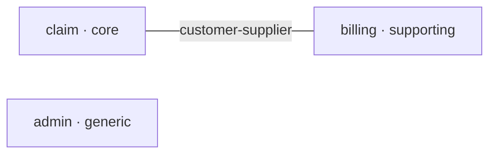

# 파생물과 선언 편집 — 정본

`DOMAIN.md`에서 파생되는 파일(요약·컨텍스트 맵 생성 구역)을 만들고 다시 만드는 규정, 그리고
`DOMAIN.md`를 고칠 때의 규율이다. init(첫 생성)·sync(드리프트 처분)·evolve(수락된 제안 반영)가
공유한다 — 세 스킬이 같은 구역을 같은 규칙으로 다뤄야 서로의 결과를 덮어쓰지 않는다.

## 1. 생성물 헤더

파생물 상단에는 아래 헤더 한 줄을 넣는다. `DOMAIN.md`(SSOT)와 ADR(기록물)에는 **넣지 않는다** —
둘 다 사람이 쓰는 문서다.

```
<!-- GENERATED by superdomain from DOMAIN.md — 직접 수정 금지, 결정 템플릿 또는 SSOT 문서를 수정할 것 -->
```

## 2. `docs/superdomain/summary.md`

SessionStart 훅이 이 파일을 **파싱하지 않고 통째로 주입**한다. 길면 매 세션 컨텍스트를 먹는다.

- 1행: §1의 생성물 헤더. 이어서 컨텍스트 표 — 열은 `이름 | 분류 | 패키지 | 프로젝트`이고
  프로젝트가 하나뿐이어도 열을 남긴다(sync가 이름·분류·소속 프로젝트를 선언과 대조한다).
- 전역 핵심 규칙 3~5개 — **선언에서 곧바로 따라오는 것만** 적는다(컨텍스트 간 직접 참조는 관계
  표에 있는 쌍만 열린다, 각 컨텍스트의 코드는 선언된 패키지 아래 산다, `confirmed` 불변식은
  대응 `@Tag` 테스트를 갖는다 등). 일반론·훈계는 적지 않는다. **고른 목록을 사용자에게 보여 주고
  확인받는다** — 매 세션 자동 주입되는 유일한 산출물이라 여기 적힌 것이 상시 규칙이 된다.
- 마지막 줄: `상세: docs/superdomain/DOMAIN.md · 검토: /superdomain:review`
- 검증: `wc -l docs/superdomain/summary.md` → **30 이하**. 넘으면 규칙 개수를 줄인다.
- **건수를 문장에 박아 두지 않는다** — 동결 건수는 migrate가 줄이면 거짓이 되고 아무도 잡지 못한다.

## 3. 컨텍스트 맵 생성 구역

**마커 문자열**의 정본은 `domain-template.md`의 "생성 구역 마커" 절이고, **그 구역을 다루는 규정은
이 절이 정본이다.** 두 줄 모두 **줄 전체가 정확히 일치**해야 하고 설명 접미사를 붙일 수 없다 —
스킬이 문자열 완전 일치로 구역을 찾아 두 마커 **사이만** 교체하기 때문이다.

- **여는 마커가 이미 있으면 새로 쓰지 않고 그 쌍 사이만 교체한다.** 한 구역에 여는 마커가 둘이
  되면 이후 스킬의 문자열 매칭이 엉뚱한 줄을 잡아 구역 바깥을 덮어쓴다.
- **닫는 마커가 없는 여는 마커를 발견하면 그것은 구역이 아니다.** 어디까지가 생성물인지 알 수
  없으므로 **갱신하지 않고 오류로 보고한다.** 그 줄을 보여 주고 어떻게 할지 묻되, 임의로 닫는
  마커를 끼워 넣어 남의 서술을 생성 구역 안에 가두지 않는다.
- **마커가 하나도 없으면**(스켈레톤의 마커 줄을 주석으로 여기고 지운 경우) 정본의 두 줄을 그대로
  넣고 그 사이에 쓴다.

사이에는 mermaid `graph LR` 하나를 둔다. 노드는 컨텍스트이고 분류를 라벨에 표시하며, 엣지는
`### 관계` 표가 연 쌍이고 라벨은 유형이다. **엣지에 화살표를 쓰지 않는다** — 허용 단위가 쌍이라
방향이 없다(`skill-protocol.md` §7). 관계가 없는 컨텍스트도 고립 노드로 남긴다(그 자체가 "닫혀
있다"는 사실이다).



생성 구역은 `DOMAIN.md` **안**이다. 채웠으면 §5의 게이트를 한 번 더 돌린다.

## 4. 선언 편집 규율 — 고쳐도 되는 것과 안 되는 것

파서가 거부하는 상태로 끝내지 말라는 지시의 가장 싼 탈출로는 문제의 선언을 지우거나 바꿔 버리는
것이고, 그것은 `skill-protocol.md` §4(확정은 사용자의 것)의 정확한 실패 형태다.

- **고쳐도 되는 것 — 형식 오류뿐이다.** 라벨 오타, 빠진 구분선, 표의 위치, 괄호 주석, 마커
  누락, 닫히지 않은 코드 펜스. 사용자가 말한 내용은 그대로 두고 형식만 맞춘다.
- **고치면 안 되는 것 — 사용자가 결정한 값**: 컨텍스트 이름·경계, `- 분류:`, `- 패키지:`,
  `- 프로젝트:` 귀속, `### 관계` 표의 쌍·유형·계약. **게이트를 통과시킬 목적만으로 바꾸지 않는다** —
  특히 "프로젝트가 여러 개이므로 `- 프로젝트:` 라벨로 지정해야 합니다" 오류에 그럴듯한 쪽을 끼워
  넣지 않는다. 정규 값이 아니어서 나는 오류는 형식 문제가 아니라 결정을 다시 물어야 한다는 신호다.
- **편집 전에 원문과 변경안을 나란히 보여 주고 확정을 받는다.** 표의 한 줄이어도 그렇다.
- **탈출 조건.** 같은 오류가 두 번 반복되면 고치기를 멈춘다. 파서 출력 원문 줄과 그 줄이 속한
  문서 구역을 그대로 보여 주고 무엇을 어떻게 바꿀지 묻는다. 세 번째 추측을 하지 않는다.

## 5. 게이트 → 파생물 재생성 → 게이트

`DOMAIN.md`를 한 글자라도 고쳤으면 돌린다.

```bash
python3 "${CLAUDE_PLUGIN_ROOT}/scripts/parse_domain.py" docs/superdomain/DOMAIN.md
python3 "${CLAUDE_PLUGIN_ROOT}/scripts/check_imports.py" docs/superdomain/DOMAIN.md
```

1. 앞은 선언이 여전히 해석되는지다. `OK: 프로젝트 N, 컨텍스트 M`의 **두 수가 의도한 개수와
   같은지** 확인한다 — 헤딩 오타는 오류가 아니라 "없는 섹션"이 되어 조용히 개수를 줄인다.
2. 뒤는 **그 편집으로 위반이 의도한 만큼만 변했는지**다. 편집 전 실행의 수치와 나란히 놓고 본다 —
   관계 표에서 행을 지우면 통과하던 참조가 위반으로 돌아서고, 행을 더하면 위반이 사라지고,
   `- 패키지:`를 고치면 귀속 범위가 통째로 바뀌어 위반 목록이 뒤집히고, 분류만 바꿨다면 위반 수는
   그대로여야 한다. 의도한 적 없는 변화가 보이면 라벨이나 표 구조를 잘못 건드린 것이다.
3. 파생물을 §2·§3대로 재생성한다. **재생성은 파생물의 손 편집을 지운다** — 쓰기 전에 diff를 보여
   주고 확정을 받는다.
4. 컨텍스트 맵 생성 구역은 `DOMAIN.md` 안이다 — 고쳤으면 **파서 게이트를 한 번 더** 돌린다.
   컨텍스트 수가 직전 실행과 같아야 하고, **이 실행의 `OK:` 출력이 편집을 끝낸 스킬의 완료 조건이다.**
   달라졌다면 삽입한 블록이 섹션 구조를 건드린 것이다(알 수 없는 `##` 헤딩은 열려 있던 섹션을 닫는다).
