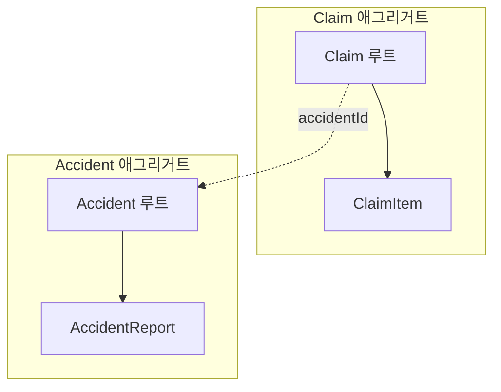
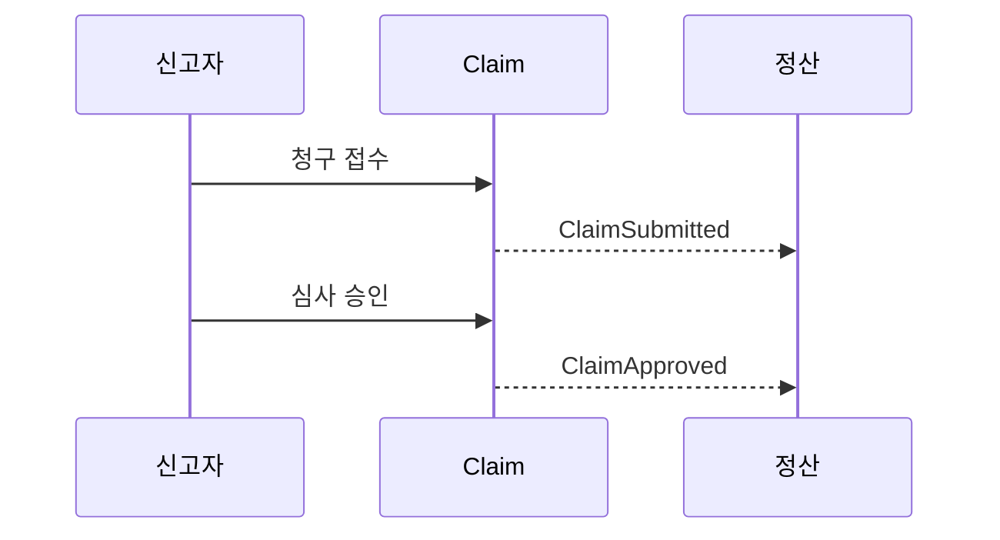

# 도메인 문서 표준 (`docs/architecture/domain/`) — 정본

대상 프로젝트의 컨텍스트별 도메인 문서 형식을 정의한다. 어떤 절이 있어야 하는지, 그중 무엇을 기계가
읽는지, 불변식 ID가 어떤 컨텍스트에 붙는지의 정본이다. `check_invariants.py`와 이 문서의 해석이
갈리면 **이 문서가 정본이고 스크립트가 고쳐져야 한다.**

> **구현 상태 — `scripts/check_invariants.py`는 이 Phase에서 함께 도착한다.** 이 문서가 먼저
> 커밋되므로 그 사이 본문의 현재형("검사가 오류로 보고한다")은 아직 사실이 아니다. 스크립트가
> 착지하면 이 블록을 지운다.

**목차 — 무엇을 판단하러 왔는가**

| 하려는 일 | 읽을 곳 |
|---|---|
| 우리 컨텍스트에 이 문서가 필요한가, 누가 관리하는가 | [§1 성격과 범위](#1-성격과-범위) |
| 파일을 어디에 두는가 | [§2 위치](#2-위치) |
| 새 도메인 문서를 처음부터 쓰기 | [§3 스켈레톤](#3-스켈레톤) |
| 불변식 표를 기계가 어떻게 읽는지, 왜 오류가 났는지 | [§4 파싱 계약](#4-파싱-계약) |
| 각 절에 무엇을 쓰는가 | [§5 절별 작성 규칙](#5-절별-작성-규칙) |
| 누가 무엇을 고치는가 | [§6 소유권과 편집 규율](#6-소유권과-편집-규율) |

---

## 1. 성격과 범위

**이 문서는 SSOT다 — 파생물이 아니다.** 생성물 헤더(`<!-- GENERATED by superarchitect ... -->`)를
붙이지 않는다. 통째로 재생성되는 일이 없고, `/superarchitect:model`·`apply`·`review`가 절 단위로
갱신하며, **사람이 에디터에서 직접 고쳐도 된다.** 스킬이 쓴 문장과 사람이 쓴 문장을 구분하지 않는다.

**기계가 읽는 것은 `## 불변식` 표 하나뿐이다.** 나머지 절(애그리거트·값 객체·도메인 이벤트·도메인
서비스·열린 질문)은 사람과 Claude가 읽는 자유 서술이고, §5는 강제가 아니라 권장 구조다. 표 바깥에
무엇을 얼마나 쓰든 검사 결과는 달라지지 않는다. 대신 반대 방향의 대가가 있다 — **파서가 모르는 것은
조용히 무시된다.** `## 불변식`을 `## 불변 조건`으로 잘못 쓰면 오류가 아니라 "불변식 0건"이 된다. 절
이름을 고친 뒤에는 반드시 `check_invariants.py`를 돌려 대조 건수를 확인한다.

**용어 정의를 쓰지 않는다.** 보편언어(용어집)는 superglossery 플러그인이 관리한다 — 이 문서는 용어를
**사용**하고, 정의가 필요하면 용어집을 참조만 한다. 새 용어가 나오면 `/glossary:add` 등록을 제안하는
것이 model 스킬의 일이다. 같은 용어의 정의가 두 곳에 살면 반드시 갈라진다.

**플러그인의 지식 문서 표준(`knowledge-doc-template.md`)과 다른 것이다.** 이 문서에는 frontmatter도
`[[key]]` 링크도 draft 판정도 없다. 여기서 다른 문서를 가리킬 때는 경로를 그대로 쓴다.

**언제 필요한가.**

| 컨텍스트의 `스타일` | domain 문서 |
|---|---|
| `hexagonal` · `layered-domain` · `clean`, 그리고 domain-pure를 포함한 `custom/<이름>` | **필수** |
| `layered-simple` | 선택 — 기록할 불변식이 쌓이면 문서를 늘리기 전에 스타일 선택부터 다시 본다(`references/knowledge/styles/layered-simple.md`) |

domain-pure 판별자는 `confine-type` 규칙 인스턴스의 존재다(`architecture-template.md` §5.1 규칙 5).
필수인 컨텍스트에 문서가 없으면 그 자체가 리뷰 지적 대상이다 — 불변식이 없는 게 아니라 적히지 않은
것이기 때문이다.

## 2. 위치

아래 경로는 전부 **`ARCHITECTURE.md`가 있는 디렉터리(= git 루트) 기준**이다. 모노레포여도 하나이며
프로젝트 디렉터리 아래에 두지 않는다 — 컨텍스트는 도메인 개념이라 프로젝트 소속과 무관하다.

- 기본: **`docs/architecture/domain/<컨텍스트>.md`** — 파일명은 `ARCHITECTURE.md`에 선언된 컨텍스트
  이름과 정확히 같아야 한다(`## 컨텍스트: claim` → `domain/claim.md`).
- 통합: 컨텍스트가 **하나뿐인** 프로젝트는 `docs/architecture/DOMAIN.md` 한 파일로 대신할 수 있다.
  컨텍스트가 둘 이상이면 `DOMAIN.md`를 쓰지 않는다.
- 검사는 **두 위치를 모두** 읽는다. 같은 컨텍스트의 불변식이 양쪽에 있으면 오류다(§4.4) — 어느 쪽이
  진짜인지 정하는 규칙을 두지 않는다. 통합하기로 했으면 `domain/`을 비우고, 나누기로 했으면
  `DOMAIN.md`를 지운다.

## 3. 스켈레톤

아래 블록은 그대로 복사해 쓸 수 있고, `check_invariants.py`의 **파싱을 통과한다**(컨텍스트 `claim`이
선언돼 있다는 전제). 표의 예시 행은 자기 컨텍스트의 것으로 교체한다 — 예시의 `confirmed`를 남긴 채
태그를 만들지 않은 상태는 `check_invariants`가 위반으로 잡는 정상 흐름이지 템플릿의 결함이 아니다.

````markdown
# claim — Domain

이 컨텍스트가 무엇을 책임지는지 한 문단으로 쓴다. 용어 정의는 쓰지 않는다 — 용어집을 참조한다.

## 불변식

| ID | 서술 | 상태 |
|---|---|---|
| INV-CLAIM-001 | 청구 금액은 0보다 커야 한다 | confirmed |
| INV-CLAIM-002 | 승인된 청구의 금액은 변경할 수 없다 | confirmed |
| INV-CLAIM-003 | 같은 사고에 대해 열려 있는 청구는 하나뿐이다 | proposed |

## 애그리거트

| 애그리거트 | 루트 | 포함 | 불변식 ID |
|---|---|---|---|
| Claim | Claim | ClaimItem, ClaimStatus | INV-CLAIM-001, INV-CLAIM-002 |
| Accident | Accident | AccidentReport |  |



## 값 객체

| 값 객체 | 구성 | 규칙 |
|---|---|---|
| Money | amount, currency | 통화가 다르면 연산하지 않는다 |
| ClaimNumber | value | CLM- 접두 + 10자리 숫자 |

## 도메인 이벤트

| 이벤트 | 발행 시점 | 스키마 |
|---|---|---|
| ClaimSubmitted | 청구가 접수돼 심사 대기로 들어갈 때 | claimId, accidentId, amount, submittedAt |
| ClaimApproved | 심사자가 승인을 확정할 때 | claimId, approvedBy, approvedAt |



## 도메인 서비스

| 서비스 | 책임 | 왜 애그리거트 밖인가 |
|---|---|---|
| ClaimDuplicationChecker | 같은 사고에 열린 청구가 있는지 판정 | 여러 Claim에 걸친 판정이라 루트 하나가 가질 수 없다 |

## 열린 질문

- [ ] [2026-08-11 model] 승인 이후 금액 변경을 예외적으로 허용해야 하는 업무 상황이 있는가?
- [ ] [2026-08-11 review] 청구 취소 시 ClaimApproved의 보상 이벤트가 필요한가? (관측: backend/src/main/kotlin/com/acme/claim/application/ClaimService.kt:88)
````

## 4. 파싱 계약

### 4.1 표 — 계약은 열의 순서다

- `## 불변식` 헤딩 아래의 **첫 표**가 불변식 표다. 그 절에 표를 두 개 두지 않는다 — 둘째 표는 무시된다.
- 첫 표를 찾는 범위는 **다음 `##` 헤딩 직전까지**다. 그 사이에 표가 없으면 다음 절로 넘어가 찾지 않고
  "불변식 0건"으로 끝난다 — `## 애그리거트`의 표가 불변식 표로 잘못 읽히는 일은 없다.
- 열은 **ID, 서술, 상태** 순서 고정이다. **파서는 헤더 셀의 이름을 읽지 않는다** — 헤더 이름은 사람을
  위한 것이라 바꿔도 결과가 같고, 반대로 열 순서를 바꿔 끼우면 조용히 잘못 읽힌다.
- 표는 헤더 행 + 구분선 행 + 데이터 행이고 빈 줄이 표를 끝낸다. 구분선(`|---|---|---|`)이 없으면 첫
  데이터 행이 구분선 자리에서 버려진다. 읽는 칸은 앞의 셋이고 넷째 칸부터는 버려진다.
- **칸이 셋에 못 미치는 데이터 행은 오류다** — 결손 행이므로 조용히 건너뛰지 않는다. 세 칸을 채우거나
  행을 지우는 것이 유일한 해소법이다(빈 상태 칸도 비정규 값 오류로 잡힌다).
- **서술 칸에 `|`를 쓰지 않는다** — 열이 갈라진다. 필요하면 낱말로 바꾼다.
- 서술은 **한 문장, 검증 가능한 형태**로 쓴다("승인된 청구의 금액은 변경할 수 없다"). "청구를 잘
  관리한다" 같은 문장은 태그 붙일 테스트를 쓸 수 없으므로 불변식이 아니다.
- `## 불변식` 표가 없는 문서는 오류가 아니라 **"불변식 0건"**이다 — 막 만든 문서의 정상 상태다.

### 4.2 ID 형식과 컨텍스트 최장 일치

- 형식은 `INV-<컨텍스트 대문자>-<3자리>`다. 컨텍스트명은 `ARCHITECTURE.md`의 선언명을 그대로
  대문자화하고 **하이픈은 유지**한다: `claim` → `INV-CLAIM-001`, `core-api` → `INV-CORE-API-001`.
- 파싱은 접두 `INV-`를 뗀 뒤 **선언된 컨텍스트 집합에 대한 최장 일치**로 컨텍스트를 정한다. `core`와
  `core-api`가 둘 다 선언돼 있어도 `INV-CORE-API-001`은 `core-api`로 읽힌다(하이픈 중의성 제거).
- **어느 컨텍스트에도 붙지 않는 ID는 오류다.** 선언되지 않은 컨텍스트의 불변식은 존재할 수 없다 —
  컨텍스트를 먼저 `ARCHITECTURE.md`에 등록한다.
- 번호는 **3자리 zero-pad**(`001`)이고 한 문서 안에서 유일하다. 다음 번호는 **그 문서의 최대 번호
  + 1**이다. 지운 번호를 다시 쓰지 않고 이미 매긴 번호를 다시 매기지도 않는다 — 테스트 태그·ADR·리뷰
  로그가 그 문자열을 가리키고 있다.
- ID는 코드의 `@Tag("INV-CLAIM-001")` 리터럴과 **문자 그대로** 같아야 한다.

### 4.3 상태 — 정규 값은 둘뿐

| 상태 | 뜻 | 검사가 기대하는 것 |
|---|---|---|
| `proposed` | 후보. 세션에서 나왔지만 사용자가 확정하지 않았다 | 대응 테스트 태그가 **없어야** 한다 |
| `confirmed` | 확정. 사용자가 이 규칙이 맞다고 확인했다 | 대응 `@Tag` 테스트가 **있어야** 한다 |

- 소문자 그대로 쓴다. 세 번째 상태를 만들지 않는다 — `deprecated`·`wip` 같은 값은 비정규 값 오류다.
- 승격(`proposed` → `confirmed`)은 **항목별 사용자 확정으로만** 일어난다. 스킬이 일괄 승격하지 않는다.
- 더 이상 성립하지 않는 불변식은 상태를 바꾸는 게 아니라 **행을 지운다.** 이력은 git이 갖고, 그 결정이
  중요하면 ADR로 남긴다.

### 4.4 오류와 경고

`check_invariants.py`가 이 문서를 읽고 내리는 판정이다.

| 상황 | 판정 |
|---|---|
| `confirmed`인데 대응 `@Tag` 테스트가 없다 | **위반** — 문서 경로와 행 번호로 지목된다 |
| 태그는 있는데 문서에 그 ID가 없다 | 경고(드리프트) — 문서에서 지웠는데 테스트가 남았거나 오타다 |
| `proposed`인데 태그가 있다 | 경고 — 확정 전 구현 |
| 같은 ID가 한 문서에 두 번 | 오류 |
| 상태가 비정규 값 / ID 형식 위반 / 어느 컨텍스트에도 안 붙는 ID | 오류 |
| `domain/<컨텍스트>.md`의 ID가 파일명 컨텍스트와 다르다 | 오류 — 문서를 잘못 찾아 들어간 항목이다 |
| 같은 컨텍스트가 `domain/<컨텍스트>.md`와 `DOMAIN.md` 양쪽에 | 오류(중복 배치, §2) |
| 컨텍스트가 둘 이상 선언됐는데 `DOMAIN.md`가 있다 | 오류 — 통합 배치는 단일 컨텍스트 전용이다(§2). 컨텍스트별로 나눠 옮긴다 |
| 선언되지 않은 이름의 `domain/<이름>.md`가 있다 | 경고(드리프트) — 표가 있든 없든 낸다. 컨텍스트를 지웠는데 문서가 남았거나 파일명 오타다 |
| 테스트 소스가 0건(테스트 디렉터리 부재 포함) | **검사 불능** — 사유와 함께 실패한다(exit 1). 태그가 있을 수 없는 환경에서 "위반 없음"은 거짓이므로 클린으로 통과시키지 않는다 |

**태그 스캔의 한계.** 검사는 선언된 프로젝트 경로 아래 테스트 소스에서 `@Tag("INV-...")` **리터럴**만
본다. 상수 간접 참조(`@Tag(INV_CLAIM_001)`)나 FQN 애너테이션은 보이지 않는다 — 태그를 리터럴로 쓰는
것이 규약이고, 리팩터링으로 상수화하면 그 불변식은 검사에서 사라진다. 그리고 **태그가 달렸다는 것은
그 테스트가 불변식을 실제로 검증한다는 뜻이 아니다** — 태그만 달린 빈 테스트나 서술과 다른 검증을
잡는 것은 결정적 검사가 아니라 arch-reviewer의 의미론 범주다(`agents/arch-reviewer.md`).

## 5. 절별 작성 규칙

기계가 읽지 않는 구역이다. 아래는 강제가 아니라 권장이며, 스킬이 이 구조를 채운다.

- **애그리거트** — 열은 애그리거트/루트/포함/불변식 ID. `불변식 ID` 칸에는 그 애그리거트가 강제하는
  항목을 적고 **불변식 표에 실재하는 ID만** 쓴다(기계가 대조하지 않으므로 사람이 본다). 경계 mermaid를
  표 아래에 병기한다. 판단 근거는 `references/knowledge/tactical/aggregates.md`.
- **값 객체** — 열은 값 객체/구성/규칙. 위반이 도메인적으로 치명적인 규칙은 여기 적고 끝내지 말고
  **불변식 표로 올려 ID를 받는다** — 태그로 강제되는 것은 ID를 가진 항목뿐이다.
  근거는 `references/knowledge/tactical/value-objects.md`.
- **도메인 이벤트** — 열은 이벤트/발행 시점/스키마. 이름은 **과거형**이고 `스키마`는 필드 이름 나열이면
  충분하다(직렬화 형식의 정본은 코드다). 흐름 mermaid를 표 아래에 병기한다.
  근거는 `references/knowledge/tactical/domain-events.md`.
- **도메인 서비스** — 열은 서비스/책임/왜 애그리거트 밖인가. 셋째 칸이 비면 그것은 애그리거트 안으로
  들어가야 할 로직일 가능성이 높다. 근거는
  `references/knowledge/tactical/repositories-domain-services.md`.
- **열린 질문** — 한 줄 체크박스 불릿이고 형식은 `- [ ] [<YYYY-MM-DD> <출처>] 질문 문장?`이다. 출처는
  `model` | `review` | `apply`이고, review 항목은 뒤에 `(관측: <경로:라인>)`을 붙인다. 답이 필요한
  **질문 형태**로 쓴다.
  - 이 절은 **append 전용**이다 — 남이 쓴 줄을 고쳐 쓰지 않고, **같은 질문을 두 번 넣지 않는다**(매
    세션 같은 줄이 쌓이면 절이 쓸모를 잃는다).
  - 절이 없으면 문서 끝에 헤딩을 만들고 그 아래에 쓴다.
  - 해소되면 `- [x]`로 바꾸고 결말(`→ INV-CLAIM-004`)을 덧붙인다. 체크된 줄은 다음 세션에서 지운다 —
    이력은 git이 갖는다.

## 6. 소유권과 편집 규율

| 주체 | 하는 일 |
|---|---|
| `/superarchitect:model` | 문서 생성(없으면 §3 스켈레톤으로), 불변식 채번·추가(proposed), 사용자 확정 시 confirmed 승격, 애그리거트·VO·이벤트·서비스 절 갱신, 열린 질문 append와 해소 |
| `/superarchitect:apply` | 읽기, 그리고 구현 중 발견한 모호함·모순의 열린 질문 append. confirmed 서술을 고치지 않는다 |
| `/superarchitect:review` | "추가 논의" 항목을 열린 질문에 append. 그 밖의 절을 건드리지 않는다 |
| 사람 | 전부. 스킬을 거치지 않고 직접 고쳐도 된다 |

- **통째로 재생성하지 않는다.** 이 문서에 생성 구역 마커(`<!-- superarchitect:generated:... -->`)는
  없다 — 그 장치는 `ARCHITECTURE.md`의 것이다. 스킬은 절 단위로 고치거나 append한다.
- **스킬은 사용자의 문장을 우선한다.** 서술을 다듬는 것은 제안이고 확정은 사용자 몫이다.
- 컨텍스트 경계 자체가 흔들리는 결론이 나오면 여기서 처리하지 않는다 — `ARCHITECTURE.md`의 일이므로
  `/superarchitect:init`·`/superarchitect:adr`로 보낸다.
- 분량 상한은 두지 않는다. 다만 한 컨텍스트의 문서가 300줄을 넘어가면 경계가 너무 넓은 것은 아닌지
  의심한다(`references/knowledge/strategic/bounded-contexts.md`).
