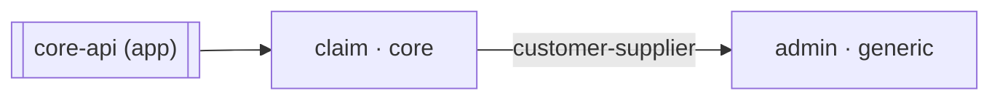

# 아키텍처 거버넌스 초기화

이 스킬이 쓰는 `ARCHITECTURE.md`는 이후 모든 superarchitect 스킬이 읽는 구조 SSOT다.
여기서 틀리게 적힌 것은 이후 스킬들이 성실하게 강제한다. 그래서 이 스킬에는 어길 수 없는
불변 두 가지가 있다.

1. **아키텍처 결정은 전부 사용자의 것이다.** 컨텍스트 경계·이름, 분류, 스타일, 모듈 구성,
   관계, 거버넌스 대상 프로젝트 — 이 중 무엇도 사용자 확인 없이 확정하지 않는다. 정보가
   없으면 추측하지 말고 묻는다. 이것은 판단을 아끼라는 뜻이 아니다 — 관측과 지식 문서를
   근거로 **판단을 적극적으로 제안**하는 것이 이 스킬의 일이고, 금지는 사용자 확인 없는
   **확정** 하나뿐이다. "알아서 해달라"는 요청에도 근거와 함께 하나를 제안하고
   동의를 받은 뒤에 적는다. 모델이 조용히 정해 버리면 이 플러그인이 없애려는 문제가 그대로
   재현된다.
2. **파서가 거부하는 상태로 끝내지 않는다.** 파서 게이트는 선택이 아니고, **`ARCHITECTURE.md`를
   고칠 때마다** 통과시킨다. 6단계에서 한 번(문서 작성 직후), 7-e에서 한 번(7-b가 생성 구역을
   삽입한 뒤). **완료 조건은 SSOT를 마지막으로 고친 뒤 받은 `OK:` 출력, 즉 7-e의 것이다** —
   6단계의 통과는 그 뒤의 편집으로 무효가 된다.

## 지식 참조 프로토콜

지식이 필요하면 **먼저 `${CLAUDE_PLUGIN_ROOT}/references/INDEX.md`를 읽고** 필요한 문서만
골라 연다. `references/knowledge/`를 통째로 또는 디렉터리 단위로 읽는 것은 금지다. 읽을
문서는 INDEX의 `read_when`에 `init`이 있는 것, 그리고 대상 컨텍스트가 채택한 스타일·패턴
문서로 한정한다.

이 문서는 라벨 목록·정규 값·체크리스트를 복제하지 않는다. 각 단계가 "지금 이 파일을 읽어라"
라고 지시하는 대로, 그 시점에 정본을 읽는다. 정본이 바뀌면 이 스킬은 고치지 않아도 맞는다.

---

## 0. 위치 확정

모든 산출물은 **git 루트에 고정**한다. 모노레포여도 `ARCHITECTURE.md`는 하나다 — 컨텍스트는
도메인 개념이라 프로젝트 소속과 무관하고, 프로젝트를 넘는 관계는 한 문서에서만 표현된다.

```bash
git rev-parse --show-toplevel
```

- 성공하면 그 경로가 작업 기준이다. cwd가 하위 디렉터리여도 여기로 올라와서 작업한다.
- git 저장소가 아니면 사용자에게 알리고, 현재 디렉터리를 루트로 삼을지 확인한다. git
  submodule 등 멀티 레포 워크스페이스는 v1 범위 밖임을 알린다.

## 1. 재초기화 확인

`ARCHITECTURE.md`가 이미 있으면:

1. 파일을 읽고 선언된 프로젝트·컨텍스트를 표로 요약해 보여준다.
2. `git status --short ARCHITECTURE.md`로 커밋되지 않은 변경이 있는지 확인한다. 있으면
   덮어쓰면 되돌릴 수 없다는 것을 먼저 알린다.
3. 세 선택지를 제시하고 **사용자가 고르게 한다.**
   - 그대로 두고 종료 (기본값)
   - 처음부터 다시 작성 — 기존 내용은 사라진다
   - 일부만 고치기 → init의 일이 아니다. 선언이 현실과 어긋난 것이면 대조해 정정하는
     `/superarchitect:sync`로 보내고, 표기만 손보는 편집이면 사용자가 직접 고친 뒤 6단계의 파서
     게이트만 실행해도 된다. 어느 쪽인지 안내하고 종료한다.

## 2. 거버넌스 후보 감지

**감지 단계에서는 아무것도 제외하지 않는다.** git 루트에서 빌드 파일을 넓게 훑는다.

```bash
find . -maxdepth 3 \
  \( -name .git -o -name node_modules -o -name build -o -name target \
     -o -name dist -o -name .gradle -o -name vendor -o -name .venv \) -prune -o \
  \( -name 'settings.gradle' -o -name 'settings.gradle.kts' -o -name 'pom.xml' \
     -o -name 'build.gradle' -o -name 'build.gradle.kts' -o -name 'package.json' \
     -o -name 'go.mod' -o -name 'Cargo.toml' -o -name 'pyproject.toml' \) -print
```

깊이가 모자라 보이면 `-maxdepth`를 늘린다. 후보가 하나도 안 나오면 3단계(그린필드)로 간다.

### 제안 기준은 프로파일 매칭 하나뿐이다

사용 가능한 프로파일은 **문서에 적힌 목록이 아니라 그 자리에서 확인한다.** 프로파일이 추가되면
이 스킬을 고치지 않아도 새 후보가 제안 대상에 올라야 한다.

```bash
ls "${CLAUDE_PLUGIN_ROOT}/profiles"
```

각 후보의 빌드 파일을 열어 스택을 파악하고(Gradle Kotlin DSL·`kotlin("jvm")` → Kotlin,
`pom.xml`의 java 컴파일러 설정 → Java 등), 그 스택에 대응하는 프로파일 디렉터리가 있으면
**제안**, 없으면 **"감지됨 — 대응 프로파일 없음, 범위 외"** 로 표시한다. 표로 전부 보여준다.

| 경로 | 감지 근거 | 추정 스택 | 대응 프로파일 | 판정 |
|---|---|---|---|---|
| `backend` | `settings.gradle.kts` | Kotlin/Spring | `kotlin-spring` | 제안 |
| `frontend` | `package.json` | Node | 없음 | 감지됨 — 범위 외 |

지켜야 할 것:

- **스택 추측을 제외 판정에 쓰지 않는다.** "package.json이니까 프런트엔드라서 뺀다"는 금지다.
  제외의 유일한 근거는 대응 프로파일 부재이며, 스택 추측은 안내 문구의 정확도에만 쓴다.
  Node 백엔드 프로파일이 생기는 날 같은 후보가 자동으로 제안 대상이 되어야 한다.
- **범위 외 후보를 숨기지 않는다.** 표에 남겨야 사용자가 "왜 빠졌는지"를 알고, 프로파일이
  추가되면 무엇이 들어올지도 안다.
- **최종 확정은 사용자다.** 제안 목록에서 뺄 것과 더할 것을 묻는다. 사용자가 프로파일 없는
  후보를 굳이 넣으려 하면, `프로파일` 라벨의 정규 값이 `profiles/` 하위 디렉터리명이라 파서가
  거부한다는 사실을 설명하고, 프로파일이 생길 때까지 범위 밖으로 둘 것을 권한다.
- **`profiles/`에 있는데 파서가 거부하면 그것은 파서의 결함이다.** 파서는 `profiles/` 하위
  디렉터리 목록을 그대로 읽으므로 정상적으로는 어긋나지 않는다. 그래도 어긋나면 선언을 되돌리지
  말고, `profiles/`가 정본이며 파서가 따라와야 한다는 사실(`architecture-template.md` §4)을
  사용자에게 알리고 파서 수정 전까지는 그 프로젝트를 범위 밖으로 둔다.

## 3. 후보 0개 — 그린필드 설계 인터뷰

**오류가 아니다.** 코드가 없어도 `ARCHITECTURE.md`는 설계서로 먼저 성립한다. 프로젝트 섹션의
`경로`는 아직 없는 **예정 경로**로 선언할 수 있다(코드 생성은 `/superarchitect:scaffold`의 몫).

**한 번에 하나씩 묻는다.** 답을 받을 때마다 지금까지 확정된 것을 두세 줄로 되짚어 준다.

1. **"이 시스템이 해결하는 문제를 한 문단으로 말해 주세요."**
   → `ARCHITECTURE.md` 상단의 자유 서술(개요)이 된다.
2. **"그 안에 서로 다른 용어를 쓰는 업무 영역이 있나요? 같은 단어를 서로 다른 뜻으로 쓰는
   곳은요?"** → 컨텍스트 **후보** 목록. 여기서 확정하지 않는다.
3. **"함께 바뀌는 것과 따로 바뀌는 것은 무엇인가요?"** → 경계 후보의 보강·병합 근거.
4. **"팀은 몇 개이고 각 영역을 누가 소유하나요? 배포 단위는 하나입니까, 여러 개입니까?"**
   → 5단계의 모듈 구성 판단 입력.
5. **"초기 규모와 12개월 안의 계획은 어떻게 되나요?"** → 같은 입력.

이어서 프로젝트 섹션의 필수 라벨 네 개를 채운다. 코드가 없으므로 전부 물어야 한다.

- **프로젝트 이름**과 **예정 경로**(단일 프로젝트면 `.`)
- **프로파일** — 지금 `ls "${CLAUDE_PLUGIN_ROOT}/profiles"`를 실행해(그린필드는 2단계에서 이
  명령에 닿은 적이 없다) 그 결과 중에서 고르게 한다. 목록에 없는 스택을 원하면 그 스택은 아직
  강제·스캐폴드를 지원하지 않는다고 알리고, 그래도 문서만 먼저 쓸지 확인한다.
- **기본 패키지** (`com.acme` 형태)
- **아키텍처 테스트 위치** — 프로젝트 경로 기준 상대 경로. 기본안을 제시하고 확인받는다.

### 도메인이 흐릿할 때

2번 질문에서 영역을 하나도 못 고르거나 용어가 계속 흔들리면, 경계를 억지로 긋지 말고 이벤트
스토밍을 먼저 권한다. 진행 규약의 정본은
`${CLAUDE_PLUGIN_ROOT}/references/knowledge/strategic/event-storming.md`이고 세션은
`/superarchitect:model`의 스토밍 모드가 진행한다 — **이 스킬이 대신 진행하지 않는다.** 선택은
사용자에게 맡긴다.

- 도메인이 정리될 때까지 init을 여기서 중단하고 `/superarchitect:model`을 권한다(권장). 스토밍이
  내는 것은 경계 **후보**이고, 그것을 컨텍스트 선언으로 바꾸는 것은 돌아온 이 스킬의 일이다
  (`event-storming.md` R3 — 스토밍 세션은 `ARCHITECTURE.md`를 고치지 않는다).
- 컨텍스트 하나로 시작하고, 경계가 드러나면 그때 나눈다. 이 선택은 근거 절에 기록한다.

그린필드는 4단계에 관측할 코드가 없다. 바로 **5단계로 간다.**

## 4. 기존 코드 스캔 — 관측하고, 추정하고, 확인받는다

확정된 프로젝트마다 아래를 관측한다. **관측 → 추정 → 확인 질문** 순서를 지키고, 승인받지
않은 추정은 문서에 넣지 않는다.

- **모듈 목록** — `settings.gradle(.kts)`의 `include`, `pom.xml`의 `<modules>`.
- **패키지 트리** — 소스 루트 아래 두세 단계.
  ```bash
  find . -type d -path '*/src/main/*/*' | sed 's|.*/src/main/[^/]*/||' | sort -u | head -60
  ```
- **실행 단위** — `@SpringBootApplication` 보유 모듈, `bootJar`·`spring-boot-maven-plugin` 설정.
- **모듈 간 의존** — 빌드 스크립트의 `project(":...")` / `<dependency>`.

### 실현 형태(모듈 구성) 추정

| 관측 | 추정 |
|---|---|
| 컨텍스트당 모듈이 둘 이상이고 이름이 `<컨텍스트>-<레이어>` 꼴 | `multi-module` |
| 모듈 하나가 컨텍스트 하나에 대응하고 레이어는 그 안의 패키지 | `single-module` |
| 실행 모듈이 둘 이상이고 패키지 최상위가 레이어, 컨텍스트가 그 아래 | `app-embedded` |

어느 쪽도 명확하지 않으면 추정을 단정하지 말고 관측 결과만 제시한 뒤 5단계에서 함께 정한다.

### 멀티 애플리케이션이면 세 표를 도출한다

`app-embedded`가 후보로 올라왔거나 실행 모듈이 여럿이면 프로젝트 섹션의 선택 표 세 개
(`### 애플리케이션`·`### 공용 모듈`·`### 패키지 규약`)를 함께 도출한다. 각 표의 필수 여부와
열 계약은 `${CLAUDE_PLUGIN_ROOT}/references/governance/architecture-template.md` §3이 정본이다.

- **애플리케이션** — 실행 모듈마다 한 행. `포함 컨텍스트`는 실제 import를 훑어 초안을 만들되,
  "지금 참조하고 있다"와 "참조해도 된다"는 다르므로 반드시 사용자에게 확인받는다.
- **공용 모듈** — 컨텍스트에 속하지 않는 모듈만. 역할 4종의 의미와 방향 규칙은
  `${CLAUDE_PLUGIN_ROOT}/references/knowledge/structure/module-composition.md` R2를 읽고 판단한다.
- **패키지 규약** — 관측된 실제 패키지에서 컨텍스트·앱에 해당하는 자리를 `{컨텍스트}`·`{앱}`
  변수로 바꿔 패턴을 만든다. 작성법은
  `${CLAUDE_PLUGIN_ROOT}/references/knowledge/structure/package-conventions.md`를 읽는다.

## 5. 경계·분류·스타일 확정 — 인터뷰의 핵심

여기가 이 스킬이 존재하는 이유다. **이 시점에** `${CLAUDE_PLUGIN_ROOT}/references/INDEX.md`를
읽고 필요한 문서만 연다: `bounded-contexts`, `domain-classification`, `module-composition`,
관계를 적을 때 `context-mapping`, 패키지 규약이 필요할 때 `package-conventions`. INDEX의
`key`·`topic`으로 경로가 정해진다 — `${CLAUDE_PLUGIN_ROOT}/references/knowledge/<topic>/<key>.md`.

### 5-a. 경계

`bounded-contexts.md`의 휴리스틱 H1~H4를 후보마다 **질문으로** 적용한다. 문서의 문항을 그대로
쓰고 이 스킬이 다시 쓰지 않는다. 휴리스틱이 서로 어긋나면 그 문서의 "휴리스틱이 서로 어긋날
때" 절을 따른다. 마지막에 R2의 "경계가 잘못 그어졌다는 신호" 체크리스트를 한 번 돌린다.

컨텍스트 이름은 영문 소문자 식별자로 짓는다 — 라벨·표·다이어그램·규칙 id가 전부 이 이름을 쓴다.

### 5-b. 분류

컨텍스트마다 `domain-classification.md`의 Q1~Q4를 묻고 종합 판정 절차를 따른다. 전부 끝나면
R4 리뷰 체크리스트를 돌린다 — 특히 "core가 절반을 넘는가"는 init에서 가장 흔한 과설계 신호다.

### 5-c. 스타일

- `domain-classification.md` R1의 분류 → 스타일 기본 매핑을 **제안**한다. 최종 결정은 사용자다.
- 매핑을 벗어나는 선택(core에 `layered-simple` 등)은 가능하다. 대신 근거 ADR을 7단계에서
  `0002` 이후 번호로 남긴다.
- 프리셋을 고르면 `${CLAUDE_PLUGIN_ROOT}/references/knowledge/styles/<스타일>.md`의 `## 선언`
  절을 읽어 **레이어 이름 목록**을 확인한다. 모듈 표와 패키지 규약 표의 `레이어` 칸에 쓸 수
  있는 값이 이 목록(그리고 `all`)뿐이다. 표 값이 목록 밖이면 6단계 게이트가 오류로 잡는다. 반면
  이름이 실제 소스 패키지와 어긋난 경우는 오류가 아니라 경고로만 드러나므로 여기서 실제 패키지와
  맞춘다.
- **프리셋이 맞지 않으면 커스텀 스타일을 선언한다.** "프리셋과 비슷한데 조금 다르게"는 선택지가
  아니다 — 선언되지 않은 변형은 강제할 수단이 없어 모든 스킬이 거부한다. 절차는
  `architecture-template.md` §7의 선언 형식과
  `${CLAUDE_PLUGIN_ROOT}/references/governance/rule-vocabulary.md` §5(「새 커스텀 스타일을
  선언할 때」) 체크리스트를 읽고,
  대상 프로젝트의 `docs/architecture/styles/<이름>.md`에 작성한 뒤 컨텍스트에서
  `- 스타일: custom/<이름>`으로 채택한다. 파일명과 이름은 같아야 한다.

### 5-d. 모듈 구성

`module-composition.md`의 "선택 절차 — 위에서부터 먼저 걸리는 것이 답이다"를 사용자와 그대로
밟는다. 4단계에서 얻은 추정은 1번 문항의 입력일 뿐이고, 판정은 절차가 한다.

**`app-embedded`에 착지했다면 — 4단계를 거쳐 왔든 그린필드든 — 여기서 멈추고 4단계의
"멀티 애플리케이션이면 세 표를 도출한다"로 돌아간다.** 파서는 app-embedded 컨텍스트가 하나라도
있으면 그 프로젝트에 `### 애플리케이션` 표와 `### 패키지 규약` 표를 **하드 요구**한다(둘 중
하나만 빠져도 거부). 관측할 코드가 없으면 그 절의 세 항목을 관측 대신 **인터뷰 답을 입력으로**
채운다 — 앱 이름과 각 앱이 접근할 컨텍스트, 공용 모듈, 그리고 `{컨텍스트}`·`{앱}` 변수를 쓴
레이어별 패키지 패턴. 전부 사용자 확인을 받는다. 지어내면 안 된다. 여기서 채우지 않으면
6단계의 게이트가 실패하고, 그때 통과시키려는 압력이 정확히 날조를 부른다.

그린필드에서 `app-embedded`를 고르려 한다면 `module-composition.md`의 1번 문항을 한 번 더 읽고
사용자에게 확인한다 — 그 문서는 이 값을 "있는 현실을 선언하기 위한 값"으로 규정하고, 그린필드의
유일한 정당한 이유로 "컨텍스트 경계가 아직 유동적이라 모듈로 굳히기 이르다"를 든다.

### 5-e. 관계

컨텍스트가 둘 이상이면 서로 참조해야 하는 쌍이 있는지 묻는다. 관계 표는 문서가 아니라
**컨텍스트 간 참조의 allow-list**이므로, 적지 않은 쌍은 닫힌다. 유형 6종의 선택 기준과 `계약`
칸 작성 규범은 `context-mapping.md`가 정본이며, 언제 선언하지 않는지도 그 문서에 있다.

### 5-f. 이 목록 중 하나라도 모델이 혼자 정했다면 되돌아간다

컨텍스트 목록과 이름 · 분류 · 스타일 · 모듈 구성 · 관계 · 거버넌스 대상 프로젝트.
확인 없이 문서에 들어간 값이 있으면 그 항목을 다시 묻는다.

## 6. ARCHITECTURE.md 작성과 파서 게이트

**지금** `${CLAUDE_PLUGIN_ROOT}/references/governance/architecture-template.md`를 읽는다. §2
스켈레톤을 뼈대로 쓰고, §4 라벨·표 사전으로 값 형식을 맞추고, §5.2의 구현 세부(괄호 주석 처리,
표의 위치 규칙, `이행`의 유니코드 화살표)를 확인한다. 라벨과 정규 값은 그 문서가 정본이므로
기억에 의존하지 않는다.

작성할 때 함께 지킬 것:

- **문서 상단 두 번째 줄의 템플릿 버전 마커**를 빠뜨리면 파서가 문서 전체를 거부한다.
- **생성 구역 안내를 문서에 남긴다.** 마커로 감싼 구역은 스킬이 갱신하고 그 밖은 자유
  서술이라는 사실을 문서 안에 한 문장으로 적어, 읽는 사람이 어디를 손대면 안 되는지 알게 한다.
- **각 컨텍스트의 `### 근거`에 한 문장 이상**을 남긴다. 왜 이 경계이고 왜 이 분류인지를 적지
  않으면 다음 세션에 다시 추측된다.
- **템플릿이 표현하지 못하는 것이 나오면 필드를 발명하지 않는다.** 파서가 모르는 라벨은 오류가
  아니라 침묵이다. 표현할 수 없다는 사실을 사용자에게 말하고, 내용은 자유 서술로 남긴다.
- **그린필드에서는 표의 경로가 전부 예정 경로다.** 아직 없는 경로도 파서가 허용한다 — 이 표를
  보고 `/superarchitect:scaffold`가 실제 골격을 만든다. 관측 대신 5단계의 결정과 인터뷰 답으로 채우되,
  **모든 행을 사용자와 확인한다.**
  - `multi-module`·`single-module` → 컨텍스트마다 모듈 표. 행은 모듈 구성과 스타일의 레이어
    목록에서 나온다.
  - `app-embedded` → 모듈 표는 **금지**이고, 대신 프로젝트에 `### 애플리케이션`·`### 패키지 규약`
    표가 **필수**다(`### 공용 모듈`은 선택). 5-d에서 이미 채웠어야 한다. 비어 있으면 지어내지
    말고 5-d로 돌아간다.

### 이행 선언

기존 프로젝트에서 현재 구조와 목표 스타일이 다르면 즉시 리팩터링을 요구하지 않는다. 초기화는
현실을 기록하는 단계다.

- `- 이행: <출발 스타일> → <목표 스타일>`을 적고, `스타일` 라벨에는 **목표**를 적는다.
- **baseline은 파서 게이트를 통과한 뒤에 동결한다**(아래 "baseline 동결"). 그전에는 만들지 않는다 —
  규칙이 성립하지 않은 상태에서 센 위반은 기준선이 될 수 없다.
- 현상 유지를 원하면 이행 라벨 없이 현재 스타일을 선언하면 된다.

### 파서 게이트 (건너뛰지 않는다)

git 루트에서 실행한다. **`resolve_rules.py`를 쓴다** — 이쪽이 `parse_architecture.py`의 검사를
전부 포함하면서 스타일 문서까지 함께 읽어 레이어 이름 대조·`custom` 문서 실존·`패턴` key 실존까지
본다.

```bash
python3 "${CLAUDE_PLUGIN_ROOT}/scripts/resolve_rules.py" ARCHITECTURE.md
```

- 실패하면 `<파일>:<줄>: <메시지>` 형태로 나오고 exit 1이다. **지목된 파일이 `ARCHITECTURE.md`가
  아닐 수 있다** — 스타일 선언 문서의 오류도 같은 목록에 섞인다. 지목된 줄을 고치고 **다시 실행**한다.
- 통과 출력은 `OK: 컨텍스트 M, 유효 규칙 N (스타일 …, 파생 …, 예외 제외 …)`이다. **컨텍스트
  수가 의도한 개수와 같은지 확인한다** — 헤딩에 오타가 나면 오류가 아니라 "없는 섹션"이 되어
  조용히 개수가 줄어든다. **파생 규칙 수가 0이 아닌지도 본다**(컨텍스트가 둘 이상이거나 앱·공용
  모듈을 선언했다면 0일 수 없다).
- 오류가 아닌 경고 줄(`실현 패턴이 없습니다` 등)이 함께 나올 수 있다. exit에 영향은 없지만
  **그 레이어의 규칙이 아무것도 검사하지 않는다는 뜻이므로** 사용자에게 그대로 보여준다.
- 문서가 "맞아 보인다"는 이유로 생략하지 않는다. 이 게이트가 통과한 적 없는 문서를 다음
  스킬들이 SSOT로 읽는 상황이 이 스킬이 만들 수 있는 최악의 결과다.

**고쳐도 되는 것과 안 되는 것.** 실패 상태로 끝내지 말라는 지시의 가장 싼 탈출로는 문제의 선언을
지우거나 바꿔 버리는 것이고, 그것은 불변 1의 정확한 실패 형태다. 그러니 경계를 명시한다.

- **고쳐도 되는 것 — 형식 오류뿐이다.** 라벨 오타, 빠진 구분선, 표의 위치, 화살표 문자,
  괄호 주석, 마커 누락. 사용자가 말한 내용은 그대로 두고 형식만 맞춘다.
- **고치면 안 되는 것 — 사용자가 결정한 값.** 컨텍스트 이름·분류·스타일·모듈 구성·관계·프로파일.
  **게이트를 통과시킬 목적만으로 이 값들을 바꾸지 않는다.** 선언한 값이 정규 값이 아니어서 나는
  오류라면 그건 형식 문제가 아니라 결정을 다시 물어야 한다는 신호다.
- **탈출 조건.** 같은 오류가 두 번 반복되면 고치기를 멈춘다. 파서 출력 원문 줄과 그 줄이 속한
  문서 구역을 사용자에게 그대로 보여주고, 무엇을 어떻게 바꿀지 묻는다. 세 번째 추측을 하지
  않는다.

### baseline 동결 — `이행`을 선언했을 때만

정본 §5.1 규칙 8의 래칫을 여기서 건다. 목표 스타일 기준의 **현재 위반 전량**을 얼려 두면 그 뒤로
기존 부채는 warn, 새 위반은 blocker가 된다. 게이트를 통과한 다음에 git 루트에서 실행한다.

```bash
python3 "${CLAUDE_PLUGIN_ROOT}/scripts/check_imports.py" ARCHITECTURE.md --json
```

- **이미 `docs/architecture/baseline.jsonl`이 있으면 덮어쓰지 않는다.** 재초기화 실행의
  `violations[]`는 그 baseline이 이미 걸러 낸 목록이라 그대로 쓰면 부채가 조용히 줄어든다 — 래칫이
  거꾸로 도는 것이다. 파일은 그대로 두고 현재 건수만 보고한다(축소는 migrate만).
- **exit 2면 동결하지 않는다.** 게이트와 같은 오류이므로 고치고 다시 실행한다.
- **exit 0(위반 0건)이면 파일을 만들지 않는다.** 얼릴 부채가 없다는 뜻이니 `이행` 라벨이 정말
  필요한지 되묻는다. 빈 파일은 래칫이 있는 척하는 상태라 더 나쁘다.
- **exit 1이면** `violations[]`의 각 항목을 `{"rule": <rule_id>, "path": <path>}` 한 줄 JSON으로 바꿔
  (rule, path)로 중복을 없애고 그 순서로 정렬해 `docs/architecture/baseline.jsonl`에 쓴다. 출력에 없는
  항목은 지어내지 않는다. `note`는 넣지 않는다 — 메시지는 재실행으로 언제나 다시 얻는다.
- **쓰기 전에 확인받는다. 순서는 하나뿐이다 — 총 건수·규칙별 분포·대상 요약 제시 → 명시 승인 →
  실행.** "동결하겠습니다"는 통보지 확인이 아니다. **"나머지는 알아서 확정해 달라"는 확정 권한의
  위임이 아니라 진행 속도의 요청이므로**(불변 1과 같은 관례) 그 답을 받아도 동결 승인만은 따로
  받는다. 이후 모든 판정의 기준선을 정하는 결정이라 모델이 혼자 정할 일이 아니다.
- **승인 전에는 동결을 완료형으로 적지 않는다.** 6단계 `### 근거`를 포함해 "위반 전량을
  동결했다"류는 파일이 실제로 생긴 뒤에 쓴다 — 거부되면 문서만 거짓말을 한 채 남는다.
- 만든 뒤 **한계 둘을 그대로 말하고 근거 절에도 남긴다**: ① 매칭 키가 (규칙 id, 경로)뿐이라 같은
  파일에서 같은 규칙을 어긴 **새 위반도 부채로 흡수된다**, ② baseline은 import 기반 근사가 만든
  것이라 Konsist만 보는 위반(같은 패키지 안의 참조 등)은 여기 없어 fitness 테스트에서 실패로 나올
  수 있다 — 부채가 는 것이 아니라 두 검사의 사각이 다르다.
- **init은 baseline을 줄이지 않는다.** 축소 경로는 migrate 하나뿐이고, 비면 `이행` 라벨을 뗀다.

### 게이트가 잡지 않는 것

`architecture-template.md` §5.3이 정본이고 남은 항목은 템플릿 마커의 버전 분기 하나다 — init이
걸리는 것은 없다(baseline 동결은 위에서 실제로 한다). 게이트 통과가 "선언이 옳다"는 뜻은 아니라는
점은 그대로다 — 정규 값을 지킨 오답은 기계가 잡지 못한다.

## 7. 파생물 생성

파생물 상단에는 아래 헤더 한 줄을 넣는다. `ARCHITECTURE.md`(SSOT)와 ADR(기록물)에는 **넣지
않는다** — 둘 다 사람이 쓰는 문서다.

```
<!-- GENERATED by superarchitect from ARCHITECTURE.md — 직접 수정 금지, 결정 템플릿 또는 SSOT 문서를 수정할 것 -->
```

### 7-a. `docs/architecture/summary.md`

SessionStart 훅이 이 파일을 **파싱하지 않고 통째로 주입**한다. 길면 매 세션 컨텍스트를 먹는다.

- 1행: 위의 생성물 헤더
- 프로젝트·컨텍스트 표 — 열은 `이름 | 분류 | 스타일 | 모듈 수`. 프로젝트가 여럿이면 소속
  프로젝트도 함께 알 수 있게 적는다.
- 전역 핵심 규칙 3~5개 — **선언에서 곧바로 따라오는 것만** 적는다(컨텍스트 간 직접 참조는
  관계 표에 있는 쌍만 열린다, 앱은 포함 컨텍스트만 참조한다, domain-pure 컨텍스트의 도메인
  레이어에 프레임워크·영속 타입 금지 등). 일반론이나 훈계는 적지 않는다.
  **고른 목록을 사용자에게 보여주고 확인받는다** — 이 파일은 매 세션 자동 주입되는 유일한
  산출물이라 여기 적힌 것이 사실상 프로젝트의 상시 규칙이 된다. 무엇을 남기고 무엇을 뺄지는
  모델이 혼자 정할 일이 아니다. 한 턴이면 된다.
- 마지막 줄: `상세: ARCHITECTURE.md · 검토: /superarchitect:review`
- 검증: `wc -l docs/architecture/summary.md` → **30 이하**. 넘으면 규칙 개수를 줄인다.

### 7-b. 컨텍스트 맵 생성 구역

마커 쌍의 정본은 `architecture-template.md`의 "생성 구역 마커" 절이다. 그 표의 문자열을 그대로
쓴다 — 두 줄 모두 **줄 전체가 정확히 일치**해야 하고 설명 접미사를 붙일 수 없다. 이후 스킬이
문자열 완전 일치로 구역을 찾아 두 마커 **사이만** 교체하기 때문이다.

6단계에서 스켈레톤을 옮겨 적었다면 마커 쌍은 **이미 문서에 있다.** 그러니 7-b는 마커를 쓰는
동작이 아니라 **이미 있는 쌍 사이에 mermaid 블록을 넣는** 동작이다.

- **여는 마커가 이미 있으면 새로 쓰지 않고 그 쌍 사이만 갱신한다.** 한 구역에 여는 마커가 둘이
  되면 이후 스킬의 문자열 매칭이 엉뚱한 줄을 잡아 구역 바깥을 덮어쓴다.
- **닫는 마커가 없는 여는 마커를 발견하면 그것은 구역이 아니다.** 어디까지가 생성물인지 알 수
  없으므로 갱신하지 않는다 — 정본이 정한 처리는 오류 보고다. 그 줄을 사용자에게 보여주고 어떻게
  할지 묻는다. 임의로 닫는 마커를 끼워 넣어 남의 서술을 생성 구역 안에 가두지 않는다.
- **마커가 하나도 없으면**(6단계에서 스켈레톤의 마커 줄을 주석으로 여기고 지운 경우) 정본 표의
  두 줄을 그대로 넣고 그 사이에 쓴다.

사이에는 mermaid `graph LR` 하나를 둔다. 노드는 컨텍스트(분류를 라벨에 표시), 엣지는 관계
표의 쌍(라벨은 유형), 애플리케이션은 별도 노드로 두고 `포함 컨텍스트`로 엣지를 잇는다.



컨텍스트마다 `### 구조 다이어그램` 소제목이 있으면 그 아래 `structure:<컨텍스트>` 구역도 같은
규칙으로 채운다(정확한 문자열은 `architecture-template.md`의 "생성 구역 마커" 절). 노드는 모듈
표의 모듈(app-embedded면 패키지 규약의 레이어)이고 엣지는 스타일이 선언한 레이어 방향이다.

### 7-c. `docs/architecture/decisions/0001-record-architecture-decisions.md`

`${CLAUDE_PLUGIN_ROOT}/references/governance/adr-template.md` §4의 템플릿을 그대로 쓴다.

- 제목은 결정문으로: "아키텍처 결정을 ADR로 기록한다"
- `- 상태: accepted`, `- 날짜:` 오늘
- 기각한 대안을 반드시 채운다(기록하지 않음 / 위키·이슈 트래커에 산재 등). 대안 칸이 빈 ADR은
  반년 뒤 아무 도움이 되지 않는다.

### 7-d. 0002 이후 — 이번 초기화의 실질적 결정

ADR을 쓸지 말지는 `adr-template.md` §1의 기준으로 판단한다. 해당하지 않으면 만들지 않는다 —
빈 ADR을 양산하면 아무도 ADR을 읽지 않게 된다. 전형적으로 해당하는 것:

- 분류 → 스타일 기본 매핑을 벗어난 선택
- 커스텀 스타일 도입
- 이행 선언 (출발·목표와 그 이유)
- 기존 구조를 `app-embedded`로 그대로 선언하기로 한 결정

**기각한 대안은 인터뷰에서 사용자가 실제로 검토하고 물리친 것만 적는다.** 그럴듯한 대안을
지어내 칸을 채우면 그것은 ADR이 아니라 날조된 결정 기록이고, 반년 뒤 "그때 그걸 봤다"는 거짓
근거로 쓰인다. 실제로 대안이 오간 적이 없다면 그 결정은 애초에 ADR 대상이 아니다
(`adr-template.md` §1).

### 7-e. 파서 재검증 (7-b가 SSOT를 다시 고쳤다)

6단계의 게이트는 7-b **이전**의 문서를 통과시킨 것이다. 7-b가 `ARCHITECTURE.md`에 마커와 mermaid
블록을 삽입했으므로 그때 통과한 문서는 더 이상 존재하지 않는다. git 루트에서 한 번 더 돌린다.

```bash
python3 "${CLAUDE_PLUGIN_ROOT}/scripts/resolve_rules.py" ARCHITECTURE.md
```

컨텍스트·유효 규칙 개수가 6단계와 **같아야 한다.** 달라졌다면 삽입한 블록이 섹션 구조를 건드린
것이다(알 수 없는 `##` 헤딩은 열려 있던 섹션을 닫는다). 이 실행의 `OK:` 출력이 이 스킬의 완료
조건이다. 실패·불일치를 고칠 때도 위의 "고쳐도 되는 것과 안 되는 것"이 그대로 적용된다.

## 8. 마무리

1. **CLAUDE.md 한 줄 추가 제안(선택).** 승인받은 뒤에만 편집한다.
   > 아키텍처 기준: 루트 `ARCHITECTURE.md`를 따른다. 요약은 `docs/architecture/summary.md`.

   `CLAUDE.md`가 없으면 새로 만들지 말고 제안만 한다.
2. **git pre-commit 훅은 이 스킬이 설치하지 않는다.** 결정적 검사(`resolve_rules.py`,
   `check_imports.py`)는 실재하지만 훅 설치는 사용자의 결정이므로, 그런 장치를 둘 수 있다는
   안내까지만 한다.
3. **다음 단계를 알려준다.** 선언만 있고 코드가 없으면(그린필드·예정 경로) `/superarchitect:scaffold`가
   그 표를 골격으로 옮기고, `/superarchitect:fitness`로 아키텍처 테스트를 생성하고,
   `/superarchitect:review`로 변경을 검토할 수 있다. 7-d에서 미룬 결정이 있으면
   `/superarchitect:adr`이 그것을 받는다. 실행 여부는 사용자가 정한다.
4. **커밋은 사용자가 한다.** 명령만 제안한다.
   ```bash
   git add ARCHITECTURE.md docs/architecture
   git commit -m "chore: 아키텍처 거버넌스 초기화"
   ```
5. **결과 보고** — 생성·수정한 파일 목록, 확정된 컨텍스트 표(분류·스타일·모듈 구성), 범위 외로
   표시한 후보, 동결한 baseline 건수(있으면), 그리고 미룬 것(fitness 실행, 훅)을 분명히 적는다.

---

## 하지 말 것

- **사용자 대신 아키텍처 결정을 내리는 것.** 5-f의 목록을 확인 없이 채웠다면 그 자체가 실패다.
- **파서 실패 상태로 종료하는 것.** SSOT를 마지막으로 고친 뒤(= 7-e) 받은 `OK:` 출력이 이
  스킬의 완료 조건이다. 6단계의 통과는 그 뒤 편집으로 무효가 된다.
- **게이트를 통과시키려고 사용자가 결정한 값을 바꾸는 것.** 고쳐도 되는 것은 형식뿐이다.
- **필수 표를 채우려고 애플리케이션·패키지 패턴을 지어내는 것.** 모르면 5-d로 돌아가 묻는다.
- **`knowledge/`를 통째로 또는 디렉터리 단위로 읽는 것.** 언제나 INDEX 경유 선별 로드다.
- **실측 없이 `baseline.jsonl`을 쓰는 것.** 빈 파일도, 지어낸 항목도, `이행` 없는 프로젝트의
  baseline도 안 된다. 근거는 방금 돌린 `check_imports`의 출력 하나뿐이다.
- **템플릿에 없는 라벨·필드를 발명하는 것.** 표현할 수 없으면 그 사실을 말하고 자유 서술로 남긴다.
- **스택 추측으로 거버넌스 대상을 제외하는 것.** 제외 근거는 프로파일 부재뿐이다.
- **파생물을 직접 고치도록 유도하는 것.** 항상 SSOT를 고치고 파생물을 다시 만든다.
- **실재하지 않는 스킬·스크립트를 안내하는 것.** `skills/` 아래 이름과 `scripts/`의 파일명은
  기억이 아니라 확인으로 댄다.
- **산출물을 하위 디렉터리에 만드는 것.** `ARCHITECTURE.md`와 `docs/architecture/`는 git 루트다.
