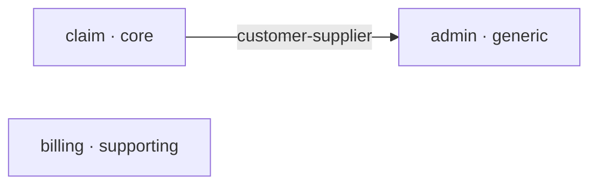

# 샘플 — Domain
<!-- superdomain:template v1 -->

## 프로젝트: backend
- 경로: backend
- 기본 패키지: com.acme

## 프로젝트: batch
- 경로: batch
- 기본 패키지: com.acme.batch

## 컨텍스트 맵
<!-- superdomain:generated:context-map -->

<!-- /superdomain:generated -->

## 컨텍스트: claim
- 프로젝트: backend
- 분류: core                (core | supporting | generic)
- 패턴: cqrs, outbox
- 패키지: com.acme.claiming..

### 관계
| 상대 | 유형 | 계약 |
|---|---|---|
| admin | customer-supplier | claim-events-v1 |

### 근거
청구는 이 제품의 핵심 도메인이라 core로 분류한다. 패키지는 역사적 이유로 `claiming`이어서
규약 기본값(`com.acme.claim..`)과 다르므로 명시한다.

### 메모
파서가 모르는 소제목이다. 이 아래의 자유 서술은 무시되어야 한다.

## 컨텍스트: admin
- 프로젝트: backend
- 분류: generic

## 컨텍스트: billing
- 프로젝트: batch
- 분류: supporting
- 패키지: com.acme.web.billing.., com.acme.batch.billing..
